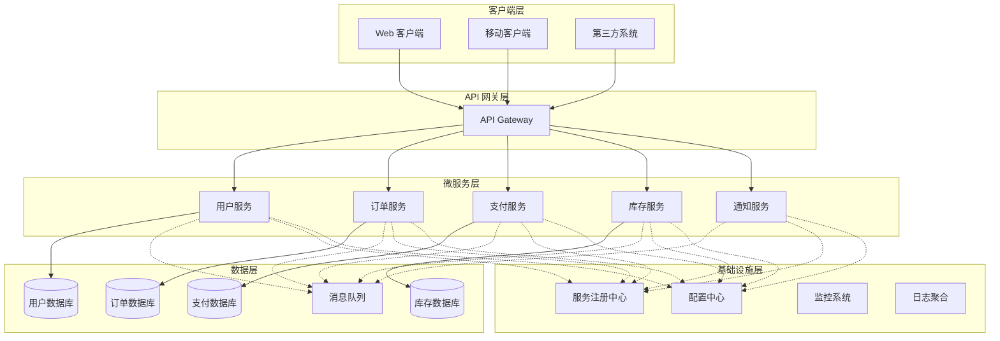
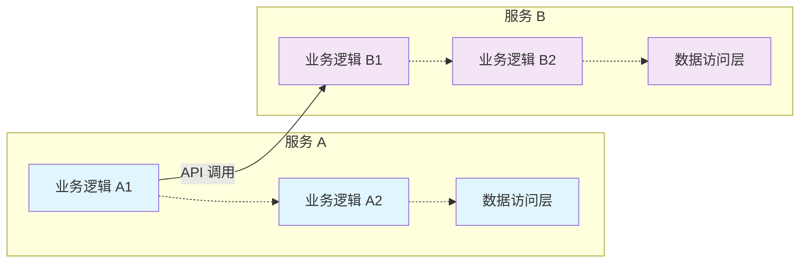
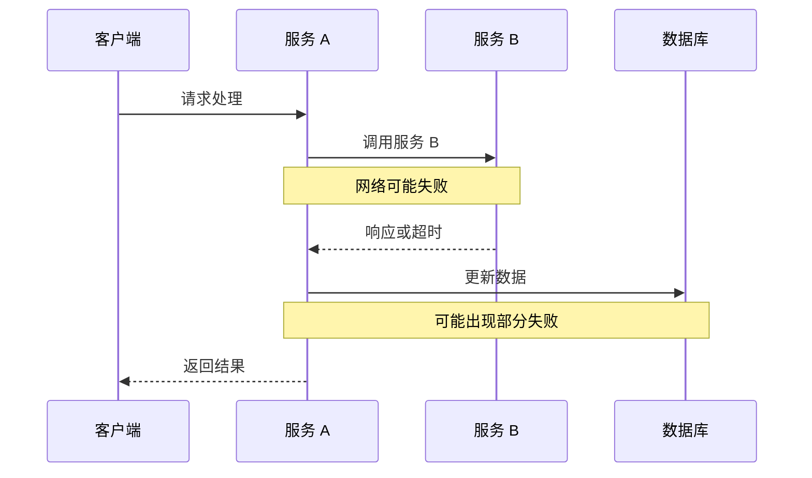
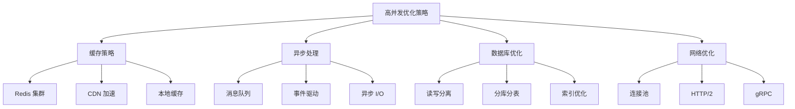

# 微服务架构基础知识与实践指南

微服务架构（Microservices Architecture）是一种分布式系统设计模式，它将单体应用程序（Monolithic Application）解构为一组松耦合的、可独立部署的小型服务集合。每个微服务专注于单一业务能力（Single Business Capability），通过明确定义的 API 接口进行通信，通常采用轻量级协议如 RESTful HTTP、gRPC 或异步消息传递机制。

## 架构概览

## 核心优势与挑战分析

> "没有银弹"（No Silver Bullet）—— Fred Brooks
> 
> 正如 Fred Brooks 在其经典论文中所述，软件工程中不存在能够解决所有复杂性问题的"银弹"。微服务架构同样如此，它是一门权衡与取舍的艺术。

微服务架构为我们带来了显著的技术优势，如水平扩展能力、技术栈多样性等。然而，在享受这些收益的同时，我们也必须面对分布式系统固有的复杂性。深入理解微服务的优势与局限性，有助于我们在实际项目中扬长避短，做出明智的架构决策。

## 微服务架构的核心优势

### 1. 复杂性分治（Divide and Conquer）

微服务架构遵循"分而治之"的设计原则，将大型单体应用按照业务边界（Business Boundary）进行垂直拆分。这种拆分策略有效降低了单个服务的认知复杂度（Cognitive Complexity），使得开发团队能够专注于特定的业务领域。

**技术实现要点：**
- 基于领域驱动设计（DDD）进行服务边界划分
- 每个服务维护独立的数据模型和业务逻辑
- 通过 API 契约（API Contract）定义服务间交互规范

### 2. 高内聚低耦合（High Cohesion, Low Coupling）

微服务架构严格遵循软件工程的基本原则，通过明确的服务边界实现：

- **高内聚**：相关功能聚合在同一服务内
- **低耦合**：服务间通过标准化接口通信，避免实现细节泄露
- **接口隔离**：每个服务仅暴露必要的 API 端点

### 3. 技术栈异构性（Technology Diversity）

微服务架构支持"多语言编程"（Polyglot Programming）和"多持久化"（Polyglot Persistence）模式：

- **语言选择自由度**：可根据业务特性选择最适合的编程语言
- **数据库技术多样性**：支持关系型、NoSQL、时序数据库等多种存储方案
- **渐进式技术演进**：可在边缘服务中试验新技术，降低技术债务风险

### 4. 持续交付与部署（Continuous Delivery & Deployment）

微服务天然支持 DevOps 实践，实现：

- **独立部署单元**：每个服务可独立进行版本发布
- **蓝绿部署**：支持零停机时间的服务更新
- **金丝雀发布**：渐进式功能发布，降低变更风险
- **回滚机制**：快速回退到稳定版本

### 5. 弹性伸缩（Elastic Scaling）

微服务支持细粒度的资源调配：

- **水平扩展**：根据负载动态调整服务实例数量
- **垂直扩展**：为特定服务分配专用计算资源
- **异构部署**：CPU 密集型服务部署在计算优化实例，内存密集型服务部署在内存优化实例

## 微服务架构的主要挑战

### 1. 服务拆分粒度控制

服务拆分是一个经验驱动的工程实践，缺乏标准化的度量指标：

**常见拆分策略：**
- **按业务能力拆分**：基于业务功能的自然边界
- **按数据模型拆分**：围绕聚合根（Aggregate Root）构建服务
- **按团队结构拆分**：遵循康威定律（Conway's Law）

**拆分粒度评估指标：**
- 团队认知负载（Cognitive Load）
- 服务间通信频率
- 数据一致性要求
- 部署和运维复杂度

### 2. 分布式系统复杂性

微服务引入了分布式系统的固有挑战：

**网络通信问题：**
- **网络延迟**：服务间调用的网络开销
- **网络分区**：部分节点间通信中断
- **调用失败**：需要实现重试、熔断、降级机制

**数据一致性挑战：**
- **CAP 定理约束**：在一致性、可用性、分区容错性之间权衡
- **分布式事务**：实现 Saga 模式或 TCC 模式
- **最终一致性**：接受数据的短暂不一致状态

### 3. 运维复杂度增加

微服务架构对运维能力提出了更高要求：

**基础设施需求：**
- **服务发现**：Consul、Eureka、etcd
- **配置管理**：Apollo、Nacos、Spring Cloud Config
- **API 网关**：Kong、Zuul、Envoy
- **监控告警**：Prometheus、Grafana、Jaeger
- **日志聚合**：ELK Stack、Fluentd

**运维挑战：**
- 服务实例数量激增
- 依赖关系复杂化
- 故障排查难度增加
- 性能监控粒度细化

### 4. 分布式链路追踪与问题定位

在微服务环境中，单个用户请求可能跨越多个服务，形成复杂的调用链路：

**技术解决方案：**
- **分布式追踪**：OpenTracing、Zipkin、Jaeger
- **关联 ID**：在请求头中传递 Trace ID 和 Span ID
- **日志聚合**：集中化日志收集和分析
- **性能监控**：APM 工具进行端到端性能监控

## 深度思考：高并发与大数据量场景分析

### 高并发场景下的性能表现

**优势分析：**

1. **水平扩展能力强**
   - 可针对热点服务进行精确扩容
   - 支持异步处理和消息队列削峰填谷
   - 实现读写分离和缓存策略优化

2. **故障隔离效果好**
   - 单个服务故障不会导致整体系统崩溃
   - 支持熔断器模式防止雪崩效应
   - 可实现优雅降级保障核心功能

**挑战分析：**

1. **网络开销显著**
   - 服务间调用增加网络延迟（通常 1-10ms）
   - 序列化/反序列化消耗 CPU 资源
   - 连接池管理和 TCP 握手开销

2. **分布式事务性能瓶颈**
   - 两阶段提交（2PC）协议延迟高
   - Saga 模式增加补偿逻辑复杂度
   - 最终一致性可能影响用户体验

**性能优化策略：**

### 大数据量场景下的架构考量

**数据分片策略：**

1. **垂直分片**：按业务领域拆分数据
2. **水平分片**：按数据量或哈希值分片
3. **混合分片**：结合垂直和水平分片

**数据一致性保障：**

1. **强一致性场景**：金融交易、库存扣减
2. **最终一致性场景**：用户画像、推荐系统
3. **弱一致性场景**：日志记录、统计分析

**存储技术选型：**

| 数据类型 | 推荐技术栈 | 适用场景 |
|---------|-----------|---------|
| 关系型数据 | MySQL Cluster, PostgreSQL | 事务性强的业务数据 |
| 文档数据 | MongoDB, CouchDB | 半结构化数据存储 |
| 键值数据 | Redis, DynamoDB | 缓存和会话存储 |
| 时序数据 | InfluxDB, TimescaleDB | 监控指标和日志 |
| 搜索数据 | Elasticsearch, Solr | 全文搜索和分析 |

### 架构演进建议

**渐进式微服务化路径：**

1. **单体优先**（Monolith First）：新项目从单体开始
2. **模块化重构**：识别服务边界，进行模块化改造
3. **数据库拆分**：实现数据层的物理隔离
4. **服务提取**：逐步提取独立的微服务
5. **平台化建设**：构建微服务治理平台

**技术债务管理：**

- 定期进行架构健康度评估
- 建立服务依赖关系图谱
- 监控服务间耦合度指标
- 制定服务退役和合并策略

## 最佳实践与实施建议

### 1. 组织架构调整

遵循康威定律，调整团队结构以匹配目标架构：

- **全功能团队**：每个团队负责完整的服务生命周期
- **DevOps 文化**：开发团队承担运维责任
- **平台团队**：提供基础设施和工具支持

### 2. 技术栈标准化

在保持技术多样性的同时，建立合理的技术标准：

- **核心技术栈**：定义主流技术选型
- **技术雷达**：评估新技术的成熟度
- **最佳实践库**：沉淀可复用的技术方案

### 3. 监控与可观测性

建立全面的监控体系：

- **指标监控**：业务指标、技术指标、基础设施指标
- **日志管理**：结构化日志、集中化收集、智能分析
- **链路追踪**：端到端请求追踪、性能瓶颈定位
- **告警机制**：多级告警、智能降噪、自动化响应

## 总结

微服务架构是现代分布式系统设计的重要范式，它为我们提供了应对复杂业务需求的有效手段。然而，成功实施微服务架构需要在技术、组织、流程等多个维度进行系统性的规划和改进。只有深入理解其优势与挑战，并结合具体的业务场景进行合理的权衡，才能真正发挥微服务架构的价值。

在高并发和大数据量场景下，微服务架构展现出了强大的水平扩展能力和故障隔离特性，但同时也带来了网络延迟、分布式事务等挑战。通过合理的缓存策略、异步处理、数据分片等技术手段，可以有效应对这些挑战，构建出高性能、高可用的分布式系统。