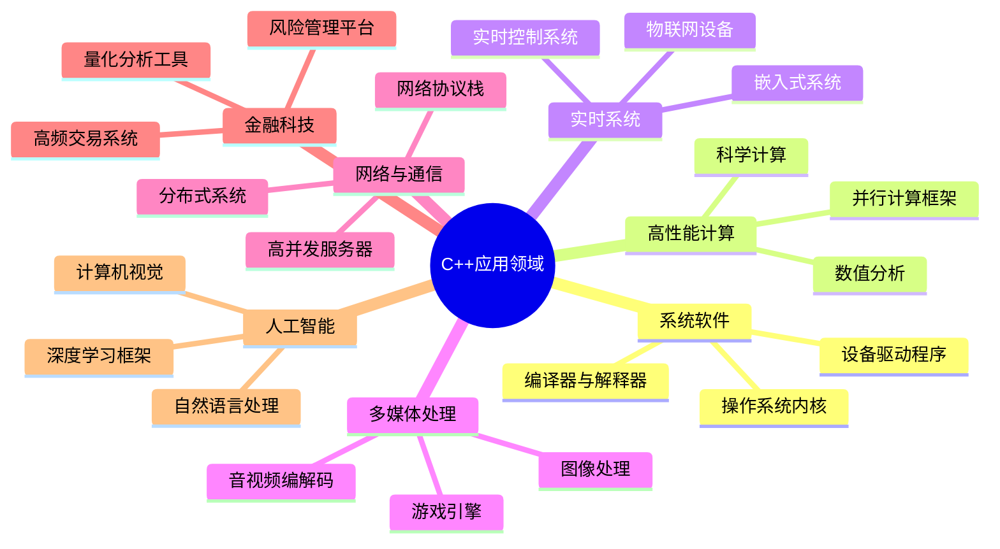
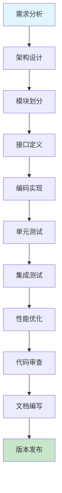

# C++核心编程技术详解与实战指南

C++作为一门兼具高性能和灵活性的系统级编程语言，在现代软件开发中占据着举足轻重的地位。本文将从基础语法到高级特性，系统性地介绍C++核心技术，并结合实际项目经验，为有志于成为高级C++开发工程师的读者提供全面的技术指导。

## C++技术栈应用领域

C++凭借其卓越的性能和底层控制能力，在多个关键技术领域发挥着核心作用：



### 核心技术优势

- **零开销抽象**：编译时优化，运行时性能接近汇编语言
- **内存精确控制**：手动内存管理与智能指针相结合
- **多范式编程**：支持面向对象、泛型、函数式编程
- **跨平台兼容**：标准化程度高，可移植性强
- **丰富的生态**：STL、Boost等成熟库支持

## 技能发展路径与学习目标

| 阶段 | 核心内容 | 技术目标 | 实战项目 |
|------|----------|----------|----------|
| **基础语法阶段** | 语法基础、内存模型、指针引用 | 掌握C++核心语法，具备基础编程能力 | 控制台应用、简单算法实现 |
| **面向对象编程** | 类设计、继承多态、RAII原则 | 理解OOP思想，能够设计中等规模项目 | 学生管理系统、图形库封装 |
| **高级特性应用** | 模板编程、STL容器、异常处理 | 掌握泛型编程，具备大型项目开发能力 | 自定义容器、算法库实现 |
| **现代C++特性** | C++11/14/17/20新特性、并发编程 | 熟练运用现代C++，具备高性能编程能力 | 多线程服务器、高性能计算 |

## 开发环境与工具链配置

### 推荐开发环境

**集成开发环境 (IDE)**
- **Visual Studio 2022**：Windows平台首选，强大的调试和IntelliSense支持
- **CLion**：跨平台，优秀的代码分析和重构功能
- **Qt Creator**：适合GUI应用开发
- **Visual Studio Code**：轻量级，丰富的插件生态

**编译器选择**
- **GCC (GNU Compiler Collection)**：开源，标准兼容性好
- **Clang**：现代化设计，错误信息友好
- **MSVC**：Microsoft Visual C++，Windows平台优化

**构建系统**
- **CMake**：跨平台构建系统，工业标准
- **Ninja**：高性能构建工具
- **Bazel**：Google开源，适合大型项目

### 项目开发流程



## 核心语法基础

### 变量与内存管理

变量是程序中用于存储数据的命名内存区域。在C++中，变量的声明和初始化遵循严格的类型系统，这是实现高性能和类型安全的基础。

#### 变量声明与初始化最佳实践

```cpp
// 现代C++推荐的初始化方式
int value{42};                    // 统一初始化语法 (C++11)
std::string name{"John Doe"};     // 避免隐式类型转换
auto result = calculateSum();     // 自动类型推导 (C++11)
const auto& config = getConfig(); // 避免不必要的拷贝

// 传统初始化方式（不推荐）
int old_style = 10;              // 可能发生隐式转换
```

#### 变量命名规范

遵循现代C++命名约定，提升代码可读性：

```cpp
// 推荐的命名风格
class DatabaseConnection {
private:
    std::string connection_string_;  // 成员变量后缀
    static constexpr int kMaxRetries = 3;  // 常量前缀
    
public:
    void EstablishConnection();      // 函数使用PascalCase
    bool IsConnected() const;        // 查询函数使用Is/Has前缀
};

// 局部变量使用snake_case
void ProcessData() {
    const auto start_time = std::chrono::high_resolution_clock::now();
    std::vector<int> processed_items;
    // ...
}
```

### 常量与编译时计算

C++提供多种常量定义方式，选择合适的方式对性能和代码质量至关重要。

#### 常量定义策略

```cpp
// 1. 编译时常量 (推荐)
constexpr double PI = 3.14159265359;
constexpr int BUFFER_SIZE = 1024;

// 2. 运行时常量
const std::string app_name = GetApplicationName();
const auto current_time = std::chrono::system_clock::now();

// 3. 类内常量
class MathConstants {
public:
    static constexpr double E = 2.71828182846;
    static constexpr double GOLDEN_RATIO = 1.61803398875;
};

// 4. 枚举类 (C++11)
enum class LogLevel : int {
    DEBUG = 0,
    INFO = 1,
    WARNING = 2,
    ERROR = 3
};
```

#### constexpr函数与编译时计算

```cpp
// 编译时计算函数
constexpr int Factorial(int n) {
    return (n <= 1) ? 1 : n * Factorial(n - 1);
}

constexpr double CircleArea(double radius) {
    return PI * radius * radius;
}

// 使用示例
constexpr auto fact_5 = Factorial(5);        // 编译时计算
constexpr auto area = CircleArea(10.0);      // 编译时计算
```

### 现代C++类型系统

#### 基础数据类型与内存布局

```cpp
#include <cstdint>  // 固定宽度整数类型

// 推荐使用固定宽度类型
std::int32_t user_id{0};           // 32位有符号整数
std::uint64_t timestamp{0};        // 64位无符号整数
std::size_t buffer_length{0};      // 平台相关的大小类型

// 浮点数类型选择
float precision_32{0.0f};          // 32位浮点数
double precision_64{0.0};          // 64位浮点数（推荐）
long double extended_precision{0.0L}; // 扩展精度（平台相关）
```

#### 类型推导与模板

```cpp
// auto关键字的高级用法
auto lambda = [](int x, int y) -> int { return x + y; };
auto future_result = std::async(std::launch::async, []() {
    return expensive_calculation();
});

// decltype用于类型推导
template<typename T, typename U>
auto Add(T&& t, U&& u) -> decltype(std::forward<T>(t) + std::forward<U>(u)) {
    return std::forward<T>(t) + std::forward<U>(u);
}
```

### 字符串处理与国际化

#### 现代字符串操作

```cpp
#include <string>
#include <string_view>  // C++17

class StringProcessor {
public:
    // 使用string_view避免不必要的拷贝
    static bool IsValidEmail(std::string_view email) {
        return email.find('@') != std::string_view::npos &&
               email.find('.') != std::string_view::npos;
    }
    
    // 字符串构建优化
    static std::string BuildQuery(std::string_view table, 
                                 std::string_view condition) {
        std::string query;
        query.reserve(50 + table.size() + condition.size());  // 预分配内存
        query += "SELECT * FROM ";
        query += table;
        query += " WHERE ";
        query += condition;
        return query;
    }
    
    // 字符串分割实现
    static std::vector<std::string> Split(std::string_view str, char delimiter) {
        std::vector<std::string> tokens;
        std::size_t start = 0;
        std::size_t end = str.find(delimiter);
        
        while (end != std::string_view::npos) {
            tokens.emplace_back(str.substr(start, end - start));
            start = end + 1;
            end = str.find(delimiter, start);
        }
        tokens.emplace_back(str.substr(start));
        return tokens;
    }
};
```

#### Unicode与多语言支持

```cpp
#include <locale>
#include <codecvt>

class UnicodeHandler {
public:
    // UTF-8 到 UTF-16 转换
    static std::u16string Utf8ToUtf16(const std::string& utf8_str) {
        std::wstring_convert<std::codecvt_utf8_utf16<char16_t>, char16_t> converter;
        return converter.from_bytes(utf8_str);
    }
    
    // 字符串长度计算（考虑多字节字符）
    static std::size_t Utf8Length(const std::string& utf8_str) {
        std::size_t length = 0;
        for (std::size_t i = 0; i < utf8_str.size(); ++length) {
            unsigned char c = utf8_str[i];
            if (c < 0x80) i += 1;
            else if (c < 0xE0) i += 2;
            else if (c < 0xF0) i += 3;
            else i += 4;
        }
        return length;
    }
};
```

## 注释

功能：在代码中加上一些说明和解释，方便程序员阅读代码。

### 单行注释

```c++
//描述信息
```

### 多行注释

```c++
/*描述信息*/
```

## 关键字

功能：关键字是 c++中预先保留的单词，定义变量或者常量不要使用关键字。

| 关键字    | 对应中文     | 功能说明                                                   |
| --------- | ------------ | ---------------------------------------------------------- |
| auto      | 自动         | 自动推导变量或表达式的类型                                 |
| break     | 终止         | 用于提前退出循环或 switch 语句                             |
| case      | 情况         | 用于定义 switch 语句中的特定分支                           |
| catch     | 捕获         | 用于处理异常块中的异常                                     |
| class     | 类           | 用于定义创建对象的类模版                                   |
| const     | 常量         | 声明一个常量变量或函数，其值在初始化后不能更改             |
| continue  | 继续         | 用于跳过当前循环，继续下一次循环。                         |
| delete    | 删除         | 用于释放内存，并销毁对象实例                               |
| do        | 执行         | 与结合使用`while`来创建`do-while`循环                      |
| double    | 双精度浮点数 | 表示双精度浮点数（更高精度的小数）                         |
| else      | 否则         | 用于指定条件为假时的替代执行路径                           |
| enum      | 枚举         | 用于定义具有一组命名常量的用户定义类型                     |
| extern    | 外部         | 声明在另一个文件夹中定义的变量或函数                       |
| false     | 假           | 代表布尔值 false                                           |
| float     | 浮点数       | 表示浮点数（十进制数）                                     |
| for       | 循环         | 用于具有预先定义循环结构的迭代执行                         |
| friend    | 友好函数     | 将非成员函数或类声明为类的友元，允许访问其私有成员         |
| goto      | 跳转         | 用于将控制转移到程序中的特定标记语句                       |
| if        | 如果         | 用于基于布尔表达式的条件执行                               |
| inline    | 内联         | 建议编译器内联函数，减少函数调用开销                       |
| int       | 整数         | 表示整数（整数）                                           |
| long      | 长整数       | 表示长整数（更大范围的整数）                               |
| mutable   | 可变         | 声明一个可以在特定范围内修改的常量变量                     |
| namespace | 命名空间     | 用于定义命名空间，即标识符的逻辑分组                       |
| new       | 新建         | 用于分配内存和创建对象实例                                 |
| null      | 空           | 表示空指针，表示不存在有效的对象引用                       |
| operator  | 运算符       | 定义或重新定义自定义操作的运算符                           |
| private   | 私有         | 指定对成员的受保护访问，将其可见行限制在类或结构内         |
| protected | 保护         | 指定对成员的受保护访问，允许在类或结构及其派生类中进行访问 |
| public    | 公共         | 指定对类或结构的成员（变量和函数）的公共访问               |
| register  | 寄存器       | 建议编译器将变量存储在寄存器中以便更快地访问               |
| return    | 返回         | 用于退出函数并可选择返回一个值                             |
| short     | 短整数       | 表示短整数（较小范围的整数）                               |
| signed    | 有符号       | 表示整型变量可以存储正值和负值                             |
| sizeof    | 大小         | 返回数据类型或变量的大小（以字节为单位）                   |
| static    | 静态         | 声明静态变量或函数，其范围仅限于定义它的文件               |
| struct    | 结构体       | 类似于`class`，但通常用于轻量级数据结构                    |
| switch    | 开关         | 用于基于比较表达式的多分支条件执行                         |
| template  | 模板         | 用于定义函数、类或其他构造的通用模板                       |
| this      | 指针         | 引用成员函数中的当前对象                                   |
| throw     | 抛出         | 用于引发异常，发生错误或意外情况的信号                     |
| true      | 真           | 代表布尔值 true                                            |
| try       | 尝试         | 用于定义可能正常运行的代码块。                             |

## 数据类型

c++规定创建变量或常量的时候，必须要指定对应的数据类型。否则无法给变来功能分配内存空间。

### 整型

整型变量表示的是整数的数据，区别是所占内存空间的不同。

| 类型      | 说明     | 内存占用空间                                                | 取值范围       |
| --------- | -------- | ----------------------------------------------------------- | -------------- |
| short     | 短整型   | 2 字节                                                      | (-2^15~2^15-1) |
| int       | 整型     | 4 字节                                                      | (-2^31~2^31-1) |
| long      | 长整型   | windows 是 4 字节，linux32 位是 4 字节，linux64 位是 8 字节 | (-2^31~2^31-1) |
| long long | 长长整型 | 8 字节                                                      | (-2^63~2^63-1) |

### 浮点型

C++提供三种浮点数据类型

| 类型        | 大小 | 近似精度  | 常见用途                 |
| ----------- | ---- | --------- | ------------------------ |
| float       | 4    | 7 位小数  | 通用浮点数计算           |
| double      | 8    | 15 位小数 | 计算要求高精度要求高     |
| long double | 16   | 19 位小数 | 极其精确的计算，科学应用 |

对于通用计算`float`就足够，如果处理更高精度数字用`double`。更苛刻精确的需求，那就用`long double`。

### 字符型

C++提供两种字符数据类型

| 类型    | 大小     | 常见用途     |
| ------- | -------- | ------------ |
| char    | 1 个字节 | 单个字符信息 |
| wchar_t | 2 个字节 | 单个字符信息 |

功能：字符型变来那个用于显示单个字符信息，c++用单引号包裹单个字符信息。字符型变来功能并不是把对应的字符本身放在内存中存储，而是将字符本身对应的 ASCII 码放到内存的存储单元中。

### 字符串型

功能：表示一串字符信息，字符串要加上双引号`""` ，才不会被警告。

使用字符串赋值

```c++
std::string str1 = "HELLO WORLD";
```

使用字符串连接

```c++
std::string str1 = "HELLO";
std::string str2 = "WORLD";
std::string str3 = str1 + str2;
```

常量字符串赋值

```c++
const std:string str1 = "HELLO WORLD";
```

动态字符串分配

`std::string`对象自动为底层字符数组分配和管理内存。开发者不需要手动分配和释放内存。说明：字符串文字会自动转换为`std::string`对象。 `std::string`支持各种操作和访问字符串内容的方法，对于大多数字符串的操作，使用`std::string`而不是原始字符数组。

⚠️ 如何省略`std:string`

```c++
#include <iostream>
// #include"head.h"
using namespace std; //加上这一行

int main()
{
    string a = "hello";
    cout << a << endl;
    return 0;
}

```

在 C++中，如果你使用了`using namespace std;`语句，那么你就可以省略`std::`前缀。这个语句会告诉编译器你在使用标准库中的所有符号，所以你就不需要每次都写`std::`了。但是，要注意这种做法可能会导致命名冲突或者不明确的情况，特别是在大型项目中，因此并不是一种推荐的做法。

#### 获取字符串长度

使用`length()`方法获取字符串长度

```c++
std::string str1 = "hello";
int length = str1.length();
```

#### 访问字符

使用`at()`方法访问字符串中的单个字符

```c++
std::string str1 = "hello";
char ch = str1[0]; //访问第一个字符
char ch2 = str1[1]; //访问第二个字符
```

#### 字符串比较

使用`==`、`!=`等运算符比较两个字符串是否相等

```c++
std::string str1 = "hello";
std::string str2 = "hello";
if(str1 == str2){
  //字符串相等
}else{
  //字符串不想等
}
```

#### 查找子字符串

使用`find()`方法来查找一个子字符串在主字符串中的位置

```c++
std::string str1 = "hello world";
size_t pos = str1.find("hello");
```

#### 替换子字符串

使用`replace()`方法来替换字符串中的子字符串

```c++
std: string str1 = "hello world";
str.replace(6,5, "everyone")
// 替换后的字符串为 "hello everyone"
```

#### 子字符串提取

使用`substr()`方法从字符串中提取子字符串

```c++
std::string str = "Hello, world";
std::string sub = str.substr(7, 5); // 从位置7开始，提取长度为5的子字符串
```

#### 字符串插入

使用`insert()`方法在字符串中插入其他字符串

```c++
std::string str = "Hello";
str.insert(5, " world"); // 在位置5处插入字符串" world"
```

#### 删除子字符串

使用`erase()`方法删除字符串中的部分内容

```c++
std::string str = "Hello, world";
str.erase(7, 5); // 从位置7开始，删除长度为5的子字符串
```

字符串大小写转换

使用`tolower()`和`toupper()`方法将字符串转换为小写或者大写

```c++
std::string str = "Hello, World";
for (char &c : str) {
    c = std::tolower(c); // 转换为小写
}
```

#### 字符串比较

使用`compare`方法，进行字符串比较

```c++
std::string str1 = "hello";
std::string str2 = "HELLO";
int result = str1.compare(str2); // 比较两个字符串（区分大小写）
int resultIgnoreCase = str1.compare(str2, 0, str2.length(), std::string::npos, std::string::npos, true); // 忽略大小写

```

#### 字符串分割

c++标准库没有提供字符串分割的方法，可以使用标准库中的流操作符和算法实现。

```c++
#include <iostream>
#include <sstream>
#include <vector>

std::vector<std::string> split(const std::string &str, char delimiter) {
    std::vector<std::string> tokens;
    std::string token;
    std::istringstream tokenStream(str);
    while (std::getline(tokenStream, token, delimiter)) {
        tokens.push_back(token);
    }
    return tokens;
}

int main() {
    std::string str = "apple,banana,cherry";
    std::vector<std::string> parts = split(str, ',');
    for (const auto &part : parts) {
        std::cout << part << std::endl;
    }
    return 0;
}

```

### 布尔型

功能：布尔型代表真或者假的值，`true`表示真，`false`表示假。

bool 类型占一个字节大小

```c++
int main(){
	bool flag = true;
	return 0;
}
```

### 数据输入

功能：用于从键盘获取输入数据

关键字：`cin`

```c++
int main(){
//整型输入
int a = 0;
cout << "请输入整型数字" << endl;
cin >> a;
cout << a << endl;
}
```

### 运算符与表达式优化

#### 算术运算符的高级应用

```cpp
#include <limits>
#include <type_traits>

class SafeMath {
public:
    // 安全的整数加法（防止溢出）
    template<typename T>
    static bool SafeAdd(T a, T b, T& result) {
        static_assert(std::is_integral_v<T>, "T must be integral type");
        
        if constexpr (std::is_signed_v<T>) {
            if (a > 0 && b > std::numeric_limits<T>::max() - a) return false;
            if (a < 0 && b < std::numeric_limits<T>::min() - a) return false;
        } else {
            if (a > std::numeric_limits<T>::max() - b) return false;
        }
        
        result = a + b;
        return true;
    }
    
    // 高效的幂运算实现
    template<typename T>
    static constexpr T FastPower(T base, unsigned int exp) {
        T result = 1;
        while (exp > 0) {
            if (exp & 1) result *= base;
            base *= base;
            exp >>= 1;
        }
        return result;
    }
};
```

#### 位运算的实际应用

```cpp
class BitOperations {
public:
    // 检查数字是否为2的幂
    static constexpr bool IsPowerOfTwo(unsigned int n) {
        return n > 0 && (n & (n - 1)) == 0;
    }
    
    // 计算整数中1的个数（汉明重量）
    static int PopCount(unsigned int n) {
        int count = 0;
        while (n) {
            count += n & 1;
            n >>= 1;
        }
        return count;
    }
    
    // 位掩码操作
    enum class Permission : uint8_t {
        READ    = 1 << 0,  // 0001
        WRITE   = 1 << 1,  // 0010
        EXECUTE = 1 << 2,  // 0100
        DELETE  = 1 << 3   // 1000
    };
    
    static bool HasPermission(uint8_t permissions, Permission perm) {
        return (permissions & static_cast<uint8_t>(perm)) != 0;
    }
    
    static void GrantPermission(uint8_t& permissions, Permission perm) {
        permissions |= static_cast<uint8_t>(perm);
    }
    
    static void RevokePermission(uint8_t& permissions, Permission perm) {
        permissions &= ~static_cast<uint8_t>(perm);
    }
};
```

## 控制流程与算法设计

### 现代条件语句

#### 结构化绑定与条件判断 (C++17)

```cpp
#include <optional>
#include <tuple>
#include <map>

class ModernControlFlow {
public:
    // 使用std::optional处理可能失败的操作
    static std::optional<int> SafeDivide(int dividend, int divisor) {
        if (divisor == 0) {
            return std::nullopt;
        }
        return dividend / divisor;
    }
    
    // 结构化绑定在条件语句中的应用
    static void ProcessUserData(const std::map<std::string, int>& user_scores) {
        for (const auto& [username, score] : user_scores) {
            if (score >= 90) {
                std::cout << username << " achieved excellent score: " << score << '\n';
            } else if (score >= 70) {
                std::cout << username << " achieved good score: " << score << '\n';
            } else {
                std::cout << username << " needs improvement: " << score << '\n';
            }
        }
    }
    
    // if constexpr 编译时条件判断 (C++17)
    template<typename T>
    static void ProcessValue(T value) {
        if constexpr (std::is_integral_v<T>) {
            std::cout << "Processing integer: " << value << '\n';
        } else if constexpr (std::is_floating_point_v<T>) {
            std::cout << "Processing float: " << std::fixed << value << '\n';
        } else {
            std::cout << "Processing other type\n";
        }
    }
};
```

### 高效循环设计

#### 范围for循环与迭代器优化

```cpp
#include <vector>
#include <algorithm>
#include <execution>

class LoopOptimization {
public:
    // 现代范围for循环
    template<typename Container>
    static void ProcessContainer(const Container& container) {
        // 只读访问
        for (const auto& item : container) {
            ProcessItem(item);
        }
        
        // 修改元素
        for (auto& item : container) {
            ModifyItem(item);
        }
        
        // 索引访问（当需要索引时）
        for (std::size_t i = 0; i < container.size(); ++i) {
            ProcessItemWithIndex(container[i], i);
        }
    }
    
    // STL算法替代手写循环
    static void ModernAlgorithms() {
        std::vector<int> numbers{1, 2, 3, 4, 5, 6, 7, 8, 9, 10};
        
        // 查找元素
        auto it = std::find(numbers.begin(), numbers.end(), 5);
        if (it != numbers.end()) {
            std::cout << "Found: " << *it << '\n';
        }
        
        // 条件查找
        auto even_it = std::find_if(numbers.begin(), numbers.end(), 
                                   [](int n) { return n % 2 == 0; });
        
        // 变换操作
        std::vector<int> squared;
        std::transform(numbers.begin(), numbers.end(), 
                      std::back_inserter(squared),
                      [](int n) { return n * n; });
        
        // 并行算法 (C++17)
        std::for_each(std::execution::par_unseq, 
                     numbers.begin(), numbers.end(),
                     [](int& n) { n *= 2; });
    }
    
private:
    static void ProcessItem(const auto& item) { /* 处理逻辑 */ }
    static void ModifyItem(auto& item) { /* 修改逻辑 */ }
    static void ProcessItemWithIndex(const auto& item, std::size_t index) { /* 处理逻辑 */ }
};
```

### 异常安全的控制流

```cpp
#include <stdexcept>
#include <memory>

class ExceptionSafeControl {
public:
    // RAII资源管理
    class ResourceManager {
    private:
        std::unique_ptr<int[]> buffer_;
        std::size_t size_;
        
    public:
        explicit ResourceManager(std::size_t size) 
            : buffer_(std::make_unique<int[]>(size)), size_(size) {
            std::cout << "Resource acquired\n";
        }
        
        ~ResourceManager() {
            std::cout << "Resource released\n";
        }
        
        // 禁止拷贝，允许移动
        ResourceManager(const ResourceManager&) = delete;
        ResourceManager& operator=(const ResourceManager&) = delete;
        ResourceManager(ResourceManager&&) = default;
        ResourceManager& operator=(ResourceManager&&) = default;
        
        int* get() const { return buffer_.get(); }
        std::size_t size() const { return size_; }
    };
    
    // 异常安全的函数设计
    static void ProcessData(const std::vector<int>& data) {
        if (data.empty()) {
            throw std::invalid_argument("Data cannot be empty");
        }
        
        try {
            ResourceManager manager(data.size());
            
            // 强异常安全保证
            std::vector<int> temp_result;
            temp_result.reserve(data.size());
            
            for (const auto& item : data) {
                if (item < 0) {
                    throw std::runtime_error("Negative values not allowed");
                }
                temp_result.push_back(item * 2);
            }
            
            // 只有在所有操作成功后才提交结果
            // result_ = std::move(temp_result);
            
        } catch (const std::exception& e) {
            std::cerr << "Error processing data: " << e.what() << '\n';
            throw;  // 重新抛出异常
        }
    }
};
```

## 数据结构

### 数组

所谓数组，就是一个集合，里面存放着相同类型的数据元素。

- 在 C++中，数组中的每个元素的数据类型都是相同的。
- 在 C++中，数组是由连续的内存空间组成的。

#### 一维数组

定义方式

```c++
数据类型 数组名称 [数组长度];

数据类型 数组名称 [数组长度] = {值1, 值2, 值3...};

数据类型 数组名[] = {值1, 值2, ...}
```

```c++
int main(){
	int score[10];
	score[0] = 100,
	score[1] = 200,
	int arr2[5] = {10,20,30,40,50};
	cout << arr2[0] << endl;
  cout << arr2[1] << endl;
  cout << arr2[2] << endl;
  cout << arr2[3] << endl;
  cout << arr2[4] << endl;
  system("pause");
    return 0;
}
```

### 一维数组数组名

一维数组名称的用途

可以统计整个数组在内存中的长度，可以获取数组在内存的首地址。

数组的属性：

- 连续内存分配，数组分配连续的内存块来存储元素，这允许有效的随机访问元素。
- 固定大小：一旦声明，数组的大小就无法更改。
- 数组类型同质性：数组中的所有元素必须具有相同的数据类型。
- 手动内存管理：数组需要使用指针以及`new`和`delete`运算符进行手动内存管理。

常见的数组操作：

- 遍历数组：使用循环迭代数组的所有元素（for）。
- 搜索数组：使用搜索算法查找数组中特定的元素。
- 对数组进行排序：按特定顺序（例如升序，降序）重新排列数组的元素。
- 插入元素：向数组添加新元素（如果数组支持动态调整大小）。
- 删除元素：从数组中删除元素。

数组的应用：

存储数据集合：数组是存储相关数据集合的一种简单有效的方法，例如学生成绩、员工记录、或传感器读数。

实现数据结构：数组构成了更复杂的数据结构（如链表、堆栈和队列）的基础。

算法和数值计算：数组通常用于对数据序列进行操作的算法中，例如排序、搜索和矩阵运算。

系统编程和硬件接口：数组在系统编程中用于与硬件设备交互并管理内存分配。

```c++
#include <iostream>
// #include"head.h"
using namespace std;

int main()
{
    int arr[5] = {1, 2, 3, 4, 5};
    int n = sizeof(arr) / sizeof(arr[0]);
    for (int i = 0; i < n; i++)
    {
        cout << i << endl;
    }
    return 0;
}
```

### 声明和初始化

```c++
int arr1[5] = {1,2,3,4,5};
double arr2[5] = {1.1,2.2,3.3,4.4,5.5};
string arr3[5] = {"张三","李四","王五","赵六","孙七"};
```


### 案例：五只小猪称体重

在一个数组中记录五只小猪的体重，找出来并打印出来。

```c++
int main(){
    //创建五只小猪的体重
    int arr[5] = {300,350,200,400,250};
    //从数组中找到最大值
	int max = 0; // 先认定一个最大值
    for(int i = 0; i < 5; i++){
    	if(arr[i] > max){
            max = arr[i];
        }
    }
    cout << max << endl;
    system("pause");
    return 0;
}
```

### 数组元素逆置

声明五个元素的数组，将里面的元素逆置。

如：[1,2,3,4,5] => [5,4,3,2,1]

```c++
#include <iostream>
// #include"head.h"
using namespace std;
int main()
{
    int arr[5] = {1, 2, 3, 4, 5};
    // Reverse the array
    for (int i = 0, j = 4; i < j; i++, j--)
    {
        swap(arr[i], arr[j]);
    }

    // Print the reversed array
    for (int i = 0; i < 5; i++)
    {
        cout << arr[i] << "";
    }
    cout << " " << endl;
    return 0;
}
```

### 查询数组元素数量

```c++
#include <iostream>
// #include"head.h"
using namespace std;

int main()
{
    int arr[5] = {1, 2, 3, 4, 5};
    int a = sizeof(arr[0]); // 确定数组中单个元素所占用的字节
    int b = sizeof(arr);    // 确定数组中所有元素所占用的字节
    cout << b / a << endl;  // 将总大小除以单个元素的字节，然后输出的就是数组中元素的数量
}
```

### 冒泡排序

```c++
#include <iostream>
// #include"head.h"
using namespace std;

int main()
{
    int arr[5] = {1, 3, 4, 5, 2};
    for (int i = 0; i < 5; i++)
    {
        for (int j = 0; j < 5 - i - 1; j++)
        {
            if (arr[j] > arr[j + 1])
            {
                int temp = arr[j];
                arr[j] = arr[j + 1];
                arr[j + 1] = temp;
            }
        }
    }
    for (int i = 0; i < 5; i++)
    {
        cout << arr[i] << " ";
    }
    cout << endl;
    return 0;
}
```

### 二维数组

二维数组就是在一维数组之上增加了一列。

定义方式

```c++
数据类型 数组名[行][列];
数据类型 数组名[行][列] = {数据1, 数据2},{数据3, 数据4}；
数据类型 数组名[行][列] = {数据1,数据2,数据3,数据4};
数据类型 数组名[][列] = {数据1,数据2,数据3,数据4};
```

以上四种方式 ，使用第二种更加直观。代码可读性高。

#### 访问元素

要访问二维数组中的元素，可以使用方括号扩起来的行索引和列索隐，行索引从0开始，列索引也从0开始。

```c++
#include <iostream>
// #include"head.h"
using namespace std;

int main()
{
    int arr[2][2] = {{1, 2}, {3, 4}};
    cout << arr[0][0] << endl;
    cout << arr[0][1] << endl;
    cout << arr[1][0] << endl;
    cout << arr[1][1] << endl;

    return 0;
}
```

#### 遍历和处理

使用嵌套for循环来迭代2d数组的元素。例如要打印`arr`数组的所有元素：

```c++
#include <iostream>
// #include"head.h"
using namespace std;

int main()
{
    int arr[2][2] = {{1, 2}, {3, 4}};

    for (int row = 0; row < 2; row++)
    {
        for (int col = 0; col < 2; col++)
        {
            cout << arr[row][col] << endl;
        }
    }

    return 0;
}

```

#### 动态内存分配

对于可以在运行时调整大小的动态二维数组，请考虑使用`std::vector<std::vector<int>>` C++标准库中的数组。

```c++
#include <vector>

int main() {
  std::vector<std::vector<int>> dynamicNumbers(3, std::vector<int>(4)); // Dynamic 2D array

  // Adding elements
  for (int row = 0; row < 3; row++) {
    for (int col = 0; col < 4; col++) {
      dynamicNumbers[row][col] = row * col;
    }
  }

  // Accessing and printing elements
  for (int row = 0; row < 3; row++) {
    for (int col = 0; col < 4; col++) {
      std::cout << dynamicNumbers[row][col] << " ";
    }
    std::cout << std::endl;
  }

  return 0;
}

```

二维数组的优点：

- 结构化数据存储：它们提供了一种结构化的方式来组织和管理行和列中的数据。
- 高效的内存使用：它们可以高效地存储具有规则模式的数据。
- 通用型：适用于图像处理、矩阵运算、游戏开发等多种场景。

注意：

- 大小限制：静态二维数组具有在编译时声明的固定大小。
- 手动内存管理：对于动态二维数组，需要手动管理内存分配和释放以避免内存泄漏。

## 函数

功能：将经常使用的代码封装起来，目的是减少重复代码。

一个较大的软件会分为若干的程序块，每个模块实现特定的功能。

### 定义：

- 返回值类型
- 函数名称
- 参数列表
- 函数体语句
- return表达式

### 语法：

```c++
返回值类型 函数名称(参数列表){函数体语句 return表达式}
```

```c++
#include <iostream>
// #include"head.h"
using namespace std;

int add(int a, int b)
{
    return a + b;
}

int main()
{
    int c = add(1, 2);
    cout << c << endl;
}
```

### 函数的调用

功能：使用函数的功能，函数调用时，有参数写上参数，没有参数不写参数。

语法：

```c++
函数名称() //没有参数的调用方法
函数名称(参数) //有参数的调用方法
```

### 值传递

函数参数通常按值传递，意味着实际值的副本将传递给函数。这意味着对函数内的喊出参数所做任何修改都不会影响调用者传递的原始值。

价值传递的好处：

- 原始值的保护：它可以防止对调用者传递的原始值进行意外的修改。
- 简单类型的效率：对于整数等小型数据类型，复制值通常是最高效的。
- 可预测的行为：它确保可预测的行为，因为函数无法意外更改调用者的数据。

何时使用值传递：

- 简单的数据类型：整数、浮点数、双精度数等。
- 不需要修改的函数参数：当函数不应更改从调用者传递的原始值时。
- 传递可能被复制的函数参数：对于大型或者复杂的数据和机构，复制可能比通过引用传递更加有效果。

值传递是C++函数参数中的基本概念，它确保函数对原始值的副本进行操作，从而防止对调用者数据的意外修改。理解值传递哦对于编写干净、可预测和可维护的C++代码至关重要。

### 函数的常见样式

- 无参无返
- 有参有返
- 无参有返
- 有参有返

```c++
#include <iostream>
// #include"head.h"
using namespace std;

//无参无返
void test01() 
{
    cout << "hello" << endl;
}
//有参有返
void test02(int a)
{
    cout << "world" << endl;
}
//无参有返
int test03()
{
    return 100;
}
//有参有返
int test04(int a)
{
    return a;
}
//主函数
int main()
{
    test01();
    test02(10);
    cout << test03() << endl;
    cout << test04(100) << endl;
    return 0;
}
```

### 函数的分文件编写

功能：让代码结构清晰

函数分文件编写分为四个步骤

1. 创建后缀名为.h的头文件
2. 创建后缀名为.cpp的源文件
3. 在头文件中写函数的声明
4. 在源文件中写函数的定义

```c++
//swap.h
#include <iostream>
using namespace std;
void swap(int a, int b);
```

```c++
//swap.cpp
#include <iostream>
using namespace std;
#include "swap.h"

void swap(int a, int b)
{
    int temp = a;
    a = b;
    b = temp;
    cout << "a = " << a << endl;
    cout << "b = " << b << endl;
}
```

## 指针

功能：指针是一个变量，可以存储一个对象的内存地址。 指针在 C 和 C++ 中广泛用于三个主要用途：

- 在堆上分配新对象，
- 将函数传递给其他函数
- 循环访问数组或其他数据结构中的元素。

c++提供列智能指针用于分配对象，提供了迭代器用于遍历数据结构，还提供了Lambda表达式用于传递函数。通过使用这些语言和库设施，而不是原始指针，可使程序更安全、易于调试。

语法：

```c++
数据类型 * 变量名;
```

```c++
// int * a;
#include<iostream>
using namespace std;
int main(){
  int b = 10;
  int * a;
  a = &b;
  cout << b << endl;
  cout << a << endl;
  cout << *a << endl;
  return 0;
}
```

### 指针所占用内存永健

指针也是一种数据类型，name这种数据类型占用多少个内存空间。

```c++
int main(){
	int a = 10;
	int *P;
	p = &a;
	cout << *P << endl;
	cout << sizeof(p) << endl;
	cout << sizeof(int *) << endl;
	cout << sizeof(char *) << endl;
	cout << sizeof(float *) << endl;
	cout << sizeof(double *) << endl;
	return 0;
}
```

注意：32位操作系统，指针占用4个字节，64位操作系统占用8个字节。

### 空指针

空指针：指针变量指向内存编号为0的空间。

用途：初始化指针变量。

注意：空指针指向的内存是不可以访问的

```c++
int main(){
int *p = NULL;
cout << *p << endl;
}
```

### 野指针

#### 什么是野指针？

野指针是指向无效内存区域的桌子很。无效内存区域可能已经被释放的内存、未初始化的内存或者程序无权访问的内存区域。

```c++
int main(){
int * p = (int*)0x1100;
cout << *p << endl;
return 0;
}
```

注意：空指针和野指针都不是我们申请的空间，因此不要访问它。

#### 野指针的危害

野指针的危害主要有以下方面

- 程序崩溃：访问野指针通过会导致程序崩溃，因为操作系统不允许程序访问无效的内存地址。
- 数据损坏：如果通过野指针修改了内存中的数据，则会导致数据损坏。
- 安全漏洞：野指针可以被利用来进行安全攻击，例如缓冲区溢出攻击。

#### 野指针产生的原因

- 使用为初始化的指针：在定义指针变量之后对它进行初始化，则该指针可能指向野指针。
- 指向已被释放的内存：如果一个指针指向的内存已经被释放了，则该指针就变成了野指针。
- 指向非法的内存地址：如果一个指针指向的内存地址是非法的，则该指针也是野指针。

#### 如何避免野指针

- 初始化指针， 在定义指针变量之后，应立即对其进行初始化，使其指向合法的内存地址。
- 检查指针值：在使用指针之前，应先检查其值是否为空或者非法。
- 使用智能指针：智能指针可以自动管理内存，避免内存泄漏和野指针的产生。

### 智能指针

智能指针是一种用于自动管理的指针类，智能指针可以自动释放所指向的内存，避免内存泄漏和野指针产生。C++11标准库提哦给你了三种智能指针模型。

- `std::shared_ptr`：共享指针，支持多个指针共享同一块内存。
- `std::unique_ptr`:唯一指针，只能由一个指针指向同一块内存。
- `std::weak_ptr`：弱指针，不控制所指向的内存，但可以用于检测共享指针是否仍然有效。

#### 使用智能指针

智能指针的使用非常简单，和普通指针类似。

- 创建智能指针：可以使用`std::make_shared()`、`std::make_unique()`或`std:: weak_ptr()`函数创建智能指针。
- 获取原始指针：可以使用`get()`函数获取智能指针所指向的原始指针。
- 重置智能指针：可以使用`reset()`函数重置智能指针，使其指向新的内存或空指针。
- 析构智能指针：智能指针的析构函数会自动释放所指向的内存。

```c++
//共享指针
std::shared_ptr<int> p = std::make_shared<int>(10);
std::shared_ptr<int> q = p;
//唯一指针
std::unique_ptr<int> r = std::make_unique<int>(20);
//弱指针
std::weak_ptr<int> w = q;
//获得原始指针
int *i = p.get();
//重置智能指针
p.reset(new int(30));
//析构智能指针
p = nullptr; // 析构 p 
q = nullptr; // 析构 q
```

### 修饰指针

1. const修饰指针。常量指针

2. const修饰常量 指针常量

3. const即修饰指针，又修饰常量。

   ```c++
   int main(){
       int a = 10;
       int b = 10;
       //const修饰的是指针，指针指向可以改，指针指向的值不可以更改
       const int * p1 = &a;
       p1 = &b;//正确
       //*p1 = 100; //报错
       //const修饰的是常量，指针指向不可以更改，指针指向的值可以更改
       int * const p2 = &a;
       //p2 = &b;//报错
       //p2 = 100;//正确
       //const 修饰指针和常量
       const int * const p3 = &a;
       *p3 = 100; //报错
       p3 = &b;//报错
       system("pause");
       return 0;
   }
   ```

   #### 指针和数据配合

   功能：利用指针访问数组中的元素

   ```c++
   int main(){
   	int arr[] = {1,2,3,4,5};
     int * p = arr;
     cout << arr[0] << endl;
     cout << *p << endl;
     for(int i = 0; i < 10; i++){
       cout << *p << endl;
       p++;
     }
     return 0;
     
   }
   ```

   

## 深度思考：C++在现代软件开发中的价值与挑战

### 性能优势分析

**编译时优化能力**

C++的模板元编程和constexpr机制允许在编译时进行大量计算，这在高性能计算场景中具有显著优势：

```cpp
// 编译时计算示例
template<int N>
struct Fibonacci {
    static constexpr int value = Fibonacci<N-1>::value + Fibonacci<N-2>::value;
};

template<>
struct Fibonacci<0> {
    static constexpr int value = 0;
};

template<>
struct Fibonacci<1> {
    static constexpr int value = 1;
};

// 编译时计算第40个斐波那契数
constexpr int fib_40 = Fibonacci<40>::value;
```

**内存管理精确控制**

在对内存使用有严格要求的系统中，C++提供了无与伦比的控制能力：

- **自定义内存分配器**：可以针对特定场景优化内存分配策略
- **栈内存优化**：通过值语义减少堆分配
- **内存池技术**：预分配内存块，避免频繁的malloc/free调用

### 在不同规模项目中的应用策略

| 项目规模 | 推荐策略 | 关键技术 | 注意事项 |
|----------|----------|----------|----------|
| **小型项目** | 简单直接，注重可读性 | 基础STL、智能指针 | 避免过度设计 |
| **中型项目** | 模块化设计，接口抽象 | 面向对象、设计模式 | 建立编码规范 |
| **大型项目** | 分层架构，组件化 | 模板编程、并发控制 | 严格的代码审查 |
| **超大型项目** | 微服务化，平台无关 | 跨语言接口、性能调优 | 自动化测试覆盖 |

### 现代C++发展趋势

**C++20及未来特性**

```cpp
// Concepts (C++20) - 约束模板参数
template<typename T>
concept Numeric = std::is_arithmetic_v<T>;

template<Numeric T>
T add(T a, T b) {
    return a + b;
}

// Coroutines (C++20) - 协程支持
#include <coroutine>

struct Generator {
    struct promise_type {
        int current_value;
        
        Generator get_return_object() {
            return Generator{std::coroutine_handle<promise_type>::from_promise(*this)};
        }
        
        std::suspend_always initial_suspend() { return {}; }
        std::suspend_always final_suspend() noexcept { return {}; }
        void unhandled_exception() {}
        
        std::suspend_always yield_value(int value) {
            current_value = value;
            return {};
        }
        
        void return_void() {}
    };
    
    std::coroutine_handle<promise_type> h_;
    
    explicit Generator(std::coroutine_handle<promise_type> h) : h_(h) {}
    ~Generator() { h_.destroy(); }
    
    bool move_next() {
        h_.resume();
        return !h_.done();
    }
    
    int current_value() {
        return h_.promise().current_value;
    }
};

Generator fibonacci() {
    int a = 0, b = 1;
    while (true) {
        co_yield a;
        auto tmp = a;
        a = b;
        b += tmp;
    }
}
```

### 职业发展建议

**技能提升路径**

1. **基础扎实**：深入理解内存模型、对象生命周期
2. **实践项目**：参与开源项目，积累实战经验
3. **性能调优**：掌握profiling工具，优化热点代码
4. **架构设计**：学习设计模式，提升系统设计能力
5. **跨领域知识**：了解操作系统、网络协议、数据库原理

**面试准备重点**

- **算法与数据结构**：LeetCode刷题，重点关注时间复杂度分析
- **系统设计**：能够设计可扩展的分布式系统
- **项目经验**：准备详细的项目技术方案和难点解决过程
- **代码质量**：展示clean code能力和测试驱动开发经验

## 实战项目推荐

### 初级项目（1-2年经验）

1. **命令行工具开发**
   - 文件处理工具
   - 日志分析器
   - 简单的HTTP客户端

2. **数据结构实现**
   - 自定义容器类
   - 算法库封装
   - 内存池实现

### 中级项目（3-5年经验）

1. **网络编程**
   - 多线程服务器
   - 异步I/O框架
   - 简单的RPC框架

2. **系统工具**
   - 性能监控工具
   - 内存泄漏检测器
   - 简单的数据库引擎

### 高级项目（5年以上经验）

1. **高性能系统**
   - 高频交易系统
   - 实时数据处理引擎
   - 分布式缓存系统

2. **基础设施**
   - 编译器前端
   - 虚拟机实现
   - 操作系统内核模块

## 总结与展望

C++作为一门历经40多年发展的编程语言，在现代软件开发中依然占据着不可替代的地位。其强大的性能、灵活的抽象能力和丰富的生态系统，使其成为系统级编程、高性能计算、实时系统等领域的首选语言。

**核心竞争优势：**

- **性能至上**：零开销抽象原则确保了运行时效率
- **内存控制**：精确的内存管理能力适应各种资源约束场景
- **生态丰富**：成熟的标准库和第三方库支持
- **标准化程度高**：跨平台兼容性好，可移植性强

**发展趋势：**

- **现代化特性**：C++11/14/17/20持续引入现代编程特性
- **并发编程**：更好的多线程和异步编程支持
- **模块系统**：C++20模块化编程提升编译效率
- **安全性增强**：更多的编译时检查和安全编程实践

对于有志于成为高级C++开发工程师的程序员，建议：

1. **扎实基础**：深入理解语言核心机制和标准库
2. **实践导向**：通过实际项目积累经验，解决真实问题
3. **持续学习**：跟进语言标准发展，掌握现代C++特性
4. **系统思维**：培养架构设计能力和性能优化意识
5. **开源贡献**：参与开源项目，提升技术影响力

C++的学习曲线虽然陡峭，但掌握后将为你的职业发展带来巨大价值。在追求高性能、低延迟的技术场景中，C++开发者往往能够获得更高的薪资水平和更广阔的发展空间。

---

*本文基于作者5年C++开发经验总结，涵盖了从基础语法到高级特性的全面内容。希望能够帮助读者建立完整的C++知识体系，在技术面试和实际工作中展现专业能力。*