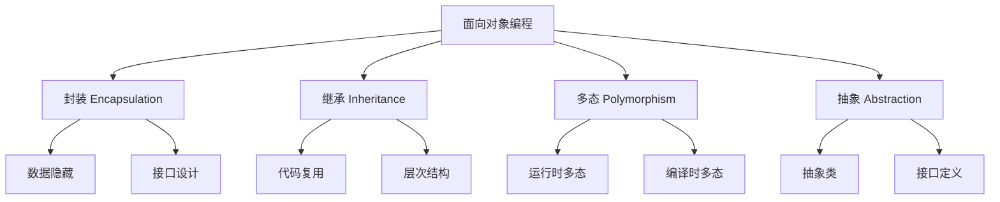

# C++面向对象编程深度解析：从类设计到多态实现

面向对象编程（OOP）是现代软件开发的核心范式之一。在我5年的C++开发经验中，深刻体会到良好的面向对象设计对项目成功的重要性。本文将从实战角度深入探讨C++面向对象编程的核心概念和最佳实践。

## 面向对象核心概念



## 类设计原则与最佳实践

### SOLID原则在C++中的应用

```cpp
#include <memory>
#include <vector>
#include <iostream>

// 1. 单一职责原则 (SRP)
class FileReader {
public:
    std::string ReadFile(const std::string& filename) {
        // 只负责文件读取
        std::ifstream file(filename);
        std::string content((std::istreambuf_iterator<char>(file)),
                           std::istreambuf_iterator<char>());
        return content;
    }
};

class DataProcessor {
public:
    std::vector<std::string> ProcessData(const std::string& data) {
        // 只负责数据处理
        std::vector<std::string> result;
        std::istringstream iss(data);
        std::string line;
        while (std::getline(iss, line)) {
            if (!line.empty()) {
                result.push_back(line);
            }
        }
        return result;
    }
};

// 2. 开闭原则 (OCP) - 对扩展开放，对修改关闭
class Shape {
public:
    virtual ~Shape() = default;
    virtual double GetArea() const = 0;
    virtual void Draw() const = 0;
};

class Rectangle : public Shape {
private:
    double width_, height_;
    
public:
    Rectangle(double width, double height) : width_(width), height_(height) {}
    
    double GetArea() const override {
        return width_ * height_;
    }
    
    void Draw() const override {
        std::cout << "Drawing Rectangle: " << width_ << "x" << height_ << std::endl;
    }
};

class Circle : public Shape {
private:
    double radius_;
    
public:
    explicit Circle(double radius) : radius_(radius) {}
    
    double GetArea() const override {
        return 3.14159 * radius_ * radius_;
    }
    
    void Draw() const override {
        std::cout << "Drawing Circle with radius: " << radius_ << std::endl;
    }
};

// 3. 里氏替换原则 (LSP)
class Bird {
public:
    virtual ~Bird() = default;
    virtual void Eat() const {
        std::cout << "Bird is eating" << std::endl;
    }
};

class FlyingBird : public Bird {
public:
    virtual void Fly() const {
        std::cout << "Bird is flying" << std::endl;
    }
};

class Sparrow : public FlyingBird {
public:
    void Fly() const override {
        std::cout << "Sparrow is flying quickly" << std::endl;
    }
};

class Penguin : public Bird {
    // 企鹅不继承FlyingBird，因为它不会飞
public:
    void Swim() const {
        std::cout << "Penguin is swimming" << std::endl;
    }
};

// 4. 接口隔离原则 (ISP)
class Readable {
public:
    virtual ~Readable() = default;
    virtual std::string Read() = 0;
};

class Writable {
public:
    virtual ~Writable() = default;
    virtual void Write(const std::string& data) = 0;
};

class Seekable {
public:
    virtual ~Seekable() = default;
    virtual void Seek(size_t position) = 0;
};

// 文件类只实现需要的接口
class File : public Readable, public Writable, public Seekable {
private:
    std::string filename_;
    size_t position_;
    
public:
    explicit File(const std::string& filename) : filename_(filename), position_(0) {}
    
    std::string Read() override {
        return "Reading from " + filename_;
    }
    
    void Write(const std::string& data) override {
        std::cout << "Writing to " << filename_ << ": " << data << std::endl;
    }
    
    void Seek(size_t position) override {
        position_ = position;
    }
};

// 5. 依赖倒置原则 (DIP)
class Logger {
public:
    virtual ~Logger() = default;
    virtual void Log(const std::string& message) = 0;
};

class FileLogger : public Logger {
public:
    void Log(const std::string& message) override {
        std::cout << "[FILE] " << message << std::endl;
    }
};

class ConsoleLogger : public Logger {
public:
    void Log(const std::string& message) override {
        std::cout << "[CONSOLE] " << message << std::endl;
    }
};

class Application {
private:
    std::unique_ptr<Logger> logger_;
    
public:
    explicit Application(std::unique_ptr<Logger> logger) 
        : logger_(std::move(logger)) {}
    
    void DoSomething() {
        logger_->Log("Application is doing something");
    }
};
```

## 继承机制深度解析

### 虚函数表（vtable）原理

```cpp
#include <iostream>
#include <typeinfo>

class Base {
public:
    virtual ~Base() = default;
    
    virtual void VirtualFunction1() {
        std::cout << "Base::VirtualFunction1" << std::endl;
    }
    
    virtual void VirtualFunction2() {
        std::cout << "Base::VirtualFunction2" << std::endl;
    }
    
    void NonVirtualFunction() {
        std::cout << "Base::NonVirtualFunction" << std::endl;
    }
};

class Derived : public Base {
public:
    void VirtualFunction1() override {
        std::cout << "Derived::VirtualFunction1" << std::endl;
    }
    
    virtual void NewVirtualFunction() {
        std::cout << "Derived::NewVirtualFunction" << std::endl;
    }
};

// 虚函数表分析工具
class VTableAnalyzer {
public:
    template<typename T>
    static void AnalyzeVTable(T* obj) {
        std::cout << "Object type: " << typeid(*obj).name() << std::endl;
        std::cout << "Object size: " << sizeof(*obj) << " bytes" << std::endl;
        
        // 获取虚函数表指针（仅用于演示，实际项目中不推荐）
        void** vtable = *reinterpret_cast<void***>(obj);
        std::cout << "VTable address: " << vtable << std::endl;
        
        obj->VirtualFunction1();
        obj->VirtualFunction2();
    }
};

void DemonstrateVTable() {
    Base base;
    Derived derived;
    
    std::cout << "=== Base Object ===" << std::endl;
    VTableAnalyzer::AnalyzeVTable(&base);
    
    std::cout << "\n=== Derived Object ===" << std::endl;
    VTableAnalyzer::AnalyzeVTable(&derived);
    
    std::cout << "\n=== Polymorphic Call ===" << std::endl;
    Base* ptr = &derived;
    VTableAnalyzer::AnalyzeVTable(ptr);
}
```

### 多重继承与虚继承

```cpp
#include <iostream>

// 多重继承示例
class Flyable {
public:
    virtual ~Flyable() = default;
    virtual void Fly() const = 0;
};

class Swimmable {
public:
    virtual ~Swimmable() = default;
    virtual void Swim() const = 0;
};

class Duck : public Flyable, public Swimmable {
public:
    void Fly() const override {
        std::cout << "Duck is flying" << std::endl;
    }
    
    void Swim() const override {
        std::cout << "Duck is swimming" << std::endl;
    }
};

// 虚继承解决菱形继承问题
class Animal {
protected:
    std::string name_;
    
public:
    explicit Animal(const std::string& name) : name_(name) {
        std::cout << "Animal constructor: " << name_ << std::endl;
    }
    
    virtual ~Animal() {
        std::cout << "Animal destructor: " << name_ << std::endl;
    }
    
    const std::string& GetName() const { return name_; }
};

class Mammal : public virtual Animal {
public:
    explicit Mammal(const std::string& name) : Animal(name) {
        std::cout << "Mammal constructor" << std::endl;
    }
    
    virtual void GiveBirth() const {
        std::cout << name_ << " gives birth to live young" << std::endl;
    }
};

class Aquatic : public virtual Animal {
public:
    explicit Aquatic(const std::string& name) : Animal(name) {
        std::cout << "Aquatic constructor" << std::endl;
    }
    
    virtual void SwimInWater() const {
        std::cout << name_ << " swims in water" << std::endl;
    }
};

class Whale : public Mammal, public Aquatic {
public:
    explicit Whale(const std::string& name) 
        : Animal(name), Mammal(name), Aquatic(name) {
        std::cout << "Whale constructor" << std::endl;
    }
    
    void Display() const {
        std::cout << "I am " << GetName() << ", a whale" << std::endl;
        GiveBirth();
        SwimInWater();
    }
};
```

## 多态机制实现

### 运行时多态（动态多态）

```cpp
#include <vector>
#include <memory>
#include <chrono>

// 策略模式实现运行时多态
class SortStrategy {
public:
    virtual ~SortStrategy() = default;
    virtual void Sort(std::vector<int>& data) const = 0;
    virtual std::string GetName() const = 0;
};

class BubbleSort : public SortStrategy {
public:
    void Sort(std::vector<int>& data) const override {
        size_t n = data.size();
        for (size_t i = 0; i < n - 1; ++i) {
            for (size_t j = 0; j < n - i - 1; ++j) {
                if (data[j] > data[j + 1]) {
                    std::swap(data[j], data[j + 1]);
                }
            }
        }
    }
    
    std::string GetName() const override { return "BubbleSort"; }
};

class QuickSort : public SortStrategy {
public:
    void Sort(std::vector<int>& data) const override {
        QuickSortImpl(data, 0, static_cast<int>(data.size()) - 1);
    }
    
    std::string GetName() const override { return "QuickSort"; }
    
private:
    void QuickSortImpl(std::vector<int>& arr, int low, int high) const {
        if (low < high) {
            int pi = Partition(arr, low, high);
            QuickSortImpl(arr, low, pi - 1);
            QuickSortImpl(arr, pi + 1, high);
        }
    }
    
    int Partition(std::vector<int>& arr, int low, int high) const {
        int pivot = arr[high];
        int i = low - 1;
        
        for (int j = low; j <= high - 1; j++) {
            if (arr[j] < pivot) {
                i++;
                std::swap(arr[i], arr[j]);
            }
        }
        std::swap(arr[i + 1], arr[high]);
        return i + 1;
    }
};

class SortContext {
private:
    std::unique_ptr<SortStrategy> strategy_;
    
public:
    explicit SortContext(std::unique_ptr<SortStrategy> strategy)
        : strategy_(std::move(strategy)) {}
    
    void SetStrategy(std::unique_ptr<SortStrategy> strategy) {
        strategy_ = std::move(strategy);
    }
    
    void ExecuteSort(std::vector<int>& data) const {
        if (strategy_) {
            auto start = std::chrono::high_resolution_clock::now();
            strategy_->Sort(data);
            auto end = std::chrono::high_resolution_clock::now();
            
            auto duration = std::chrono::duration_cast<std::chrono::microseconds>(end - start);
            std::cout << strategy_->GetName() << " took " << duration.count() << " microseconds" << std::endl;
        }
    }
};
```

### 编译时多态（静态多态）

```cpp
#include <type_traits>

// CRTP (Curiously Recurring Template Pattern)
template<typename Derived>
class Shape {
public:
    double GetArea() const {
        return static_cast<const Derived*>(this)->GetAreaImpl();
    }
    
    void Draw() const {
        static_cast<const Derived*>(this)->DrawImpl();
    }
    
    // 编译时类型检查
    static_assert(std::is_base_of_v<Shape<Derived>, Derived>, 
                  "Derived must inherit from Shape<Derived>");
};

class Rectangle : public Shape<Rectangle> {
private:
    double width_, height_;
    
public:
    Rectangle(double width, double height) : width_(width), height_(height) {}
    
    double GetAreaImpl() const {
        return width_ * height_;
    }
    
    void DrawImpl() const {
        std::cout << "Drawing Rectangle: " << width_ << "x" << height_ << std::endl;
    }
};

class Circle : public Shape<Circle> {
private:
    double radius_;
    
public:
    explicit Circle(double radius) : radius_(radius) {}
    
    double GetAreaImpl() const {
        return 3.14159 * radius_ * radius_;
    }
    
    void DrawImpl() const {
        std::cout << "Drawing Circle with radius: " << radius_ << std::endl;
    }
};

// 模板特化实现编译时多态
template<typename T>
class Calculator {
public:
    static T Add(const T& a, const T& b) {
        return a + b;
    }
};

// 特化版本用于字符串
template<>
class Calculator<std::string> {
public:
    static std::string Add(const std::string& a, const std::string& b) {
        return a + " " + b;  // 字符串连接
    }
};

// 概念约束 (C++20)
#if __cplusplus >= 202002L
template<typename T>
concept Numeric = std::is_arithmetic_v<T>;

template<Numeric T>
T SafeAdd(T a, T b) {
    if constexpr (std::is_integral_v<T>) {
        // 整数溢出检查
        if (a > 0 && b > std::numeric_limits<T>::max() - a) {
            throw std::overflow_error("Integer overflow");
        }
        if (a < 0 && b < std::numeric_limits<T>::min() - a) {
            throw std::underflow_error("Integer underflow");
        }
    }
    return a + b;
}
#endif
```

## 高级类设计技巧

### RAII与资源管理

```cpp
#include <fstream>
#include <mutex>
#include <chrono>

// RAII文件管理器
class FileManager {
private:
    std::unique_ptr<std::fstream> file_;
    std::string filename_;
    
public:
    explicit FileManager(const std::string& filename, 
                        std::ios::openmode mode = std::ios::in | std::ios::out)
        : filename_(filename) {
        file_ = std::make_unique<std::fstream>(filename, mode);
        if (!file_->is_open()) {
            throw std::runtime_error("Failed to open file: " + filename);
        }
        std::cout << "File opened: " << filename_ << std::endl;
    }
    
    ~FileManager() {
        if (file_ && file_->is_open()) {
            file_->close();
            std::cout << "File closed: " << filename_ << std::endl;
        }
    }
    
    // 禁止拷贝，允许移动
    FileManager(const FileManager&) = delete;
    FileManager& operator=(const FileManager&) = delete;
    FileManager(FileManager&&) = default;
    FileManager& operator=(FileManager&&) = default;
    
    template<typename T>
    FileManager& operator<<(const T& data) {
        if (file_) {
            *file_ << data;
        }
        return *this;
    }
    
    template<typename T>
    FileManager& operator>>(T& data) {
        if (file_) {
            *file_ >> data;
        }
        return *this;
    }
};

// RAII锁管理器
template<typename Mutex>
class ScopedLock {
private:
    Mutex& mutex_;
    std::chrono::time_point<std::chrono::steady_clock> start_time_;
    
public:
    explicit ScopedLock(Mutex& mutex) : mutex_(mutex) {
        start_time_ = std::chrono::steady_clock::now();
        mutex_.lock();
    }
    
    ~ScopedLock() {
        mutex_.unlock();
        auto end_time = std::chrono::steady_clock::now();
        auto duration = std::chrono::duration_cast<std::chrono::microseconds>(end_time - start_time_);
        std::cout << "Lock held for " << duration.count() << " microseconds" << std::endl;
    }
    
    // 禁止拷贝和移动
    ScopedLock(const ScopedLock&) = delete;
    ScopedLock& operator=(const ScopedLock&) = delete;
    ScopedLock(ScopedLock&&) = delete;
    ScopedLock& operator=(ScopedLock&&) = delete;
};
```

### 类型安全与强类型

```cpp
#include <type_traits>

// 强类型包装器
template<typename T, typename Tag>
class StrongType {
private:
    T value_;
    
public:
    explicit StrongType(const T& value) : value_(value) {}
    explicit StrongType(T&& value) : value_(std::move(value)) {}
    
    const T& Get() const { return value_; }
    T& Get() { return value_; }
    
    // 类型安全的比较操作
    bool operator==(const StrongType& other) const {
        return value_ == other.value_;
    }
    
    bool operator!=(const StrongType& other) const {
        return !(*this == other);
    }
    
    bool operator<(const StrongType& other) const {
        return value_ < other.value_;
    }
};

// 定义强类型
struct UserIdTag {};
struct ProductIdTag {};

using UserId = StrongType<int, UserIdTag>;
using ProductId = StrongType<int, ProductIdTag>;

class OrderService {
public:
    void CreateOrder(UserId user_id, ProductId product_id, int quantity) {
        std::cout << "Creating order for user " << user_id.Get() 
                  << ", product " << product_id.Get() 
                  << ", quantity " << quantity << std::endl;
    }
    
    // 编译时会阻止参数顺序错误
    // CreateOrder(ProductId{1}, UserId{2}, 3);  // 编译错误
};
```

## 深度思考：面向对象设计的权衡

### 性能考量

在我的项目经验中，面向对象设计需要在以下方面进行权衡：

1. **虚函数调用开销**：虚函数调用比直接函数调用慢约10-20%
2. **内存布局**：继承层次会影响对象内存布局和缓存性能
3. **编译时优化**：模板和内联函数能提供更好的性能

### 设计复杂度管理

| 设计原则 | 优势 | 挑战 | 适用场景 |
|----------|------|------|----------|
| 单一继承 | 简单清晰 | 功能受限 | 简单层次结构 |
| 多重继承 | 功能丰富 | 复杂度高 | 需要多种能力组合 |
| 组合优于继承 | 灵活性高 | 代码量增加 | 动态行为变化 |
| 接口隔离 | 职责清晰 | 接口数量多 | 大型系统设计 |

## 总结

面向对象编程在C++中的应用需要深入理解：

1. **SOLID原则**：指导类设计的基本准则
2. **继承机制**：理解虚函数表和内存布局
3. **多态实现**：运行时多态vs编译时多态的选择
4. **资源管理**：RAII原则确保异常安全
5. **类型安全**：强类型设计避免编程错误

在实际项目中，要根据具体需求在性能、可维护性和设计复杂度之间找到平衡点。良好的面向对象设计不仅能提高代码质量，还能为团队协作和项目维护带来长远价值。
