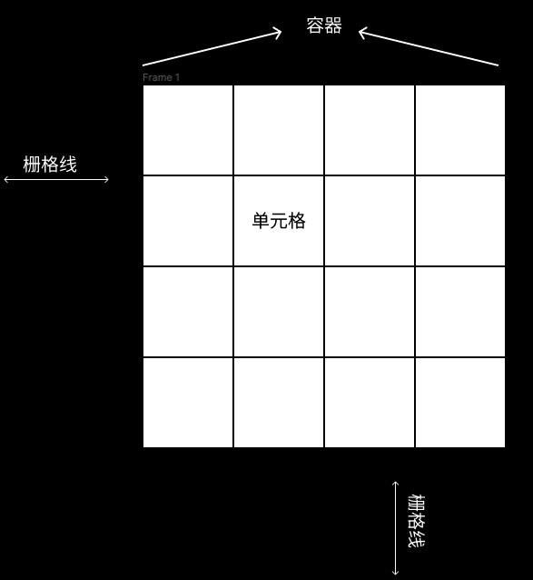
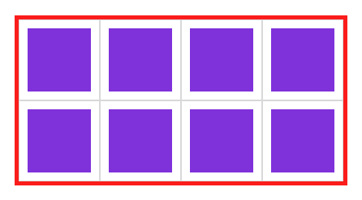
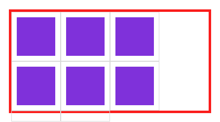
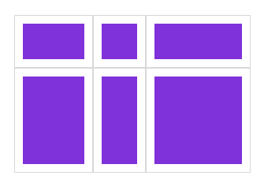
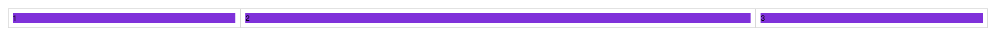
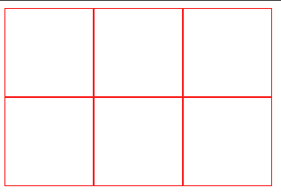
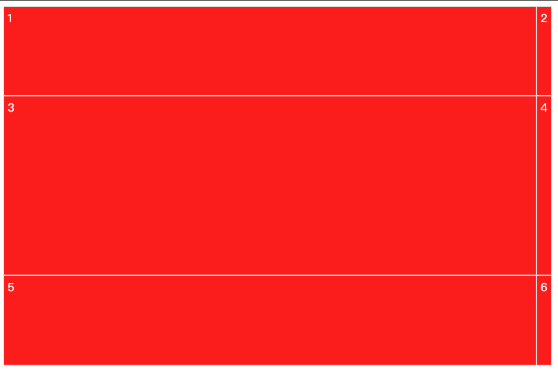
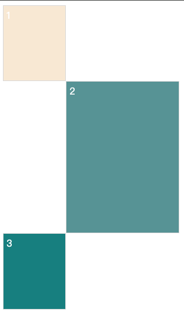

# 栅格系统

## 栅格介绍

css网格布局(Grid Layout)是css中最强大的布局系统，这是个二维系统。它可以同时处理列和行

栅格系统与flex弹性布局有相似处理，都是由父容器包含多个项目元素的使用

## 基本知识

下面了解栅格有关的元素说明，可以帮助你更好的使用栅格。

### 名词解释

css网格布局（Grid Layout）是css中最强大的布局系统。这是一个二维系统，这意味着它可以同时处理列和行。

栅格系统与FLEX弹性布局有相似之处，都是由父容器包含多个项目元素的使用。

 

### 声明容器

#### 块级容器



```html
<!DOCTYPE html>
<html lang="en">
<head>
    <meta charset="UTF-8">
    <meta name="viewport" content="width=device-width, initial-scale=1.0">
    <title>Document</title>
    <style>
        *{
            padding:0;
            margin:0;
        }
        body{
            padding:200px;
        }
        article{
            width:400px;
            height:200px;
            border: solid 5px red;
            display:grid;
            grid-template-rows: 50% 50%;
            grid-template-columns: 25% 25% 25% 25%;
        }
        article div{
            background: blueviolet;
            background-clip: content-box;
            padding:10px;
            border: solid 1px #ddd;
        }
    </style>
</head>
<body>
    <article>
        <div></div>
        <div></div>
        <div></div>
        <div></div>
        <div></div>
        <div></div>
        <div></div>
        <div></div>
    </article>
</body>
</html>
```

### 行级容器

```css
display: inline-grid;
```

#### 划分行列

栅格有点类似表格，有`行`和`列`。使用`grid-template-columns`规则可以划分列数，使用`grid-template-rows`划分行数。

#### 固定宽度

使用固定宽度划分两行三列，当容器宽度过大时将漏白。



```html
	<!DOCTYPE html>
<html lang="en">
<head>
    <meta charset="UTF-8">
    <meta name="viewport" content="width=device-width, initial-scale=1.0">
    <title>Document</title>
    <style>
        *{
            padding:0;
            margin:0;
        }
        body{
            padding:200px;
        }
        article{
            width:400px;
            height:200px;
            border: solid 5px red;
            display:grid;
            grid-template-rows: 100px 100px;
            grid-template-columns: 100px 100px 100px;
        }
        article div{
            background: blueviolet;
            background-clip: content-box;
            padding:10px;
            border: solid 1px #ddd;
        }
    </style>
</head>
<body>
    <article>
        <div></div>
        <div></div>
        <div></div>
        <div></div>
        <div></div>
        <div></div>
        <div></div>
        <div></div>
    </article>
</body>
</html>
```

### 百分比

可以使用百分比自动适应容器

```css
display: grid;
grid-template-rows: 50% 50%;
grid-template-columns: 25% 25% 25% 25%;
```

### 重复设置

使用`repeat`统一设置值，第一个参数为重复数量，第二个参数是重复值。

```css
grid-template-rows: repeat(2, 50%);
grid-template-columns: repeat(2, 50%);
```

可以设置多个值来定义重复，下面定义了四列，以`100px 20px`重复排列。

```css
display: grid;
grid-template-rows: repeat(2, 50%);
grid-template-columns: repeat(2, 100px 50px);
```

#### 自动填充

自动填充是根据容器尺寸，自动设置元素尺寸。

```css
width:300px;
height: 200px;
display: grid;
grid-template-rows: repeat(auto-fill, 100px);
grid-template-columns: repeat(auto-fill, 100px);
```

### 比例划分

使用`fr`单位设置元素在空间中 所占的比例，下面按`一份-二份`分成两组共四列。

#### 单位组合



```css
width:300px;
height: 200px;
display:grid;
grid-template-rows: 1fr 2fr;
grid-template-columns: 100px 1fr 2fr;
```

#### 重复定义

```css
width: 300px;
height: 100px;
display: grid;
grid-template-rows: repeat(2, 1fr);
grid-template-columns: repeat(2, 1fr, 2fr);
```

### 自动空间

第二个栅格列使用`auto`来让其获取所有剩余空间



```html
<!DOCTYPE html>
<html lang="en">
<head>
    <meta charset="UTF-8">
    <meta name="viewport" content="width=device-width, initial-scale=1.0">
    <title>Document</title>
    <style>
        *{
            padding:0;
            margin:0;
        }
        body{
            padding:200px;
        }
        article{
            display: grid;
            grid-template-rows: repeat(2, 1fr);
            grid-template-columns: 20vw auto 20vw;
        }
        article div{
            background: blueviolet;
            background-clip: content-box;
            padding:10px;
            border: solid 1px #ddd;
        }
       
    </style>
</head>
<body>
    <article>
        <div>1</div>
        <div>2</div>
        <div>3</div>
    </article>
</body>
</html>
```

#### 组合定义

`grid-template`是`grid-template-rows`、`grid-template-columns`、`grid-template-areas`的三个属性的简写。

使用`grid-template`实现三行三列的布局



```html
<!DOCTYPE html>
<html lang="en">
<head>
    <meta charset="UTF-8">
    <meta name="viewport" content="width=device-width, initial-scale=1.0">
    <title>Document</title>
    <style>
        .app{
            display: grid;
            grid-template: repeat(3, 100px) / repeat(3, 100px);
            width: 300px;
            height: 300px;
        }
        .app > div{
            border: solid 1px red;
            box-sizing: border-box;
        }
    </style>
</head>
<body>
    <div class="app">
        <div></div>
        <div></div>
        <div></div>
        <div></div>
        <div></div>
        <div></div>
    </div>
</body>
</html>
```

使用`grid-template`同时声明`grid-template-rows`、`grid-template-columns`。



```html
<!DOCTYPE html>
<html lang="en">
<head>
    <meta charset="UTF-8">
    <meta name="viewport" content="width=device-width, initial-scale=1.0">
    <title>Document</title>
    <style>
        .app{
            display: grid;
            grid-template: 10vh 20vh 10vh / 30vw 1fr;
            width: 300px;
            height: 100px;
        }   
        .app > div{
            background-color: red;
            color: white;
            border: solid 1px #ddd;
            padding: 5px;
        }
    </style>
</head>
<body>
    <div class="app">
        <div>1</div>
        <div>2</div>
        <div>3</div>
        <div>4</div>
        <div>5</div>
        <div>6</div>
    </div>
</body>
</html>
```

使用`grid-template`定义`grid-template-areas`,有关`grid-template-areas`的使用方法。



```html
<!DOCTYPE html>
<html lang="en">
<head>
    <meta charset="UTF-8">
    <meta name="viewport" content="width=device-width, initial-scale=1.0">
    <title>Document</title>
    <style>
        main{
            display: grid;
            grid-template: "header . ." 10vh ". main ." 20vh "footer footer ." 10vh;
            width: 300px;
        }
        div{
            background-color: antiquewhite;
            border: solid 1px #ddd;
            color: white;
            padding: 5px;
        }
        div:nth-child(2){
            grid-area: 2/2/3/4;
            background-color: cadetblue;
        }
        div:nth-child(3){
            grid-area: 3/1/4/2;
            background-color: darkcyan;
        }
    </style>
</head>
<body>
    <main>
        <div>1</div>
        <div>2</div>
        <div>3</div>
    </main>
</body>
</html>
```

#### minmax

使用`minmax`方法可以设置取值范围，下列在行高在`最小10px-最大1fr`间取值。

```css
width: 300px;
height: 300px;
display: grid;
grid-template-rows: 100px minmax(100px, 1fr);
grid-template-columns: 100px 1fr;
```

#### 间距定义

使用`row-gap`设置行间距

```css
width: 300px;
height:300px;
display: grid;
grid-template-rows: repeat(2, 1fr);
grid-template-columns: repeat(3, 1fr);
row-gap: 30px;
```

使用`column-gap`设置列间距

```css
width: 300px;
height:300px;
display: grid;
grid-template-rows: repeat(2, 1fr);
grid-template-columns: repeat(3, 1fr);
column-gap: 30px;
```

#### 组合定义

使用`gap`定义行和列间距

```css
gap: 20px 10px;
```

统一间距

```css
gap:20px;
```

## 栅格命名

栅格线可以使用命名与编号找到，方便控制指定栅格，或将内容添加到指定栅格中。

### 独立命名

可以为每个栅格独立命名来进行调用

```html
<!DOCTYPE html>
<html lang="en">
<head>
    <meta charset="UTF-8">
    <meta name="viewport" content="width=`, initial-scale=1.0">
    <title>Document</title>
    <style>
        *{
            padding: 0;
            margin: 0;
        }
        body{
            padding-top: 50px;
        }
        article{
            margin: 0 auto;
            width: 300px;
            height: 300px;
            border: solid 5px silver;
            display: grid;
            grid-template-rows: [r1-start] 100px [r1-end r2-start] 100px [r2-end r3-start] 100px [r3-end];
            grid-template-columns: [c1-start] 100px [c1-end c2-start] 100px [c2-start c3-start] 100px [c3-end];
        }
        div{
            background-color: aliceblue;
            background-clip: content-box;
            border: solid 1px black;
            padding: 10px;
            box-sizing: border-box;
            color: white;   
        }
        div:first-child{
            grid-row-start: r2-start;
            grid-column-start: c1-end;
            grid-row-end:r2-end;
            grid-column-end: c3-start;
        }
    </style>
</head>
<body>
    <article>
        <div>1</div>
    </article>
</body>
</html>
```

### 自动命名

对于重复设置的栅格系统会自动命名，使用时使用`c 1 c2`的方式定位栅格。

## 元素定位

| 属性              | 说明         |
| ----------------- | ------------ |
| grid-row-start    | 行开始栅格线 |
| grid-row-end      | 行结束栅格线 |
| grid-column-start | 列开始栅格线 |
| grid-column-end   | 列结束栅格线 |

上面几个样式属性可以使用以下值

| 属性          | 说明                               |
| ------------- | ---------------------------------- |
| Line          | 栅格络                             |
| span 数值     | 栅格包含的栅格数量                 |
| span 区域名称 | 栅格包含到指定的区域名称           |
| auto          | 自动设置，默认为一个网格宽度和高度 |

### 根据栅格线

通过设置具体的第几条栅格线来设置区域位置，设置的数值可以是整数和负数。

```css
grid-row-start: 2;
grid-row-end:4;
grid-column-start:2;
grid-column-end:4;
```

### 根据偏移量

使用`span`可以设置包含栅格的数量或包含到的区域名称。

### 简写模式

可以使用`grid-row`设置行开始栅格线，使用`grid-column`设置结束栅格线。

```css
grid-row: 2/4;
grid-column: 2/4;
```

### 区域定位

通过`grid-area`属性可以将元素放在指定区域中  。`grid-area`由`grid-row-start`、`grid-column-start`、`grid-row-end、`grid-column-end`的简写模式。

```css
grid-area: 2/2/4/4;
```

### 命名定位

可以使用栅格线命名来附加元素

### 区域声明

区域由多个单元格构成，使用`grid-template-areas`可以定义栅格区域，并且栅格区域必须是矩形的。

### 区域布局

```css
grid-template: "栅格名称 栅格名称 栅格名称 栅格名称" 行高；

grid-template: "栅格名称 栅格名称 栅格名称 栅格名称" 行高/列宽 列宽 列宽 列宽；
```

## 栅格流动

在容器中设置`grid-auto-flow`属性可以改变单元格排列方式。

| 选项   | 说明                 |
| ------ | -------------------- |
| column | 按列排序             |
| row    | 按行排序             |
| dense  | 元素使用前面空余栅格 |

### 强制填充

当元素在栅格中放不下时，将会发生换行产生留白，使用`grid-auto-flow:row dense;`可以执行填充空白区域操作。

## 对齐管理

通过属性方便的定义栅格或元素的对齐方式

| 选项            | 说明                                             |
| --------------- | ------------------------------------------------ |
| justify-content | 所有栅格在容器中水平对齐方式，容器有额外空间时   |
| align-content   | 所有栅格在容器中的垂直对齐方式，容器有额外空间时 |
| align-items     | 栅格内所有元素的垂直排列方式                     |
| justify-items   | 栅格内所有元素的横向排列方式                     |
| align-self      | 元素在栅格中垂直对齐方式                         |
| justify-self    | 元素在栅格中水平对齐方式                         |

### 栅格对齐

justify-content与align-content用于控制栅格的对齐方式，比如在栅格的尺寸小于容器的心里时，控制栅格的布局方式。

justify-content属性的值如下

| 值            | 说明                                                         |
| ------------- | ------------------------------------------------------------ |
| start         | 容器左边                                                     |
| end           | 容器右边                                                     |
| center        | 容器中间                                                     |
| stretch       | 撑满容器                                                     |
| space-between | 第一个栅格靠左边，最后一个栅格靠右边，余下元素平均分配空间   |
| space-around  | 每个元素两侧的间隔相等，所以，栅格之间的间隔比栅格与容器边距的间隔大一倍 |
| space-evenly  | 栅格间距离完全平均分配                                       |

align-content属性的值如下

| 值            | 说明                                                         |
| ------------- | ------------------------------------------------------------ |
| start         | 容器顶边                                                     |
| end           | 容器底边                                                     |
| center        | 容器垂直中间                                                 |
| stretch       | 撑满容器                                                     |
| space-between | 第一个栅格靠左边，最后一个栅格靠右边，余下元素平均分配空间   |
| space-around  | 每个元素两侧的间隔相等，所以栅格之间的间隔比栅格与容器边距的间隔大一倍 |
| space-evenly  | 栅格间距离完全平均分配                                       |

### 元素对齐

justify-items与align-items用于控制所有栅格内元素的对齐方式

justify-items用于控制元素的水平对齐方式，可用的属性值如下

| 值      | 说明               |
| ------- | ------------------ |
| start   | 元素对齐栅格左边   |
| end     | 元素对齐栅格的右边 |
| center  | 元素对齐栅格的空间 |
| stretch | 水平撑满栅格       |

align-items用于控制元素的垂直对齐方式，可用的属性值如下

| 值      | 说明                   |
| ------- | ---------------------- |
| start   | 元素对齐栅格的顶边     |
| end     | 元素对齐栅格的底边     |
| center  | 元素对齐栅格的垂直中间 |
| stretch | 垂直撑满栅格           |

### 元素独立控制

justify-self和align-self控制单个栅格内元素的对齐方式，属性值与justify-items和align-items是一致的

### 组合简写

place-content

用于控制栅格的对齐方式，语法如下

```
place-content:<align-content> <justify-content>
```

place-items

控制所有元素的对齐方式，语法结构如下

```
place-items:<align-items><justify-items>
```

place-self

控制单个元素的对齐方式

```
place-self:<align-self><justify-self>
```

### 自动排列

当栅格无法放置内容时，系统会自动添加栅格用于放置溢出的元素，我们需要控制自动添加栅格的尺寸。

| 选项              | 说明                                                  |
| ----------------- | ----------------------------------------------------- |
| grid-auto-rows    | 控制自动增加的栅格行的尺寸，grid-auto-flow:row;为默认 |
| grid-auto-columns | 控制自动增加的栅格列的尺寸，grid-auto-flow:column;    |

### 自动栅格行

```css
grid-auto-rows:50px;
grid-auto-columns:200px;
```

#### 终极简写

grid是简写属性

```
显式网格属性 grid-template-rows grid-template-columns grid-template-areas
隐式网格属性 grid-auto-rows grid-auto-columns grid-auto-flow
间距属性 grid-columns-gap grid-row-gap
```

