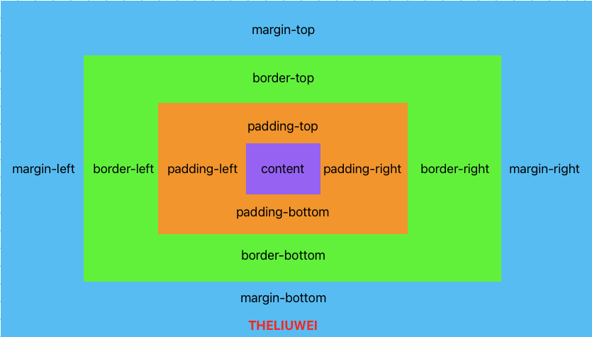

# 盒子模型

## 盒子模型



基本使用示例

```html
<!DOCTYPE html>
<html lang="en">
<head>
  <meta charset="UTF-8">
  <meta name="viewport" content="width=device-width, initial-scale=1.0">
  <title>Document</title>
  <style>
    a{
      display: inline-block;
      border:solid 1px #ddd;
      text-align:center;
      padding:10px 20px;
      margin-right:30px;
    }
  </style>
</head>
<body>
 <a href="">html</a>
 <a href="">css</a>
 <a href="">javascript</a>
</body>
</html>
```

### 外边距

#### 声明定义边距顺序依次为：上右下左。是顺时针方向的。

```html
<!DOCTYPE html>
<html lang="en">
<head>
  <meta charset="UTF-8">
  <meta name="viewport" content="width=device-width, initial-scale=1.0">
  <title>Document</title>
  <style>
    main{
      border: solid 1px red;
      width:500px;
      height: 500px;
      margin:0 auto;
    }
    h2{
      border:solid 1px green;
      width: 300px;
      height: 300px;
      margin: 50px 70px 100px 200px;
    }
  </style>
</head>
<body>
  <main>
    <h2>THELIUWEI</h2>
  </main>
</body>
</html>
```

### 居中设置

`margin`设置成 auto后，浏览器会自动将盒子居中。                                                                                                                                                                                                                                                                                                                                                                                                                                                                                                                                                                                                                                                                                                                                                                                                                                                                                                                                                                                                                                                                                                                                                                                                                                                                                                                                                                                                                                                                                                                                                                                                                                                                                                                                                                                                                                                                                                                                                                                                                                                                                                                                                                                                                                                                                                                                                                                                                                                                                                                                                                                                                                                                                                                                                                                                                                                                                                                                                                                                                                                                                                                                                                                                                                                                                                                                                                                                                                                                                                                                                                                                                                                                                                                                                                                                                    

### 负值设置

```css
margin-left:-50px;
margin-top:-50px;
```

### 边距合并

相邻元素的纵向外边距会进行合并

```html
<!DOCTYPE html>
<html lang="en">
<head>
  <meta charset="UTF-8">
  <meta name="viewport" content="width=device-width, initial-scale=1.0">
  <title>Document</title>
  <style>
    h2 {
      border: solid 1px red;
      margin-bottom: 20px;
    }
    h3{
      border: solid 1px green;
      height:20px;
    }
  </style>
</head>
<body>
  <h2>hello</h2>
  <h2>world</h2>
</body>
</html>
```

### 内边距

内边距使用`padding`进行定义，使用语法与`margin`相似。

```html
<!DOCTYPE html>
<html lang="en">
<head>
  <meta charset="UTF-8">
  <meta name="viewport" content="width=device-width, initial-scale=1.0">
  <title>Document</title>
  <style>
    h2 {
      border: solid 1px red;
      padding: 10px 30px;
    }
    h3{
      border: solid 1px green;
      height:20px;
    }
  </style>
</head>
<body>
  <h2>hello</h2>
  <h2>world</h2>
</body>
</html>
```

### box-sizing

宽度和高度包括内边距和边框

```html
<!DOCTYPE html>
<html lang="en">
<head>
  <meta charset="UTF-8">
  <meta name="viewport" content="width=device-width, initial-scale=1.0">
  <title>Document</title>
  <style>
    h2 {
      border: solid 1px red;
      padding: 10px 30px;
      box-sizing: border-box;
    }
    h3{
      border: solid 1px green;
      height:20px;
    }
  </style>
</head>
<body>
  <h2>hello</h2>
  <h2>world</h2>
</body>
</html>
```

## 边框设计

### `border-style`样式选择

| 类型   | 描述                                            |
| ------ | ----------------------------------------------- |
| none   | 定义无边框                                      |
| dotted | 定义点状边框，在大多数浏览器中呈现实线          |
| dashed | 定义虚线，大多数浏览器中呈现实线                |
| solid  | 定义实线                                        |
| double | 定义双线，双线的宽度等于border-width的值        |
| groove | 定义3d 凹槽边框，其效果取决于border-color的值   |
| ridge  | 定义3d 垄装边框，其效果取决于border-color的值   |
| inset  | 定义3d inset边框，其效果取决于border-color的值  |
| outset | 定义3d outset边框，其效果取决于border-color的值 |

```css
border-style:double;
or
border-style:outset solid dotted double;
```

单独设计一边样式

| 规则                | 说明 |
| ------------------- | ---- |
| border-top-style    | 顶边 |
| border-right-style  | 右边 |
| border-bottom-style | 下边 |
| border-left-style   | 左边 |
| border-style        | 四边 |

### 边框宽度

`border-width`

| 规则                | 说明 |
| ------------------- | ---- |
| border-top-width    | 顶边 |
| border-right-width  | 右边 |
| border-bottom-width | 下边 |
| border-left-width   | 左边 |
| border-width        | 四边 |

### 边框颜色

| 规则                | 说明 |
| ------------------- | ---- |
| border-top-color    | 顶边 |
| border-right-color  | 右边 |
| border-bottom-color | 下边 |
| border-left-color   | 左边 |
| border-color        | 四边 |

### 圆角边框

`border-radius`

| 规则                       | 说明 |
| -------------------------- | ---- |
| border-top-left-radius     | 上左 |
| border-top-right-radius    | 上右 |
| border-bottom-left-radius  | 下左 |
| border-bottom-right-radius | 下右 |
| border-radius              | 四角 |

```css
border-raduis:20px;
```

### 轮廓线

元素在获取焦点时产生轮廓线，并且轮廓线不占用空间。可以使用伪类`:focus`定义样式。

轮廓线显示在边框外面

轮廓线不影响页面布局

#### `outline-style`线条样式

| 值     | 说明                                             |
| ------ | ------------------------------------------------ |
| none   | 默认，定义无轮廓。                               |
| dotted | 定义点状轮廓                                     |
| dashed | 定义虚线轮廓                                     |
| solid  | 定义实线轮廓                                     |
| double | 定义双线轮廓，双线的宽度等于outline-width的值。  |
| groove | 定义3d 凹槽轮廓，此效果取决于outline-color的值。 |
| ridge  | 定义3d 凸槽轮廓，此效果取决于outline-color的值。 |
| inset  | 定义3d 凹边轮廓，此效果取决于outline-color的值。 |
| outset | 定义3d 凸边轮廓，此效果取决于outline-color的值。 |

```css
outline-style: double;
```

### 线条宽度

```css
outline-width:10px;
```

### 线条颜色

```css
outline-color:red;
```

### 线条组合定义

```css
outline: red solid 20px;
```

### 输入框轮廓线

输入框默认有轮廓线，但有时不好看，使用以下样式规则去除。

```css
input:focus{
	outline:none;
}
```

## display

控制元素显示隐藏

使用`display`控制元素的显示机制

| 值           | 说明                        |
| ------------ | --------------------------- |
| none         | 隐藏元素                    |
| block        | 显示为块元素                |
| inline       | 显示为行元素，不能设置宽/高 |
| inline-block | 行级块元素，允许设置宽/高   |

### 行元素转块元素

```html
<!DOCTYPE html>
<html lang="en">
<head>
  <meta charset="UTF-8">
  <meta name="viewport" content="width=device-width, initial-scale=1.0">
  <title>Document</title>
  <style>
  a{
    border: solid 1px red;
    display:block;
    margin-bottom: 50px;
  }
  </style>
</head>
<body>
  <a href="">theliuwei.com</a>
  <a href="">theliuwei.com</a>
  <a href="">theliuwei.com</a>
</body>
</html>
```

### 块元素转行元素

```html
<!DOCTYPE html>
<html lang="en">
<head>
  <meta charset="UTF-8">
  <meta name="viewport" content="width=device-width, initial-scale=1.0">
  <title>Document</title>
  <style>
  ul>li{
    display: inline;
    padding: 5px 10px;
    border: solid 1px red;
  }
  ul>li:hover{
    background:green;
    color:white;
    cursor:pointer;
  }
  </style>
</head>
<body>
<ul>
  <li>theliuwei.com</li>
  <li>www.theliuwei.com</li>
  <li>hello world</li>
</ul>
</body>
</html>
```

### 行级块使用

行级块元素（inline-block）是具有**行内元素**和**块级元素**特性的元素。这意味着它既可以在同一行中与其他元素并排显示，又可以像块级元素一样占据整个可用宽度并自动换行

```html
<!DOCTYPE html>
<html lang="en">
<head>
  <meta charset="UTF-8">
  <meta name="viewport" content="width=device-width, initial-scale=1.0">
  <title>Document</title>
  <style>
    a{
      display:inline-block;
      width:500px;
      height:200px;
      border:solid 1px red;
      text-align:center;
      line-height:3em;
    }
  </style>
</head>
<body>
<a href="">html</a>
<a href="">css</a>
<a href="">javascript</a>
</body>
</html>
```

visibility

控制元素显示隐藏，在隐藏后空间的位置也占用着。

```html
<!DOCTYPE html>
<html lang="en">
<head>
  <meta charset="UTF-8">
  <meta name="viewport" content="width=device-width, initial-scale=1.0">
  <title>Document</title>
  <style>
    article{
      padding:30px;
      border:solid 1px red;
      width:200px;
    }
    article div{
      width:100px;
      height:100px;
      border:solid 2px red;
      padding:20px;
    }
    article div:nth-of-type(1){
      visibility:hidden;
    }
  </style>
</head>
<body>
  <article>
    <div></div>
    <div></div>
  </article>
</body>
</html>
```

### 溢出控制

`overflow`内容溢出隐藏控制

| 值     | 说明                                                     |
| ------ | -------------------------------------------------------- |
| hidden | 内容溢出隐藏                                             |
| scroll | 显示滚动条（有些浏览器一直显示，有些浏览器滚动时才显示） |
| auto   | 根据内容自动处理滚动条                                   |

```html
<!DOCTYPE html>
<html lang="en">
<head>
  <meta charset="UTF-8">
  <meta name="viewport" content="width=device-width, initial-scale=1.0">
  <title>Document</title>
  <style>
  div{
    width:400px;
    height: 100px;
    border: solid 1px #ddd;
    padding:20px;
    overflow:hidden;
  }
  </style>
</head>
<body>
<div>哈哈哈哈哈哈哈哈哈哈哈哈哈哈哈哈哈哈哈哈哈哈哈哈哈哈哈哈哈哈哈哈哈哈哈哈哈哈哈哈哈哈哈哈哈哈哈哈哈哈哈哈哈哈哈哈哈哈哈哈哈哈哈哈哈哈哈哈哈哈哈哈哈哈哈哈哈哈哈哈哈哈哈哈哈哈哈哈哈哈哈哈哈哈哈哈哈哈哈哈哈哈哈哈哈哈哈哈哈哈哈哈哈哈哈哈哈哈哈哈哈哈哈哈哈哈哈哈哈哈哈哈哈哈哈哈哈哈哈哈哈哈哈哈哈哈哈哈哈哈哈哈哈哈哈哈哈哈哈哈哈哈哈哈哈哈哈哈哈哈哈哈哈哈哈哈哈哈哈哈哈哈哈哈哈哈哈哈哈哈哈哈哈哈哈哈哈哈哈哈哈哈哈哈哈哈哈哈哈哈哈哈哈哈哈哈哈哈哈哈哈哈哈哈哈哈哈哈哈哈哈哈哈哈哈哈哈哈哈哈哈哈哈哈哈哈哈哈哈哈哈哈哈哈哈哈哈哈哈哈哈哈哈哈哈哈哈哈哈哈哈哈哈哈哈哈哈哈哈哈哈哈哈哈哈哈哈哈哈哈哈哈哈哈哈哈哈哈哈哈哈哈哈哈哈哈哈哈哈哈哈哈哈哈哈哈哈哈哈哈哈哈哈哈哈哈哈哈哈哈哈哈哈哈哈哈哈哈哈哈哈哈哈哈哈哈哈哈哈哈哈哈哈哈哈哈哈哈哈哈哈哈哈哈哈哈哈哈哈哈哈哈哈哈哈哈哈哈哈哈哈哈哈哈哈哈哈哈哈哈哈哈哈哈哈哈哈哈哈哈哈哈哈哈哈哈哈哈哈哈哈哈哈哈哈哈哈哈哈哈哈哈哈哈哈哈哈哈哈哈哈哈哈哈</div>
</body>
</html>
```

### 溢出产生滚动条

```
overflow:scroll
```

### 单行文本溢出处理方式

`text-overflow`

```css
div{
	width: 400px;
	height:100px;
	border: solid 1px red;
	padding:20px;
	overflow:hidden;
	text-overflow:ellipsis;
	white-space:nowrap;
}
```

### 多行文本溢出处理方式 

```css
div{
	width:200px;
	overflow:hidden;
	display: -webkit-box;
	-webkit-line-clamp:3;
	-webkit-box-orient: vertical;

}
```

### 尺寸定义

可以使用多种方式为元素设置宽、高尺寸。

| 选项           | 说明             |
| -------------- | ---------------- |
| width          | 宽度             |
| height         | 高度             |
| min-width      | 最小宽度         |
| min-height     | 最小高度         |
| max-width      | 最大宽度         |
| max-height     | 最大高度         |
| fill-available | 撑满可用空间     |
| fill-content   | 根据内容适应尺寸 |

### min&max

不希望图片太大造成溢出`div` ，也不希望太小影响美观。使用下面代码进行约束。

```css
div{
	width: 400px;
	border: solid 1pd red;
	padding: 20px;
}

div img{
	min-width: 50%;
	max-width: 90%;
}
```

### fill-available

在`chrome`浏览器中使用前缀`-webkit`书写样式，下面是行块元素可以撑满可用空间。

```html
<!DOCTYPE html>
<html lang="en">
<head>
  <meta charset="UTF-8">
  <meta name="viewport" content="width=device-width, initial-scale=1.0">
  <title>Document</title>
  <style>
    *{
      padding:0px;
      margin:0px;
    }
    body{
      background-color: #f2f2f2;
      width: 100vw;
      height: 100vh;
    }
    main{
      background-color: #9b59b7;
      height: 100px;
      padding:20px;
      box-sizing: border-box;
    }
    span{
      background-color: #e67e22;
      display: inline-block;
      width: -webkit-fill-available;
      height: -webkit-fill-available;
    }
  </style>
</head>
<body>
  <main>
    <span>theliuwei.com</span>
  </main>
</body>
</html>
```

### fit-content

根据内容自动适应宽度，让元素居中显示。

```html
<!DOCTYPE html>
<html lang="en">
<head>
  <meta charset="UTF-8">
  <meta name="viewport" content="width=device-width, initial-scale=1.0">
  <title>Document</title>
  <style>
      *{
        padding:0px;
        margin: 0px;
      }
      body{
        height: 100vh;
        width: 100vw;
        background-color: aqua;
      }
      h2{
        text-align:center;
        background-color: bisque;
        width: fit-content;
        margin:auto;
      }
  </style>
</head>
<body>
  <h2>theliuwei.com</h2>
</body>
</html>
```

### min-content

`min-content`将容器尺寸按照最小元素宽度设置。

```html
<!DOCTYPE html>
<html lang="en">
<head>
  <meta charset="UTF-8">
  <meta name="viewport" content="width=device-width, initial-scale=1.0">
  <title>Document</title>
  <style>
      *{
        padding:0px;
        margin: 0px;
      }
      body{
        height: 100vh;
        width: 100vw;
        background-color: aqua;
      }
      main{
        width: min-content;
        margin:auto;
      }
      div{
        margin-bottom: 20px;
        background-color: beige;
        word-break:break-all;
        padding:10px;
      }
      div:nth-child(1){
        width: 100px;
      }
  </style>
</head>
<body>
  <main>
    <div>hello world</div>
    <div>theliuwei.com</div>
  </main>
</body>
</html>
```

### max-content

`max-content`将容器尺寸按照最大元素宽度设置

```html
<!DOCTYPE html>
<html lang="en">
<head>
  <meta charset="UTF-8">
  <meta name="viewport" content="width=device-width, initial-scale=1.0">
  <title>Document</title>
  <style>
      *{
        padding:0px;
        margin: 0px;
      }
      body{
        height: 100vh;
        width: 100vw;
        background-color: aqua;
      }
      main{
        width: max-content;
        margin:auto;
      }
      div{
        margin-bottom: 20px;
        background-color: beige;
        word-break:break-all;
        padding:10px;
      }
      div:nth-child(1){
        width: 100px;
      }
  </style>
</head>
<body>
  <main>
    <div>hello world</div>
    <div>theliuwei.com</div>
  </main>
</body>
</html>
```

