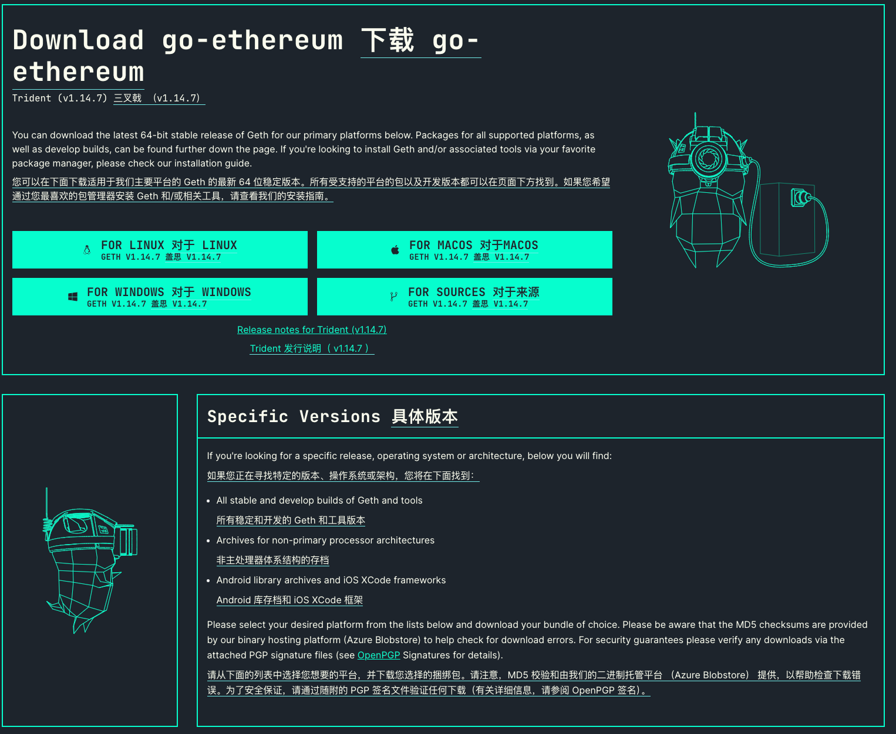

# 使用Go语言建立web3区块链开发

## 区块链

区块链（英语：blockchain或block chain）是**借由密码学与共识机制等技术建立与存储庞大交易资料链的点对点网络系统**。 每一个区块包含了前一个区块的加密散列、相应时间戳记以及交易资料（通常用默克尔树（Merkle tree）算法计算的散列值表示），这样的设计使得区块内容具有难以篡改的特性。

## Web3

**Web3**（也被称为**Web 3.0**，又写为**web3**[[1\]](https://zh.wikipedia.org/wiki/Web3#cite_note-1)）是关于[万维网](https://zh.wikipedia.org/wiki/全球資訊網)发展的一个概念，主要与基于[区块链](https://zh.wikipedia.org/wiki/区块链)的去中心化、[加密货币](https://zh.wikipedia.org/wiki/加密貨幣)以及[非同质化代币](https://zh.wikipedia.org/wiki/非同質化代幣)有关。[[2\]](https://zh.wikipedia.org/wiki/Web3#cite_note-Bloomberg_2021_Jack_Dorsey-2)[[3\]](https://zh.wikipedia.org/wiki/Web3#cite_note-3)与区块链有关的Web3概念是由[以太坊](https://zh.wikipedia.org/wiki/以太坊)联合创始人[Gavin Wood](https://zh.wikipedia.org/w/index.php?title=Gavin_Wood&action=edit&redlink=1)于2014年提出，并于2021年受到[加密货币](https://zh.wikipedia.org/wiki/加密貨幣)爱好者、大型科技公司和[创业投资](https://zh.wikipedia.org/wiki/創業投資)公司的关注。


# 欢迎来到go-ethereum

Go-ethereum（又名 Geth）是一个内置于 Go 的以太坊客户端。它是原始和最受欢迎的以太坊客户端之一。这些文档页面旨在帮助用户下载、安装和使用 Geth。

## 从这里去哪里

首先，确保您有足够的硬件，然后下载并安装 Geth。确保您熟悉安全注意事项，并已设置防火墙。

如果您刚刚开始使用 Geth，请前往 入门页面。该页面指导新用户了解 Geth 的一些基本功能，例如创建和保护帐户以及进行交易。

然后，建议阅读“基础”部分中的材料 - 这些页面将有助于从用户的角度和幕后构建对 Geth 工作方式的基本理解。

还提供更高级的主题 - 使用侧边栏探索它们！

## 下载 go-ethereum

### 方式1

在有golang环境的电脑上安装go-ethereum，使用下面命令安装

```python
go get github.com
```


### 方式2

官方下载网址

```shell
https://geth.ethereum.org/downloads
```



## 开发者和贡献者

如果您想帮助开发 Geth 或在其上构建去中心化应用程序，请前往我们的开发者文档。