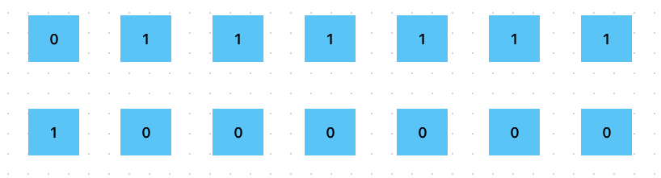
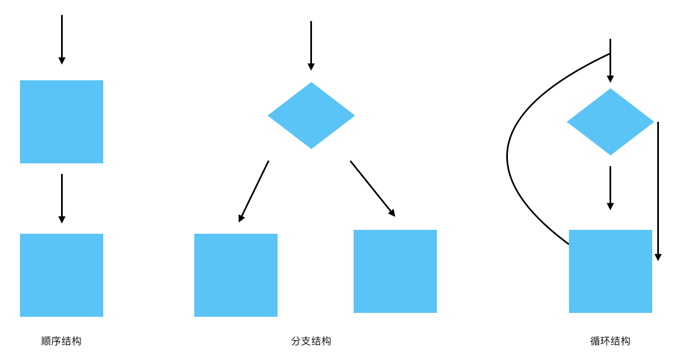
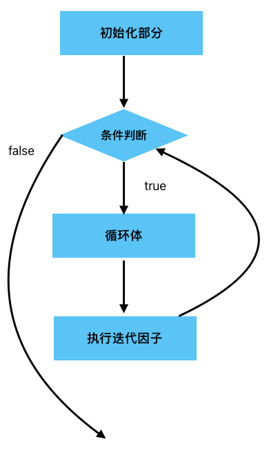
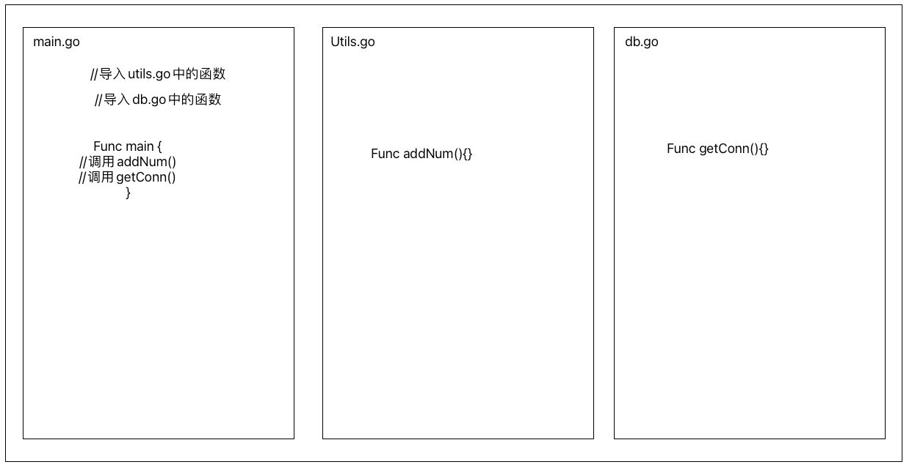
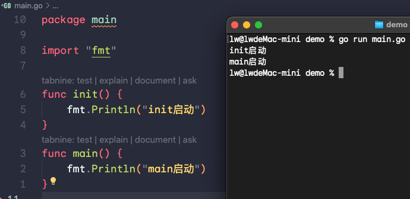
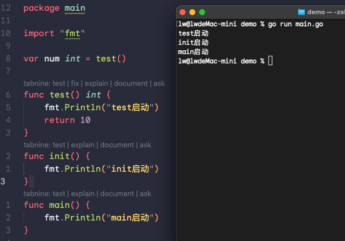
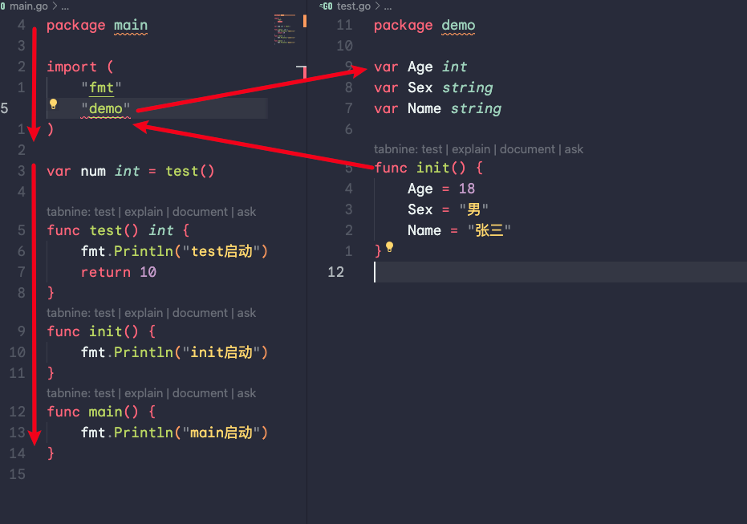
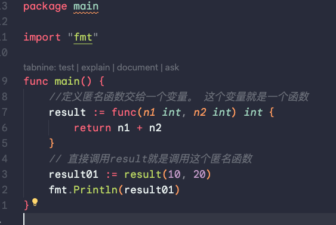
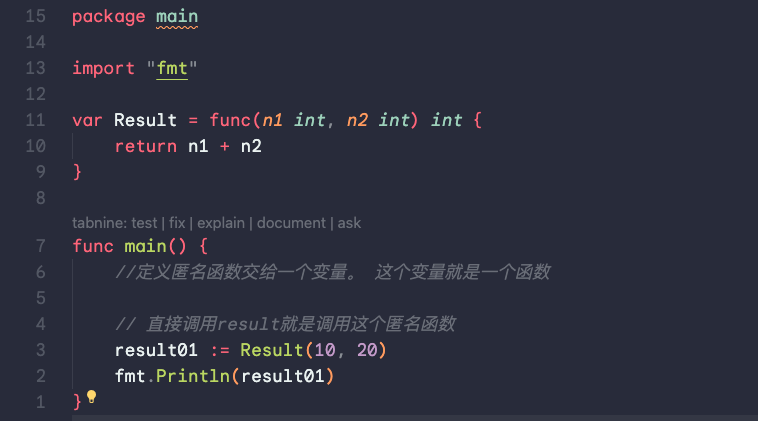

#                  基础知识

## 简介

Go（又称Golang）是Google开发的一种静态强类型、编译型、并发型。具有垃圾回收功能的编程语言。

Go语言是由谷歌2007年创建，2009年11月正式宣布推出，成为开放源代码项目。并在Linux和Mac OS X平台上进行了实现。

Go的作者是罗布特、罗勃派克、肯汤姆逊开发的。

## 描述

Go的语言接近C语言，但对于变量的声明有所不同。Go支持垃圾回收功能。Go的并行模型是以东尼霍尔的通信顺序进程（CSP）为基础，采用类似模型的其他语言包括Occam和Limbo,但是它具有Pi运算的特征，比如通道传输，在1.8版本中开放插件(Plugin)的支持,这意味着现在能从Go中动态加载部分函数。

与C++相比，Go并不包括如枚举、异常处理、继承、泛型、断言、虚函数等功能，但增加了切片(Slice)、并发、管道、垃圾回收、接口等特性等语言支持。Go2.0版本支持泛型，对于断言的存在，则持负面态度。同时也为自己不提供类型继承来辩护。

不同与Java，Go内嵌了关联数组（也称为哈希表（Hashes）或字典（Dictionaries）

## 撰写风格

在Go中有几项规定，当不匹配以下规定时编译将产生错误。

- 每行程序结束后不需要写分号（;）
- 大括号({})不能够换行放置
- if判断和for循环不需要以小括号包括起来 

## 特点

1. 背靠大厂
2. 天生支持并发
3. 语法简单，上手快
4. 内置runtime，支持垃圾回收
5. 直接编译机器码，不依赖其他库
6. 丰富的标准库
7. 跨平台编译

源代码编译成机器码，意味着通常优于解释性语言，因其极快的编译速度而出名。通过依存分析使其成为可能。尽管它是静态类型语言，执行类型判断来让语法更简洁和实用。也有包和模块系统，方便在项目间导入和导出代码。

## 应用领域

- 服务器、游戏软件工程师
- 分布式、云计算软件工程师
- 区块链工程师

## 优势

go语言适合做高并发的工作

## 工具介绍

visual studio code就可以开发go语言。它可以运行在macos、windows、linux操作系统上。

## 编程工具安装

### 下载

https://code.visualstudio.com/download

### 安装

#### windows安装vscode

1. 打开安装包
2. 勾选我同意此协议，点击下一步。
3. 选择软件安装位置，建议放D盘。
4. 点击下一步
5. 可选项：勾选创建桌面快捷方式
6. 勾选添加到PATH（重启后生效）
7. 点击下一步
8. 点击安装
9. 点击完成

## 安装扩展

1. 打开vscode中的扩展
2. 搜索go
3. 点击安装


## 新建go文件

在空文件夹新建一个后缀为.go的空文件，声明main函数。它是程序开始执行的地方，go有标准的核心包库。用于处理常用的需求，像网络、数学、打印、格式化IO等。通过 `import` 命令进行导入。

```go
// hello.go
package main

import "fmt" 

func main(){
	fmt.Println("hello go");	
}
```

## 运行项目

终端执行代码

```shell
go run hello.go
```

## 打包项目

终端执行代码

```shell
go build main.go
```

文件夹中就会出现后缀为.exe的同名文件。

##  依赖项

远程链接GitGub上的包，先要对文件夹进行用于初始化Go模块的命令

```shell
go mod init package_name
```

`package_name`是您要初始化的模块的名称。在执行此命令时，它将创建一个名为 `go.mod` 的文件，该文件包含有关模块的基本信息，如模块名称、版本控制等。

## 注释

Go语言提供了类似c语言风格的注释，`/* */`和`//`

### 行注释

```go
//
```

### 块注释

```go
/* */
```

### 包注释

每个包都应该有一个包注释来介绍这个包。包注释包括包的简介，概述和功能。

特别在大型的包中，包注释可以提供API最重要部分的简要概述。并根据需要链接到其他文档注释。

```go
// 包注释内容
package main
```

### 结构体注释

#### 简单结构体注释

结构体注释应该解释该类型的每个实例所代表的含义或者提供的内容。如果API很简单，文档注释可以很短。

```go
package zip
type Reader struct {

}
```

### 方法注释

```go
package strconv
//方法注释内容

func Quote(s string) string{
  
}
```

## 变量

一个程序就是一个世界，不论哪种编程语言，变量都是其程序的基本组成单位。

### 介绍

变量相当于内存中一个数据存储空间的表示

#### 使用步骤

1. 声明
2. 赋值
3. 使用

#### 声明

```go
var a string
```

#### 赋值

```go
a = "hello"
```

#### 使用

```go
fmt.Println(a)
```

### 声明和赋值合在一起使用

```go
var age int = 20
```

注意：变量的重复定义会报错，变量的类型定义与数据不匹配会报错。

#### 变量的4种使用形式

```go
package main
import "fmt"

func main(){
  //第一种使用形式
  var num int 18
  fmt.Println(num)
  //第二种使用形式 
  var num2 int
  fmt.Println(num2) //不赋值，int类型默认值是0
  //第三种使用形式
  var num3 = 10 //如果没有写变量的类型，go会根据变量后面的值进行判断变量的类型（自动类型推断机制）
  //第四种使用形式
  num4 := 20 //省略var关键字，注意 := 不能写成 =
}
```

#### 支持一次性声明多个变量（多变量声明）

```go
package main
import "fmt"

func main(){
	var n1, n2, n3
  fmt.Println(n1)
  fmt.Println(n2)
  fmt.Println(n3)
  var n4,n5,n6 = 4,5,6
  fmt.Println(n4)
  fmt.Println(n5)
  fmt.Println(n6)
}
```

### 全局变量

在函数外定义的变量

```go
package main
import "fmt"
//全局变量，定义在函数外的变量
var n7 = 200
var n8 = 300
//一次性声明，简化上面的写法。 
var (
	n9 = 400
  n10 = 500
)
func main(){
	var n1, n2, n3
  fmt.Println(n1)
  fmt.Println(n2)
  fmt.Println(n3)
  var n4,n5,n6 = 4,5,6
  fmt.Println(n4)
  fmt.Println(n5)
  fmt.Println(n6)
}
```


## 数据类型

### 基本数据类型

#### 布尔型bool

布尔型的只只可以是常量true或者false

```go
var a bool = true
```

#### 数字类型

二进制如何看正数，从左往右数第一位是0，那就是正数。

二进制如何看负数，从左往右数第一位是1，那就是负数。

口诀：左一为零是正数，左一为一是负数。 



#### 有符号整数类型

| 类型  | 有无符号 | 占用存储空间 | 表数范围               |
| ----- | -------- | ------------ | ---------------------- |
| int8  | 有       | 1字节        | -128~127               |
| int16 | 有       | 2字节        | -32768~32767           |
| int32 | 有       | 4字节        | -2147483648~2147483647 |
| int64 | 有       | 8字节        | $-2^63~2^63-1$         |

#### 无符号整数类型

| 类型   | 有无符号 | 占用存储空间 | 表数范围 |
| ------ | -------- | ------------ | -------- |
| uint8  | 无       | 1字节        | 0～255   |
| uint16 | 无       | 2字节        | 0～2^6-1 |
| uint32 | 无       | 4字节        | 0~2^31-1 |
| uint64 | 无       | 8字节        | 0~2^63-1 |

#### 其他整数类型

| 类型 | 有无符号 | 占用存储空间                       | 表数范围                |
| ---- | -------- | ---------------------------------- | ----------------------- |
| int  | 有       | 32位系统-4字节<br />64位系统-8字节 | -2^31~2^31-1            |
| uint | 无       | 32位系统-4字节<br />64位系统-8字节 | 0～2^32-1<br />0~2^64-1 |
| rune | 有       | 等价int32                          | -2^31~2^31-1            |
| byte | 无       | 等价uint8                          | 0~255                   |

#### 浮点类型

| 类型    | 存储空间 | 表数范围             |
| ------- | -------- | -------------------- |
| float32 | 4字节    | -3.403E38~3.403E38   |
| float64 | 8字节    | -1.798E308~1.798E308 |

程序员在保证程序正确运行下，尽量在写代码的时候使用占用内存空间小的类型。

#### 获取数据的类型

```go
func main(){
  var data = 10
	fmt.Println("数据的类型是: %T", data)
}
```

#### 获取数据的占用的字节

```go
import (
	"unsafe"
  "fmt"
)

func main(){
  var data = 10
	fmt.Println(unsafe.Sizeof(data))
}
```


- 数值型
    - 整数类型
        - int
            - 占用存储空间32位系统-4字节
        - int8
            - 占用存储空间1字节
        - int16
            - 占用存储空间2字节
        - int32
            - 占用存储i空间4字节
        - int64
            - 占用存储空间8字节
        - uint
        - uint8
            - 占用存储空间1字节
        - uint16
            - 占用存储空间2字节
        - uint32
            - 占用存储空间4字节
        - uint64
            - 占用存储空间8字节
        - byte
            - 所有数据都可以使用byte
    - 浮点类型
        - float32
            - 占用存储空间4字节
        - float64
            - 占用存储空间8字节
- 字符型
    - 没有单独的字符型，使用byte来保存单个字母字符
- 布尔型
- 字符串

> [!NOTE]
>
> 底层存储空间和操作系统无关
>
> 浮点类型底层存储：符号位+指数位+尾数位，所以尾数位只是存了一个大概，很可能出现精度的损失。

#### 字符型

1. go语言没有专门的字符类型，如果要存储单个字符（字母），一般使用`byte`来保存。
2. go语言中字符使用UTF-8编码
3. 字符类型，本质上就是一个整数，也可以直接参与运算，输出字符的时候，会将对应的码值进行输出
4. 字母、数字、标点符号等字符，按照ASCII码进行存储
5. 汉字字符，底层对应的是Unicode码值
6. go语言的字符对应使用的是UTF-8编码（Unicode时对应的字符集，UTF-8是Unicode的其中的一种编码方案）

#### 转义字符

将后面的字母表示为特殊含义

| 转义符 | 含义            | Unicode值 |
| ------ | --------------- | --------- |
| \b     | 退格(backspace) | \u0008    |
| \n     | 换行            | \u000a    |
| \r     | 回车            | \u000d    |
| \t     | 制表符(tab)     | \u0009    |
| \\"    | 双引号          | \u0022    |
| \\'    | 单引号          | \u0027    |
| \\\    | 反斜杠          | \u005c    |


#### 字符串类型

字符串就是一串固定长度的字符连接起来的字符序列

#### 字符串使用

```go
package main
import "fmt"
func main(){
	var s1 string "hello world"
	fmt.Println(s1)
}
```

注意：在go语言中，字符串是不可变的，指的是字符串一旦定义好，其中的字符的值不能改变。

```go
var s2 string "abc"
s2[0] = 't' //这是错误的，字符串不允许修改里面的字符的
```

#### 字符串的表示形式

```go
//如果字符串中没有特殊字符，字符串的表示形式采用双引号
var s3 string "asdasdasdasd"
//如果字符串中有特殊字符，字符串的表示形式采用反引号``
var s4 string `hello\world`
```

#### 字符串的拼接

```go
var s5 string "abc"+"def"

var s6 string "abc"
s6 += "def"
//字符串过长拼接，注意：+号保留在上一行
var s7 string s1 + s2 + s3 + s4 +
s5 + s6
```

#### 基本数据类型默认值

| 类型    | 默认值 |
| ------- | ------ |
| int     | 0      |
| float32 | 0      |
| float64 | 0      |
| bool    | 0      |
| string  | false  |

#### 数据之间转换

1. go在不同类型的变量之间赋值时需要显式转换，并且只有显式转换（强制转换）
2. 语法：
3. 表达式T（V）将值V转换为类型T
    1. T就是数据类型
    2. V就是需要转换的变量

```go
package main
import "fmt"

func main(){
	var n1 int = 100
	var n2 float32 = float32(n1)
  fmt.Println(n2)
}
```

在go语言中，无论什么类型的相互转换，都必须要显式转换。

注意：数据的类型转换时，整数int64转成int8可能会编译不报错，但是会数据溢出。 

#### 基本数据类型和string转换介绍

程序开发中，经常使用基本数据类型转换成string类型，或者将string类型转换成基本数据类型。

##### 方式

```go
fmt.Sprintf("%参数"，表达式)
or
使用strconv包的函数
```

```go
//代码测试
package main
import "fmt"

func main(){
  var n1 int  = 10
  fmt.Sprintf("%d", n1)
}
```

```go
//代码测试
package main
import "fmt"

func main(){
  var n1 int  = 10
  var s2 string = strconv.FormatInt(int64(n1),10) //第一个参数必须专为int64类型，第二个参数指定字面值的进制形式为10进制
  fmt.Sprintf("%d", n1)
  
  var n2 float64 = 3.14
  var s3 string = strconv.FormatFloat(n2, 'f', 9, 64)
}
```

#### string转换为基本数据类型

##### string转换为bool类型（只允许是bool类型的字符串才能转）

ParseBool这个函数的返回值有两个:(value bool , err error)

```go
package main
import (
	"fmt"
	"strconv"
)

func main(){
	var s1 string = "true"
	var b bool
	b = strconv.ParseBool(s1) // bool类型  
  fmt.Println("%T",b)
}

```

#### string转换为int64类型

```go
package main
import (
	"fmt"
	"strconv"
)

func main(){
	var s1 string = "64"
	var b int64
	b = strconv.ParseInt(s1, 10, 64) //数据 10进制， 64   
  fmt.Println("%T",b)
}
```

#### string转换为float64类型

```go
package main
import (
	"fmt"
	"strconv"
)

func main(){
	var s1 string = "6.4"
	var b float64
	b = strconv.ParseFloat(s1, 64) //数据 10进制， 64   
  fmt.Println("%T",b)
}
```

 

### 派生数据类型(复杂数据类型)

#### 指针

go语言中，已经剔除了像C语言里的指针的运算。

##### 基本数据类型和指针

```go
package main

import "fmt"

func main(){
  var age int = 19 // 在内存中为age变量开辟一个空间，空间中存储19
  fmt.Println(&age) // &符号+变量 就可以获取这个变量的内存地址
 	// 定义一个指针变量
  // var 表示声明一个变量
  // ptr 指针变量的名字
  // ptr对应的类型是 *int 是一个指针类型（可以理解为指向int类型的指针）
  // &age就是一个地址，是ptr变量具体的值
  //指针也是有自己的内存地址的
  var ptr *int = &age
  fmt.Println(&ptr)
  //获取ptr这个指针或者这个地址指向的数据
  fmt.Println(*ptr)
}
```

总结：指针就是内存地址, 最重要的就是两个符号`&`：取内存地址,`*`：根据地址取值。

##### 指针的4个细节

```go
package main
import (
	"fmt"
)

func main(){
  var num int = 10
  fmt.Println(num)
  
  var ptr *int = &num
  *ptr = 20
  fmt.Println(num)
}
```

1. 可以通过指针改变指向值
2. 指针变量接收的一定是地址值
3. 指针变量的地址不可以不匹配
4. 基本数据类型（又叫做值类型），都有对应的指针类型，形式为*数据类型，比如：int的对应的指针就是*int，float32对应的指针类型就是*float32。其他类型依此类推。

## 标识符 

读音：biāo zhì 

### 什么是标识符？

变量，方法等只要是其名字的地方，那个名字就是标识符， var `age` int = 19 

### 标识符定义规则

三个可以（组成部分）：数字， 字母， 下划线

四个注意：不可以用数字开头，严格区分大小写，不能包含空格，不可以使用go语言中的关键字。

见名知意：增加可读性

下划线`_` 在go语言中是一个特殊的标识符，称为空标识符，可以代表任何其他的标识符。但是它对应的值会被忽略（比如：忽视某个返回值）。所以只能作为占位符使用，不能单独作为标识符使用。

长度没有限制，但是也不能太长。

```go
package main

import (
	"fmt"
	_"strconv" //_起到忽略作用·
)
func main(){
	var age = 20
	fmt.Println(age)
}
```

### 起名规则

1. 包名：尽量保持package的名字和目录保持一致，尽量采取有意义的包名，简短、有意义。不要和标准库冲突。
2. 变量名、函数名、常量名：采用驼峰法。
3. 如果变量名、函数名、常量名首字母大写，则可以被其他包访问。
4. 如果首字母小写，则只能在本包中使用。

注意：

import 导入语句通常放在文件开头包声明语句的下面。导入的包名需要使用双引号包裹起来，包名是从$GOPATH/src/后开始计算的，使用/进行路径分隔。

## 运算符

### 算数运算符

```go
+ - * / % ++ --
```

```go
package main
import "fmt"

func main(){
  //+
  var n1 int = 10
  var n2 int = 20
  var n3 = n1 + n2
  fmt.Println(n3)
  
  var s1 string = "abc" + "def"
  fmt.Println(s1)
  // /
  fmt.Println(10/3) //两个int类型数据运算，结果是int类型的数
  fmt.Println(10.0/3) //float类型参与运算，结果是float类型的数
  // %
  // 等价公式 a%b = a-a/b*b
  fmt.Println(10%3) // 10%3 = 10-10/3*3 = 1
  // ++
  var a int = 10
  a++
  fmt.Print(a)
  // --
  var b int 10
  a--
  fmt.Print(a) // go语言中，++ -- 操作非常简单，只能单独使用。不能参与到运算中去， ++ -- 只能写在变量的后面不能写在变量的前面
}
```

### 赋值运算符

```go
= += -= *= /= %=
```

```go
package main
import "fmt"

func main(){
  var n1 int = 10
  fmt.Println(n1)
  var n2 int = (10 + 20) % 3 + 3 - 7 // 右侧运算完成之后，再赋值给左侧
  fmt.Println(n2)
  // +=
  var n3 int 10
  n3 += 10 // 等价于 n3 = n3 + 10
  fmt.Println(n3)
  // 交换数值
  var a int 1
  var b int 2
  fmt.Printf("a = %v, b = %v", a,b)
  // 交换。需要引入一个中间变量
  var t int
  t = a
  a = b
  b = t
  fmt.Printf("a = %v, b = %v", a,b)
}
```

### 关系运算符

```go
== != > < >= <=
```

```go
package main
import "fmt"

func main() {
	var n1 int = 10
	var n2 int = 10
	var n3 bool = n1 == n2 // 判断左右两侧的值是否相等，相等返回true，不相等返回false
	fmt.Println(n3) // true
  fmt.Println(5 != 9) // 判断不等于  true
  fmt.Println(5 > 9) // false
  fmt.Println(5 < 9) // true
  fmt.Println(5 >= 9) // true
  fmt.Println(5 <= 9) // true
}

```

关系运算符最终的结果都是bool型，也就是true或者false

### 逻辑运算符

```go
&& || !
```

```go
package main

import "fmt"

func main() {
	// 与逻辑： && 两个数值 / 表达式只要有一侧是false，结果一定是false
	// 也叫短路与：只要第一个数值 / 表达式的结果是false， 那么后面的表达式就不用运算了，直接结果就是false
	fmt.Println(true && true)
	fmt.Println(true && false)
	fmt.Println(false && true)
	fmt.Println(false && false)
	// 或逻辑 || 两个数值 / 表达式只要有一侧是true，结果一定是true
	// 也叫短路或，只要第一个数值 / 表达式的结果是true，那么后面的表达式等就不用运算两，直接结果就是true
	fmt.Println(true || true)
	fmt.Println(true || false)
	fmt.Println(false || true)
	fmt.Println(false || false)
	// 非逻辑 取相反的结果
	fmt.Println(!true)
	fmt.Println(!false)
}

```


### 位运算符

```go
& | ^
```

### 其他运算符

```
& *
```

```go
// & 返回变量的存储地址
// * 获取变量对应的数值
package main

import "fmt"

func main() {
	var a int = 20
	fmt.Println(&a)
	var b *int = &a
	fmt.Println(*b)
}

```

### 优先级

为了提高数据运算时的优先级，给需要提前计算的数据表达式加上（）

## 获取用户终端输入

在编程汇总，需要接收用户输入的数据，就可以使用键盘输入语句来获取

### API

#### func Scanln

```go
func Scanln(a ...interface{}) (n int, err error)
```

Scanln类似Scan，但会在换行时才停止扫描，最后一个条目后必须有换行或者到达结束位置。

#### func Scanf

```go
func Scanf(format string, a ...interface{}) (n int, err error)
```

Scanf从标准输入扫描文本，根据format参数指定的格式将成功读取的空白分隔的值保存进成功传递给本函数的参数，返回成功扫描的条目和个数和遇到的任何错误。

## 流程控制

流程控制语句用来控制程序中各语句执行顺序的语句，可以把语句组合成能完成一定功能的小逻辑模块。

### 控制语句的分类

控制语句分为三类：顺序、选择和循环

顺序结构代表先执行A，在执行B的逻辑，条件判断结构代表如果....，则..... 的逻辑。循环结构代表如果....则再继续.....的逻辑。

三种流程控制语句就能表示所有事情，这三种基本逻辑结构时相互支撑的，它们共同构成了算法的基本结构，无论怎么复杂的逻辑结构，都可以通过它们来表达。

所有的任何一门编程语言都要具备上述两种结构。



### 分支结构

#### if单分支

##### 基本语法

```go
if 条件表达式 {
	逻辑代码
}
```

```go
package main

import "fmt"

func main() {
	var a int = 20
	if a == 20 {
		fmt.Println("a is 20")
	}

}

// if 后面的表达式，返回的结构一定是true或者是false
// 如果返回结果是true，那么{}里的代码就会执行
// 如果返回结果是false，那么{}里的代码就不会执行
```

注意 条件表达式左右的()可以补血，也建议不写。if和表达式中间，一定要有空格。在go语言中，{}是必须要有多，就算你只写一行代码。

go语言中，if 后面可以并列加入变量的定义, 变量的定义和条件表达式中间用`;`分隔。

```go
package main

import "fmt"

func main() {
	if a := 20; a == 20 {
		fmt.Println("a is 20")
	}

}

```

#### if 双分支

##### 基本语法

```go
if 条件表达式{
	逻辑代码1
}else{
	逻辑代码2
}
```

当条件表达式成立，执行逻辑代码1，否则执行逻辑代码2。

```go
package main

import "fmt"

func main() {
	if a := 20; a == 20 {
		fmt.Println("a is 20")
	}else{
		fmt.Println("a is not 20")
	}

}

```

#### if多分支

##### 基本语法

```go
if 条件表达式1{
	逻辑代码1
}else if 条件表达式2{
	逻辑代码2
}else{
	逻辑代码n
}
```

利用多个单分支拼凑出多个选择，多个选择是并列的，依次从上到下按顺序执行，即使走了第一个分支，那么其他分支也会去执行判断。

```go
package main

import "fmt"

func main() {
	var a int = 60
	if a < 60 {
		fmt.Println("不及格")
	} else if a == 60 {
		fmt.Println("及格")
	} else {
		fmt.Println("优秀")
	}

}

```

#### switch分支

##### 基本语法

```go
switch 表达式{
  case 值1,值2.....
  	语句块1
  case 值3,值4.....
  	语句块
  default:
  	语句块
}
```

注意：

switch后是一个表达式（即：常量值，变量，一个有返回值的函数等都可以）

case后等各个值的数据类型，必须和switch的表达式数据类型一致

case后面可以带多个表达式，使用`，`逗号间隔。比如case 表达式1,表达式2

case后面的表达式如果是常量值（字面值），则要求不能重复

case后买呢不需要带break，程序匹配到一个case以后就会执行对应的代码块，然后退出switch，如果一个都匹配不到，则执行default

default语句不是必须的

switch后也可以不带表达式，当作if分支来使用

switch后也可以直接声明/定义一个变量，分号结束，不推荐

switch穿透，利用`fallthrough`关键字，如果在case语句块后增加`fallthrough`，则会继续执行下一个case，也叫switch穿透

```go
package main

import "fmt"

func main() {
	var a int = 90
	switch a / 10 {
	case 10:
		fmt.Println("A")
	case 20:
		fmt.Println("B")
	case 30:
		fmt.Println("C")
	case 40:
		fmt.Println("D")
	default:
		fmt.Println("结束")
	}

}

```

## 循环

在go语言里只有for循环

### 语法结构

```go
for (初始表达式; 布尔表达式; 迭代因子){
	循环体;
}
```

for循环语句是支持迭代的一种通用结构，是最有效、最灵活的循环结构。for循环在第一次反复之前要进行初始化，即执行初始化表达式；随后对布尔表达式进行判定，若判定结果为true，则执行循环体，否则，终止循环；最后在每一次反复循环的时候，进行某种形式的“步进”，即进行迭代因子。

初始化部分设置循环变量的初值

条件判断部分为任意布尔表达式

迭代因子控制循环变量的增减

for循环在执行条件判断后，先执行的循环体部分，在执行步进。



```go
package main

import "fmt"

func main() {
	var sum int = 0
	for i := 1; i <= 5; i++ {
		sum += i
	}
	fmt.Println(sum)
}
//for循环的初始化表达式，不能使用var定义变量的形式，要用:=
//for循环世纪上就是让程序员写代码效率高，但是底层该怎么执行还是怎么执行，底层效率没有提高。

```

或者使用

```go
package main
import "fmt"

func main(){
  i := 1 // 变量初始化
  for i <= 5 { // 条件表达式，判断条件
    fmt.Println("hello") // 循环体
    i++ // 迭代
  }
}
```

### For range

它是go语言中特有的一种迭代结构，在许多情况下都非常有用，for range可以便利数组、切片、字符串、map级通道，for range语法上类似于其他语言中的foreach语句，一般形式为：for key, val := range coll {}

```go
for key， val := range coll{

}
```

```go
package main

import "fmt"

func main() {
	//定义一个字符串
	var str string = "hello golang"
	//普通循环 按照字节进行遍历输出的
	for i := 0; i < len(str); i++ { //i理解为字符串的下标
		fmt.Printf("%c", str[i])
	}
	//方式2
	for i, val := range str {
		fmt.Printf("(%d,%c) ", i, val)
	}
	//对str进行便利，遍历的每个结果的索引值被i接收，每个结果的值被val接收
}

```

## 关键字

### break

```go
// break在循环中的作用
package main

import "fmt"

func main() {
	// 功能：求1-100的和，当和第一次超过300时候，停止程序
	sum := 0
	for i := 1; i <= 100; i++ {
		sum += i
		if sum > 300 {
			break //停止正在执行的循环
		}
	}
	fmt.Println(sum)

}

```

总结：switch分支中，每个case分支后默认都是用break结束当前分支，但是在go语言中break可以不写。break可以结束正在执行的循环，如果有双层循环，里层循环使用break， break结束也只结束离它最近的循环。

```go
package main


func main() {
	for i := 1; i <= 5; i++ {
		for j := 2; j <= 4; j++ {
			if i == 2 && j == 2{
				break
			}
		}
	}

}


```

go语言新增了一个功能，就是可以内部的break可以直接结束外部的循环。只要加标签即可完成。示例如下

```go
package main

func main() {
label:
	for i := 1; i <= 5; i++ {
		for j := 2; j <= 4; j++ {
			if i == 2 && j == 2 {
				break label //结束指定标签对应的循环
			}
		}
	}

}

```

注意：标签不能乱加，如果标签没有使用，那就要删除标签，否则报错：定义未找到。 

### contiue

```go
package main
import "fmt"
func main(){
	for i := 1; i <= 100; i++{
		if i % 6 == 0{
			continue //结束本次循环，继续下一次循环
		}
    fmt.Println(i)
	}
}
```

深入理解：continue的作用是结束离它近的循环， 它的功能是结束本次循环，继续下一次循环。

```go
package main
import "fmt"
func main(){
label
	for i := 1; i <= 100; i++{
		if i % 6 == 0{
			continue  label//结束本次循环，继续下一次循环
		}
    fmt.Println(i)
	}
}
```

###   goto

Go语言中的goto语句可以无条件的转移到程序中指定的行，goto通常于条件语句配合使用，可用于实现条件转移。在go程序设计中一般不建议使用goto语句，容易造成程序流程的混乱。

```go
package main

import "fmt"

func main() {
	fmt.Println("Hello World")
	if 1 == 1 {
		goto label
	}
	fmt.Println("Hello W")
label:
	fmt.Println("Hello Wr")

}
```

### return

结束当前函数

```go
package main

func main() {
	for i := 1; i <= 100; i++ {
		if i == 14 {
			return //结束当前函数
		}
	}
}

```

## 函数

使用函数为了提高代码的复用性，减少代码的容于，代码的维护性高。函数为了实现某一功能的程序指令（语句）的集合，称为函数。

如果返回值就一个，那么()可以省略不写的

### 基本语法

```go
func 函数名(形参列表)（返回值类型列表）{
	执行语句
	return + 返回值列表
}
```

```go
package main

import "fmt"

func sum(a int, b int) int {
	s := a + b
	return s
}
func main() {
	s := sum(1, 2)
	fmt.Println(s)
}

```

函数有函数的定义和函数的调用。定义的意思就是创建函数，调用就是使用函数。

```go
func 函数名(形参列表) (返回值列表){
  代码块
  return 返回值
}
```

```go
接收值 := 函数名(参数)
```

#### 函数名

遵循标识符命名规则，见名知意。首字母不能是数字，首字母大写该函数可以被本包文件和其他文件中使用 类似(public),首字母小写只能被本包文件使用，其他包文件不能使用(类似private)。

#### 形参列表

个数：可以是一个参数，可以是n个参数。可以是0个参数。

#### 实际参数

实际传入的数据，实际传输的参数必须要与函数上的参数一一对应。

#### 返回值列表

返回可以返回一个数据，多个数据，0个数据。

注意：没有返回值，在自定义函数的返回值列表不需要写。

#### 返回两个参数

```go
func A(n1,n2){
  result := n1+n2
  data := n1-n2
  return result,data
}


//接收
result, data := A(20,20)
//或者只要一个值，需要忽略一个值（使用_）
result,_ := A(20,20)
```

```go
package main

import "fmt"

func A(a int, b int) int {
	return a + b
}
func main() {
	var a int = 10
	var b int = 20
	result := A(a, b)
	fmt.Println(result)
}

```

```go
package main

import "fmt"

func A(a int, b int) (int, int) {
	return a, b
}
func main() {
	var a int = 10
	var b int = 20
	result, data := A(a, b)
	i1, _ := A(a, b)
	fmt.Println(result, data)
	fmt.Println(i1)
}

```

#### 注意事项

go语言中函数不支持重载（允许创建多个具有不同实现的同名函数。对重载函数的调用会运行其适用于调用上下文的具体实现，即允许一个函数调用根据上下文执行不同的任务。）就是允许你创建同名的函数，但是接收的形参类型或者数量上不同。那在调用函数的时候，虽然名称相同，但是是不同的函数。

#### 可变参数

go语言中支持可变参数（如果你希望函数带有可变数量的参数）

```go
package main

import "fmt"

func A(args ...int) int {
	fmt.Println(args)
	return args[0]
}
func main() {
	result := A(1, 2, 3, 4)
	fmt.Println(result)
}

```

函数内部处理可变参数的时候，将可变参数当作切片来处理

```go
package main

import "fmt"

func A(args ...int) {
	fmt.Println(args)
	for i := 0; i < len(args); i++ {
		fmt.Println(args[i])

	}
}
func main() {
	A(1, 2, 3, 4)
}

```

### 通过函数改变函数外部的值

```go
package main
import "fmt"

func test(num *int){
	//对地址对应的变量进行改变数值
	*num = 30
}

func main(){
	var num int = 10
	fmt.Println(&num)
	test(&num) //调用test函数的时候，传入的是num的地址
	fmt.Println(num)
}
```

基本数据类型和数组默认都是值传递，即进行值拷贝，在函数内修改，不会影响到原来的值。

以值传递方式的数据类型，如果希望在函数内的变量能修改函数外的变量，可以传递变量的地址`&函数`,函数内以指针的方式操作变量，从效果上看类似引用传递。

函数也是一种数据类型，可以赋值给一个变量，则该变量就是一个函数类型的变量了，通过该变量可以对函数调用。函数既然是一种数据类型，因此在go中，函数可以作为实参传递给其他函数，并且调用（把函数本身作为一种数据类型）

为了简化数据类型的定义，go支持自定义数据类型。

### 自定义数据类型

#### 基本语法

```go
type 自定义数据类型名 数据类型
```

可以理解为：相当于起了一个别名

例如：type myInt int 这是myInt就等价int来使用

例如：type mySum func (int, int) int 这里的mySum就等价于一个函数类型func(int,int) int

```go
package main
import "fmt"

func test(num int){
fmt.Println(num)
}

func main(){
	a := test
	fmt.Printf("a的类型是：%T, test函数的类型是 %T", a, test) //a的类型是:func(int), test函数的类型是:func(int)
  //通过该变量可以对函数的调用
  a(10) //等价于test(10)
}
```

定义一个函数，把另一个函数作为一个形参

```go
package main
import "fmt"

func test(num int){
fmt.Println(num)
}

func test02(num1 int, num2 float32, testFunc func(int)){
  fmt.Println("test02")
}
func main(){
	a := test
  a(10)
  test02(10, 3.14, a)
}
```

#### 自定义数据类型示例

```go
package main

import (
	"fmt"
)

// 定义一个函数
func test(num int) {
	fmt.Println(num)
}

func main() {
	//函数也是一种数据类型，可以赋值给一个变量
	a := test // 变量就是一个函数类型的变量
	fmt.Println(a)
	a(10)
	//自定义数据类型：（相当于起别名），给int类型起了别名叫myInt类型
	type myInt int
	var num1 myInt = 1
	fmt.Println(num1)
	var num2 int = 1
	num2 = int(num1) // 虽然是别名，但是在go中编译识别的时候还是认为myInt不是一种数据类型
	fmt.Println(num2)
}

```

```go
package main

import (
	"fmt"
)

// 定义一个函数
func test(num int) {
	fmt.Println(num)
}

type myFunc func(int)

func test01(n1 int, n2 float32, testFunc myFunc) {
	fmt.Println("hello")
}
func main() {
	//函数也是一种数据类型，可以赋值给一个变量
	a := test // 变量就是一个函数类型的变量
	fmt.Println(a)
	a(10)
	//自定义数据类型：（相当于起别名），给int类型起了别名叫myInt类型
	type myInt int
	var num1 myInt = 1
	fmt.Println(num1)
	var num2 int = 1
	num2 = int(num1) // 虽然是别名，但是在go中编译识别的时候还是认为myInt不是一种数据类型
	fmt.Println(num2)
	test01(10, 10.1, test)
}

```

支持对返回值命名

```go
package main

import "fmt"

func test(n1 int, n2 int) (sum int, sub int) {
	sum = n1 + n2
	sub = n1 - n2
	return
}

func main() {
	fmt.Println("Hello, World!")
	sum, sub := test(20, 20)
	fmt.Println(sum, sub)
}

```

## 包

程序员不可能把所有代码都写在一个文件中，可以分门别类的把代码写到不同的源文件中，还有同名的函数问题，在同一个文件是不允许写同名的函数的。此时可以使用包来区分。



```go
package main // 1. package进行包的声明，建议包的声明这个包和所在的文件夹同名
// 2. main包是程序的入口包， 一般main函数会放在这个包下
func main() {}

```

main函数一定要放在main包下

### 引入包

```go
import "包的路径"
```

### 多个包引入

```go
import ("fmt" "其他包")
```

在函数调用的时候，前面要定位到所在的包

函数名，变量名首字母大写，函数可以被其他包访问。

一个目录下不能有重复的函数 

包名和文件夹的名字可以不一样，一个目录下的同级文件归属一个包。

包到底是什么？

在程序层面，所有使用相同package包名的源文件组成的代码模块，在源文件层面就是一个文件夹。

在Go语言中，包（package）是组织代码的一种方式，提供了代码的可重用性和模块化。一个Go项目通常包含多个包，每个包包含特定功能的相关代码。下面是关于Go项目中的包的详细解释和常见实践。

### 包的基本概念

1. **包声明**： 每个Go源文件以一个`package`声明开始，表示该文件属于哪个包。

    ```go
    package main
    ```

2. **导入包**： 使用`import`语句导入其他包。

    ```go
    import "fmt"
    ```

3. **包的可见性**：

    - 以大写字母开头的标识符是导出的（public），可以被其他包访问。
    - 以小写字母开头的标识符是未导出的（private），仅在包内可见。

### 创建和使用包

#### 1. 创建一个包

假设我们创建一个简单的数学包，提供加法和减法功能。

**目录结构**：

```go
myproject/
├── main.go
└── mathutils/
    └── mathutils.go
```

**mathutils/mathutils.go**：

```go
package mathutils

// Add returns the sum of two integers.
func Add(a int, b int) int {
    return a + b
}

// Subtract returns the difference of two integers.
func Subtract(a int, b int) int {
    return a - b
}
```

#### 2. 使用包

**main.go**：

```go
package main

import (
    "fmt"
    "myproject/mathutils"
)

func main() {
    sum := mathutils.Add(3, 5)
    diff := mathutils.Subtract(10, 4)
    fmt.Println("Sum:", sum)
    fmt.Println("Difference:", diff)
}
```

### 管理依赖

Go语言使用`go.mod`文件来管理依赖关系。可以使用以下命令初始化一个Go模块：

```shell
go mod init myproject
```

### 常见实践

1. **包命名**：
    - 包名应简洁明了，通常使用小写字母。
    - 包名通常与目录名一致。
2. **组织包**：
    - 根据功能划分包，保持代码的模块化。
    - 避免在一个包中包含过多不相关的功能。
3. **文档和注释**：
    - 为包、函数和类型添加注释，生成文档时使用`go doc`工具。
    - 注释应说明代码的功能和使用方法。
4. **测试包**：
    - 使用Go的内置测试工具编写测试。
    - 测试文件以`_test.go`结尾，并且在同一个包内。

**mathutils/mathutils_test.go**：

```go
package mathutils

import "testing"

func TestAdd(t *testing.T) {
    result := Add(1, 2)
    expected := 3
    if result != expected {
        t.Errorf("Add(1, 2) = %d; want %d", result, expected)
    }
}

func TestSubtract(t *testing.T) {
    result := Subtract(5, 3)
    expected := 2
    if result != expected {
        t.Errorf("Subtract(5, 3) = %d; want %d", result, expected)
    }
}
```

### 示例项目

假设你有一个项目需要多个包来组织不同的功能模块，如下所示：

**目录结构**：

```go
myproject/
├── go.mod
├── main.go
├── mathutils/
│   └── mathutils.go
└── stringutils/
    └── stringutils.go
```

**stringutils/stringutils.go**：

```go
package stringutils

// Reverse returns the reverse of the given string.
func Reverse(s string) string {
    runes := []rune(s)
    for i, j := 0, len(runes)-1; i < j; i, j = i+1, j-1 {
        runes[i], runes[j] = runes[j], runes[i]
    }
    return string(runes)
}
```

**main.go**：

```go
package main

import (
    "fmt"
    "myproject/mathutils"
    "myproject/stringutils"
)

func main() {
    sum := mathutils.Add(3, 5)
    reversed := stringutils.Reverse("hello")
    fmt.Println("Sum:", sum)
    fmt.Println("Reversed:", reversed)
}
```

通过这种方式，可以将项目代码分割成多个包，增强代码的可读性、可维护性和可重用性。

注意事项：

1. 一个目录下的同级文件归属于一个包，目录中有多个文件的，这些多个文件必须写同一个包名 `package 同一个包名`
2. 可以给包起别名，但是起了别名后，原来的包名就不能使用了

## init函数

初始化函数，可以用来进行初始化操作

1. 每一个源文件都可以包含一个`init`函数，该函数会在`main`函数执行前，被go运行框架调用。

    

2. 全局变量定义，init函数，main函数的执行流程。

    

3. 多个源文件都有init函数的时候如何执行

    多个文件中都有init函数的时候，哪个文件被引入使用，哪个文件就先执行。



## 匿名函数

1. go支持你名函数，如果我们某个函数只是希望执行一次，可以考虑使用你名函数。

2. 匿名函数的使用方式

    1. 在定义匿名函数的时候直接调用，这种方式匿名函数只能调用一次

        ```go
        package main
        
        import "fmt"
        
        func main() {
        	//定义匿名函数，定义的同时调用
        	result := func(n1 int, n2 int) int {
        		return n1 + n2
        	}(10, 20)
        	fmt.Println(result)
        }
        
        ```

        

    2. 将匿名函数赋值给一个变量（该变量就是函数变量了），在通过该变量调用匿名函数。

        

    3. 如何让一个匿名函数，可以在整个程序中有效呢？

        1. 将匿名函数赋值给一个全局变量就可以了。

        
