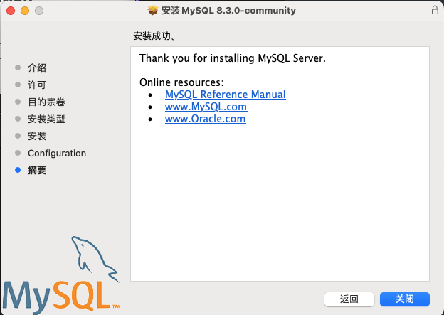

# 基础知识

要想在电脑上使用数据库，那肯定是先进行下载数据库的软件，然后在进行安装工作。最后进行配置工作。等一切完成之后，就可以愉快的使用数据库了，

数据库是一种用于存储、组织和管理数据的电子系统。它可以被视为一个电子化的文件柜，用于存储各种类型的数据，例如客户信息、产品信息、财务数据等。数据库的功能主要包括以下几个方面：

- **数据存储**：数据库可以存储大量结构化和非结构化数据。数据按照一定的格式进行组织，便于存储和检索。
- **数据组织**：数据库将数据组织成表、行和列的形式，并定义数据之间的关系。这使得数据更加清晰易懂，也便于数据分析和处理。
- **数据管理**：数据库提供各种数据管理功能，例如数据新增、修改、删除和查询。用户可以使用数据库管理系统（DBMS）对数据库中的数据进行操作。
- **数据共享**：数据库可以支持多个用户同时访问和共享数据。这使得多个用户可以协同工作，提高工作效率。
- **数据安全**：数据库提供各种安全功能，例如用户认证、数据加密和访问控制，以保护数据的安全。

数据库的功能可以概括为以下几点：

- **存储数据**：数据库可以存储各种类型的数据，包括结构化数据和非结构化数据。
- **组织数据**：数据库将数据组织成表、行和列的形式，并定义数据之间的关系。
- **管理数据**：数据库提供各种数据管理功能，例如数据新增、修改、删除和查询。
- **共享数据**：数据库可以支持多个用户同时访问和共享数据。
- **保护数据**：数据库提供各种安全功能，以保护数据的安全。

数据库被广泛应用于各种领域，例如电子商务、金融、医疗、教育等。随着数据量的不断增长，数据库在现代社会中发挥着越来越重要的作用。

## 下载和安装

### 下载

网站：`https://dev.mysql.com/downloads/mysql/`


点击 Download按钮，将文件下载到下载文件夹。

### 安装

点击`访达`，进入到下载文件夹后打开`mysql-8.3.0-macos14-arm64.dmg`的文件。然后在双击下图的图标(mysql-8.3.0-macos14-arm64.pkg)。


点击询问框中的允许按钮


点击继续


点击继续


点击询问框中的同意（你不同意也不给你安装）


点击继续


点击安装


输入密码后，点击安装软件。

点击Next


输入密码后，点击Finsh。然后在输入你苹果电脑的登录密码。点击确定。然后就是安装成功。



点击关闭

至此MySQL的安装就已经完成了，但是还需要增加MySQL的环境变量。

### 配置

在终端使用`vim`命令打开`~/.zshrc`文件。          

```shell
vim ~/.zshrc
```

在文件的末尾添加以下行

```shell
export PATH=$PATH:/usr/local/mysql/bin
```

保存并关闭文件（按下`ESC`键，按下`Shift键` + `:键`,输入wq，按下`Enter键`。）

重新加载配置文件

```shell
source ~/.zshrc
```

 
