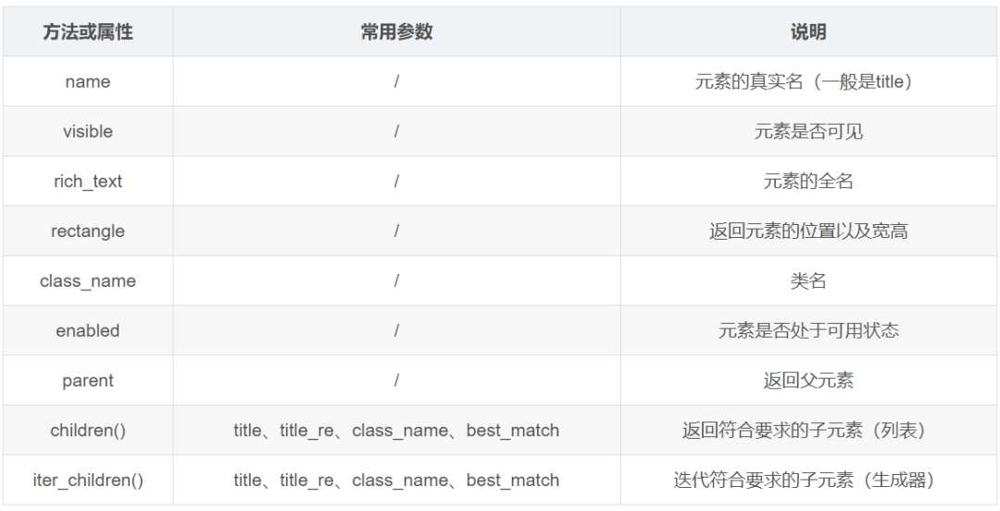
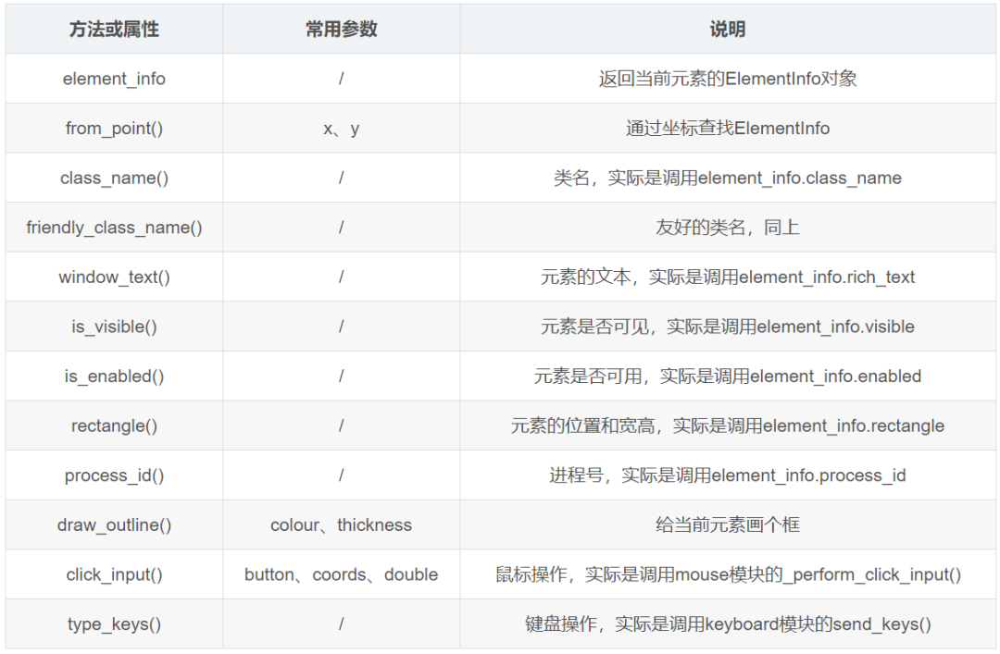
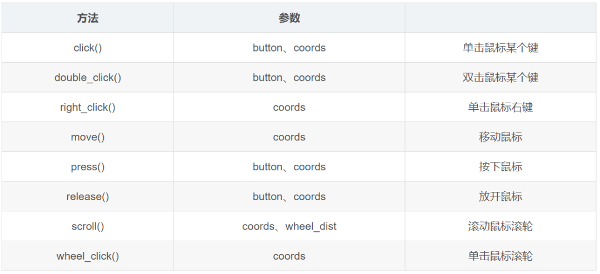
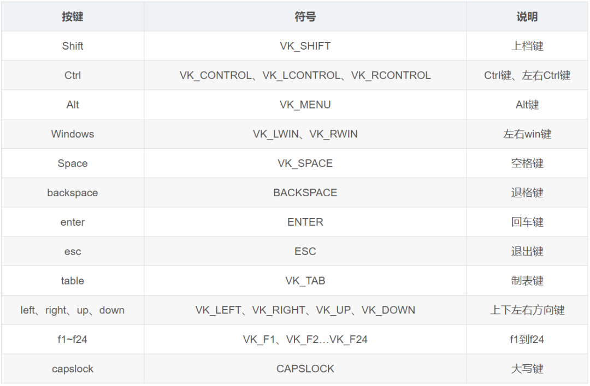

# pywinauto

## 安装

它是一个自动化的 Python 模块，适合`windows`系统上的软件（GUI），可以通过`Pywinauto`遍历窗口（对话框）和窗口里的空间，可以控制鼠标和键盘输入，它能做的事情比`pysimplegui`更多

```shell
pip install pywinauto
```

官网文档：https://pywinauto.readthedoc.io/latest/

## Application

要控制软件第一件事就是启动一个 Windows 文件，每一个软件（进程）都是一个 Application 对象。实例化 Application 对象的时候可以传入一个`backend`参数，可选值为 win32(默认)和 uia。

- win32 对应的框架：MFC、VB6、VCL、简单的 WinForms 空间和大多数旧的遗留应用程序。
- uia 对应的框架：WinForms、WPF、商店应用程序、Qt5、浏览器

如果无法知道要测试的软件使用的术语哪种框架，可以使用`Inspect(对应的uia)`和`Spy++(对应的win32)`看看，看哪个显示更全就选哪个。Inspect 和 Spy++需要自己安装一下。

下面是 Application 对象的主要方法

| 方法                    | 常用参数                                | 说明                                                 |
| ----------------------- | --------------------------------------- | ---------------------------------------------------- |
| start()                 | cmd_line、timeout、retry_interval       | 通过 cmd 命令启动一个软件（进程）                    |
| connect()               | process、handle、path、timeout          | 连接一个进程，一般使用进程号（任务管理器可以查询到） |
| top_window()            | /                                       | 获取应用到顶层窗口                                   |
| window()                | title、title_re、class_name、best_match | 获取单个窗口（WindowSpecification）                  |
| windows()               | title、title_re、class_name             | 获得多个窗口(UIAWrapper)                             |
| is64bit()               | /                                       | 是否 64 位应用                                       |
| cpu_usage               | interval                                | CPU 占用率                                           |
| wait_cpu_usage_lower()  | threshold、timeout                      | 等待 CPU 占率小于某个阀值                            |
| active()()              | /                                       | 搜索返回一个激活窗口                                 |
| kill()                  | Soft                                    | 结束进程                                             |
| wait_for_process_exit() | timeout、retry_interval                 | 等待进程结束                                         |

## WindowSpecification

获取窗口，一个窗口都是一个`WindowSpecification`对象，可以通过`Application`对象的 window()方法获取，参数可以是 title、classname 或者 best_match 等。这都可以在 inspect.exe 上看到，不过需要注意的是 inspect 看到的 Name 其实对应的是 window()的 title 参数。

| 方法                        | 常用参数              | 说明                                                            |
| --------------------------- | --------------------- | --------------------------------------------------------------- |
| Maximize()                  | /                     | 最大化窗口                                                      |
| minimize()                  | /                     | 最小化窗口                                                      |
| restore()                   | /                     | 恢复窗口                                                        |
| close()                     | /                     | 关闭窗口                                                        |
| get_show_state()            | /                     | 截取窗口状态，0 正常 1 最大化 2 最小化                          |
| was_maximized()             | /                     | 当前是否最大化                                                  |
| draw_outline()              | colour、thickness     | 给窗口画个框可以使用定位                                        |
| print_control_identifiers() | /                     | 打印所有子窗口和子元素(会打印对应的 control_type)               |
| child_window()              | title、control_type   | 获取子窗口                                                      |
| exists()                    | timeout               | 窗口是否存在                                                    |
| wait()                      | wait_for、timeout     | 等待窗口变成某个状态(exists、visible、enabled、ready、active)   |
| wait_not()                  | wait_for_not、timeout | 等待窗口不处于某个状态(exists、visible、enabled、ready、active) |

## 元素控件

一个窗口里一般都会有各种各样的元素，比如说**按钮** （Button）、**编辑栏**（Edit）、**树状视图**（Tree View）、**复选框**（CheckBox）、**对话框**（Dialog）、**工具栏**（Toolbar）、**状态栏**（StatusBar）、**列表框**（ListBox）、**窗格**（Pane）、**菜单**（Menu）、**菜单栏**（MenuItem）、**静态内容**（Static）、**工具提示**（ToolTips）、**列表控件**（ListView）、**单选框**（RadioButton）、**组合框**（ComboBox）、**选项卡控件**（TabControl）、**组框** （GroupBox）、**弹出菜单**（PopupMenu）、**头\*\***部\*\*（Header）等。

因为控件类型太多了不能一个一个学习，但是它们都有一个 element_info 的属性，访问之后会返回一个继承于 ElementInfo 的对象（UIAElementInfo 或 HwndElementInfo），比较重要的属性或方法如下



这些元素除了有 element_info 可以获取一些元素的主要信息，它们还都被包装成一个 Wrapper，所以也可以学一下 BaseWrapper 的常用方法和属性。其实 BaseWrapper 的方法基本上都是对 ElementInfo 进一步包装，我只列出部分方法，如下表



说明一下，每个控件元素都有对应的 Wrapper，所以上面的方法也不一定都用，需要根据实际情况进行测试区分。另外，比较有用的 click_input()和 type_keys()这两个方法分别用于操作鼠标和键盘（输入），下面我会单独拿出来说一下

## 鼠标操作

鼠标点击肯定离不开点击的位置，桌面就是一个坐标，左上角为坐标原点，往右是 X 轴正向，往下是 Y 轴正向。pywinauto 提供了一个 mouse 模块用于鼠标操作，最核心的方法是\_perform_click_input()，不过它是一个私有方法，我们调用的是基于它的封装方法，如下表



参数说明：

- 参数 button 的默认值都是“left”，即鼠标左键，可选值有 left、right、middle、move、wheel、x
- 参数 coords 的默认值都是元组(0, 0)，元组里的两个整数分别是 X、Y 轴的值
- 参数 wheel_dist 表示滚动的距离，大于 0 是向上滚动，小于 0 是向下滑动

## 键盘操作

键盘操作主要是按下键盘上的按键，相关方法在 keyboard 模块，最最主要的是 send_keys()方法，第一个参数 keys 就是我们需要按下的按键，其他参数比如说 with_spaces、with_tabs、with_newlines、turn_off_numlock、set_foreground、vk_packet，一看就知道作用，而且都是布尔值，此处不进行举例

pywinauto 支持的完整的按键可以在官方文档查看，https://pywinauto.readthedocs.io/en/latest/code/pywinauto.keyboard.html

下面我列举出的是一些比较常用的按键



说明：

- 使用按键时需要搭配大括号，比如说按下回车键是 '{ENTER}' （是字符串）
- 在 Windows 平台默认是发送虚拟按键的，以 VK*开头的按键，都是指虚拟按钮，如果不想使用虚拟按钮可以把 VK*前缀去掉，把 send_keys()的 vk_packet 参数改为 False 即可

单个按键按下抬起还不够，往往需要组合键，这时候就需要修饰符了，在大括号里可以使用`down`、`up`控制按键什么时候按下和抬起，如果后面加上数字，表示按下多少次

当然，很多时候使用`down`、`up`修饰感觉不够简洁，所以 pywinauto 还提供了简化写法，使用+代替{VK_SHIFT}，使用^代替{VK_CONTROL}，使用%代替{VK_MENU}

如果不想按下按钮，纯属想要输入纯字符串，那就需要取消转义了，注意修饰符和按钮的写法是不一样的
