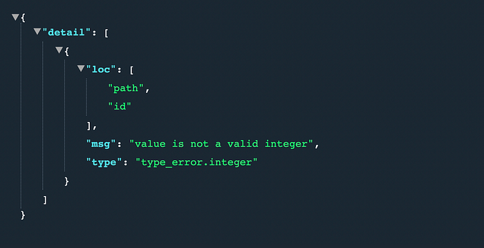
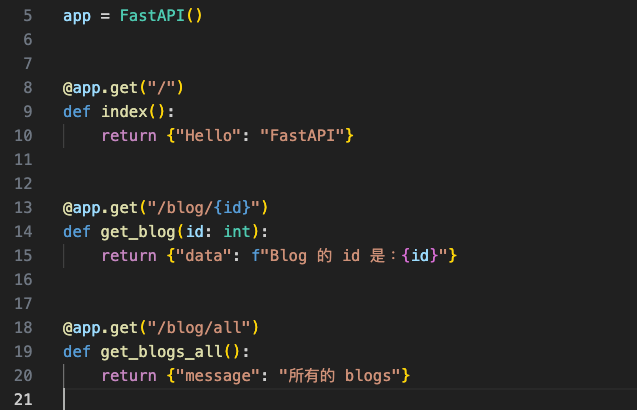
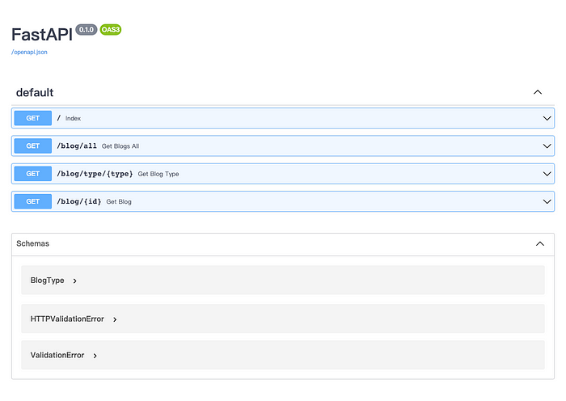
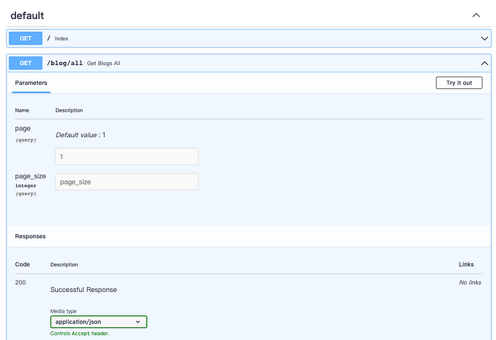
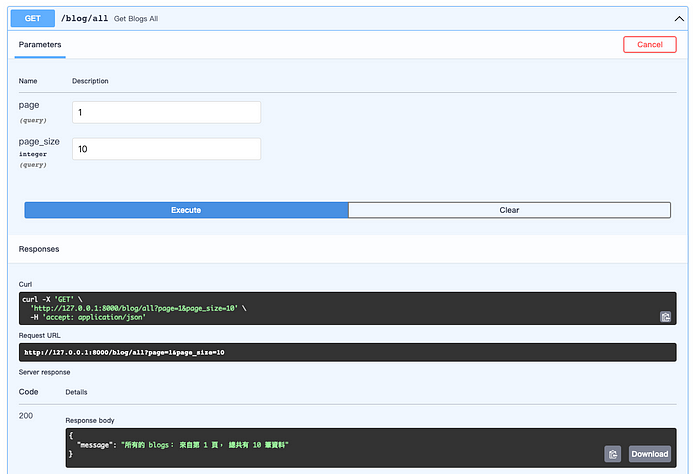

# 快速上手 FastAPI

您听过 FastAPI 吗？

FastAPI 是在 Python 中构建 RESTful API 的现代 Web 框架，于 2018 年首次发布。 在 Python 众多的框架中，FastAPI 虽然名气可能还不如 Flask 或 Django 那么大，但却有着自己独特的魅力：它的执行速度超快、使用起来简单直觉，而且还能自动产生 API 文件，让你的开发过程变得轻松愉快。

如果您对于刚刚提到的这些特点感到好奇的话，那就让我们一起展开这次的 FastAPI 新手之旅吧！

在接下来的文章中，将为大家介绍 FastAPI 的主要特性，并分享如何快速上手使用 FastAPI。

此外，我们还会看一些 FastAPI 实际的应用案例。 无论你是刚接触 Python 程序的新手，还是想在 Python 的学习中寻找新的可能，相信这篇文章都能给你带来新的启示。

那么，让我们一起踏上这趟旅程，进入 FastAPI 的世界吧！

# FastAPI 的特性与优势

那么，FastAPI 到底有什么让人无法忽视的特性与优势呢？

## 速度

首先，最吸引人的莫过于它的速度。 如同它的名字 FastAPI，「快」是它的招牌。 根据多项性能测试显示，FastAPI 是目前所有 Python 框架中最快的。 对于那些在意效能，或者是在服务器负载上有所考量的开发者来说，这无疑是一大利多。

## 易用

接着是它的易用性。 FastAPI 使用 OpenAPI 的开源标准，还有 auto complete，让你的开发过程更加流畅无阻。 对于初学者来说，这个特性无疑让学习曲线降低了许多。

## 文件

还有一点让人赞不绝口的是 FastAPI 会自动产生对应的 API 文件。 写完 API 之后，只需要一个简单的指令，FastAPI 就会帮你生成所有相关的 API 文件，无需再花费额外的时间与精神去管理文件，是不是超省事？

## 简洁

最后，对于曾有过 Python 应用开发经验的朋友们，FastAPI 的简洁语法会让您感到非常亲切。 与 Flask、Django 等其他 Python 框架相比，FastAPI 的语法更为直觉且易懂，并且能够支持现代的异步处理模型，对于想尝试新框架的您来说，转换框架的学习成本并不高。

总结起来，FastAPI 以其快速、直觉的开发体验、自动产生文件以及简洁的语法，在 Python 网页框架中崭露头角。 不论你是初学者还是有经验的开发者，都值得尝试 FastAPI。

# 快速上手 FastAPI

废话不多说，我们直接进入实际操作，看看如何快速上手 FastAPI。

首先，按照惯例，我们需要安装 FastAPI。 如果您已经安装了 Python 和 pip，那么只需在命令行中输入以下命令即可：

```shell
pip install fastapi
```

接着我们还需要一个 ASGI 服务器，这里我们使用 `uvicorn` 。 您可以通过下面的命令来安装：

```shell
pip install uvicorn
```

注：以上的安装，强烈建议在安装前先建立一个虚拟环境。 并在虚拟环境下安装各个套件。

安装完成后，我们就可以开始编写第一个 FastAPI 应用程序了。 打开您的程序编辑器（例如 VS Code），并创建一个新的 Python 文件，例如 `main.py` ，然后在新创建的文件中输入以下代码 ：

```python
# main.py

from fastapi import FastAPI

app = FastAPI()

@app.get("/")
def read_root():
    return {"Hello": "FastAPI"}
```

以上的代码，将会建立了一个极简的 FastAPI 应用程序（眼前所见一切复杂的事务，都从最简单的地方开始）。 当您启动服务器并且通过网页浏览器浏览应用程序的根目录网址（ `/ `）时，程序将返回一个 JSON 格式的响应，其内容为 `{“Hello”: “FastAPI”} `。

若要执行这个应用程序，我们需要使用 uvicorn 来启动服务器。 回到您的命令行界面，输入以下命令即可：

```shell
uvicorn main:app --reload
```

这里的“ `main` ”应该是您的 Python 文件的名称，而“ `app` ”则是我们在文件中建立的 FastAPI 实例的名称（ 也就是 `app = FastAPI()` 的 app）。” `— reload` 」选项使得当您修改代码时，服务器会自动重新加载，非常适合开发时使用。

输入指令后，按下 enter 启动（终端机会显示下面讯息）。


恭喜！ 您的第一个 FastAPI 应用程序已经成功运行了！ 可以在浏览器中输入 `http://127.0.0.1:8000` 或者是 `http://localhost:8000`，就可以看到您的应用程序。

看起来是不是很简单？ FastAPI 的设计理念就是让你轻松上手，快速开发。 接下来，您可以试着新增更多路由，定义更多函数，让您的应用更加丰富多样。

# FastAPI 的 GET 应用

GET 应用可以分为三种类型来讨论。

路径参数（Path parameters）

预定义值（Predefined values）

查询参数（Query parameters）

以下分别针对各种类型说明其使用情况。

## 路径参数 Path Parameters

路径参数（Path parameters）也称为 URL 参数，它是一个参数，这个参数让我们可以嵌入在 URL 路径中使用。

例如，在 URL `/items/{item_id}` 中， `item_id` 是一个路径参数。 你可以在 FastAPI 应用程序的路由函数中使用相同的名称作为参数来接收这个值。

例如我们在前面的 main.py 里面增加下面这一段代码：

```python
@app.get("/blog/{id}")
def get_blog(id):
    return {"data":f"Blog 的 id 是：{id}"}
```

由于我们在 id 的后面加上 int（ id： int ），程序会对输入的参数 id 进行判断。 int 代表的是实数。 换句话说，如果 id 不是实数的话，就会出现错误讯息。 例如我们在网址栏输入 http://127.0.0.1:8000/blog/fun，会得到下面的结果。



当我们有一个函数，该放在哪个位置比较适当，需要谨慎决定。 以下面的例子来说，假设我们有一个如下的函式 get_blogs_all，到底应该放在哪里比较好？ 也就是说函式 index 、get_blogs 与 get_blogs_all 三者应该如何排列？

```python
@app.get("/blog/all")
def get_blogs_all():
    return {"message": "所有的 blogs"}
```

如果以下面方式排序，会出现错误，是不可行的顺序方式：



即使输入 http://127.0.0.1:8000/ 与 http://127.0.0.1:8000/blog/5 都会得到正确的结果，但是当我们输入 http://127.0.0.1:8000/blog/all 时，就会得到错误的结果。 因为在顺序上路由函式 get_blog 在 get_blogs_all 的前面，在原则上会先执行第 14 行的函数，后再执行第 19 行的函数。

如果将三个函数调整为以下的顺序，就可以正常执行：


在这样的状况下，输入 http://127.0.0.1:8000/blog/all 就不会出现错误。 因为原本第 14 行的函数被移到第 19 行的位置。 get_blogs_all 就可以被执行。 也就是 blog/all 的条件可以被满足。

## 预定义值 Predefined values

这种特性允许你为路径参数或查询参数设置预定义的有效值。 当用户端发送的请求中，其请求的参数值不在你的预定义值之中时，FastAPI 会自动回传一个错误，告诉客户端哪些值是被接受的。

要使用这个功能，首先需要导入 Enum，并且通过 Enum（列举）设定一个 class。 藉由这个 class 来定义我们需要的预定值。 以下举例说明：

下面的 BlogType class，继承了 Enum，并定义了我们需要的三个预定值。

```python
class BlogType(str, Enum):
    business = "business"
    story = "story"
    qa = "qa"
```

由上面代码可以看到，里面总共定义了三种有效值：business、story、qa。 接着，就像前面我们在判断路径参数的型态时使用的方式一样，在路径函式 get_blog_type 里面设定 type 的判断为 BlogType class。

```python
@app.get("/blog/type/{type}")
def get_blog_type(type: BlogType):
    return {"message":f"Blog 的資料型態是 {type}"}
```

用户输入 BlogType 里面的任何一个值，都是有效的，get_blog_type 函数会被执行：

反之，如果用户的请求超过 business、story、qa 这三个有效值，就会出现错误讯息。

以下是此部分的全部代码 ：

```python
from enum import Enum

class BlogType(str, Enum):
    business = "business"
    story = "story"
    qa = "qa"


@app.get("/blog/type/{type}")
def get_blog_type(type: BlogType):
    return {"message":f"Blog 的資料型態是 {type}"}
```

## 查询参数 Query parameters

它是指在 URL 中使用问号，并且在问号（ `?` ）之后由「和符号」（ `&` ）分隔的一系列的键值（ `key=value` ）对。 浏览的网址看起来会像下面的样子：

```python
http://127.0.0.1:8000/blog/all?page=2&page_size=10
```

查询参数本身并不是路径的一部分。 以下面的代码为例，路径的部分为/blog/all（ `http://127.0.0.1:8000/blog/all `），而 page 与 page_size 为查询参数（ `page=2&page_size=10` ）。 因此，可以说是以「和符号」（ `&` ）作为分界点。

```python
@app.get("/blog/all")
def get_blogs_all(page, page_size):
    return {"message": f"所有的 blogs： 來自第 {page} 頁， 總共有 {page_size} 筆資料"}
```

你会得到下面的结果：


又例如，在 URL `/items?skip=0&limit=10` 中， `skip` 和 `limit` 都是查询参数。 你可以在 FastAPI 应用程序的路由函数中使用相同的名称作为参数来接收这些值。 在 FastAPI 中，查询参数常用于排序、过滤等操作。

**查询参数可以设定预设参数值**

再回到前面的代码

```python
@app.get("/blog/all")
def get_blogs_all(page, page_size):
    return {"message": f"所有的 blogs： 來自第 {page} 頁， 總共有 {page_size} 筆資料"}
```

我们也可以对查询参数设置默认值，例如我们可以将 page 的默认值设定为 1，page_size 的默认值设定为 10（ `page=1, page_size=10` ）：

```python
@app.get("/blog/all")
def get_blogs_all(page =1,page_size=10):
    return {"message": f"所有的 blogs： 來自第 {page} 頁， 總共有 {page_size} 筆資料"}
```

即使只是输入 http://127.0.0.1:8000/blog/all 的 URL，也会得到下面的结果：


因为我们已经将查询参数的默认值设定为 `page=1, page_size=10 `了。

**查询参数的验证方式：Optional**

查询参数还可以使用 Optional 来处理验证。 首先，导入 Optional 套件：

```python
from typing import Optional
```

修改 get_blogs_all，将 page_size 由固定数字改为 Optional。 并且在 Optional 后面加上数据型态，在这里使用 int 并且让他等于 None。

```python
@app.get("/blog/all")
def get_blogs_all(page=1, page_size: Optional[int] = None):
    return {"message": f"所有的 blogs： 來自第 {page} 頁， 總共有 {page_size} 筆資料"}
```

在这里需要在 FastAPI 的 Swagger UI 下进行测试。

请输入 URL http://127.0.0.1:8000/docs 。 你会看到 FastAPI 强大的测试工具。



接着，点击/blog/all 打开。 您会看到下面的画面：



点击画面上的 Try It Out 按钮，就可以进行测试。

如果在字段中放入数字（例如 10），会得到正确结果。



是，若在 page_size 的位置输入字符串（例如：abc），就会出现错误。

因此，使用 Optional 也可以来处理查询参数的验证。

# FastAPI 的应用

经过前面的介绍，相信您已经对 FastAPI 有了基本的了解。 接下来，让我们来看看 FastAPI 在实际开发中可以如何发挥它的效用。

首先，FastAPI 快速、简单的特性让它在开发 API 方面的表现相当优秀。 您可以快速地建立各种 RESTful API，并且由于 FastAPI 具备自动文件产生功能，在 API 的管理和使用上都变得非常方便。

FastAPI 还支持 OAuth2 认证、跨域请求等功能，让你的 API 更具有安全性和可用性。 另外，FastAPI 的异步处理能力使得它在开发实时应用（如聊天室、游戏等）上具有强大的优势。 你可以使用 Python 的 async/await 语法来撰写 API。

最后，由于 FastAPI 使用了现代 Python 的 type hints，使得你的代码具备更多的可读性和可维护性。 这对于团队合作或是使用期间较长的项目来说，都是非常有价值的。

# 结语

透过这篇文章，我们揭开了 FastAPI 框架的神秘面纱。

从基本特性到实际应用，FastAPI 展现了惊人的优势。 不论是其简洁易懂的语法、快速的执行速度、自动化的文件生成，还是对异步处理的强大支持，都使 FastAPI 成为当今 Python web 框架中的热门选择之一。 不管您是 Python 的热爱者，还是初次踏入编程的新手，FastAPI 都值得您一探究竟。 希望这篇文章能帮助您轻松上手 FastAPI，并在您的开发旅程中提供些许帮助。
