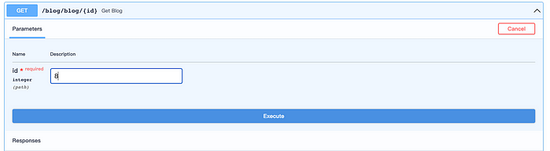
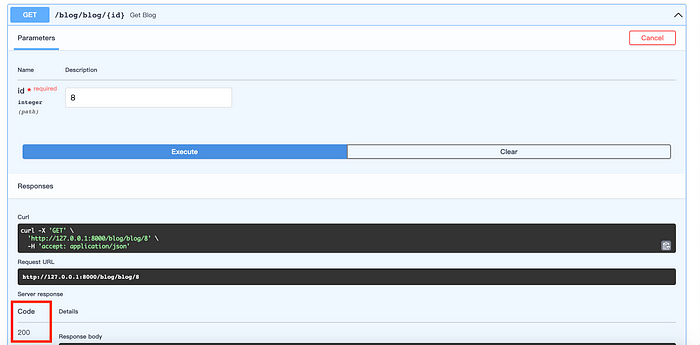
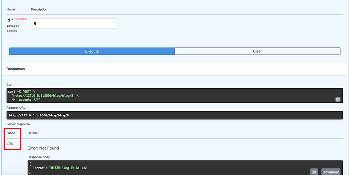
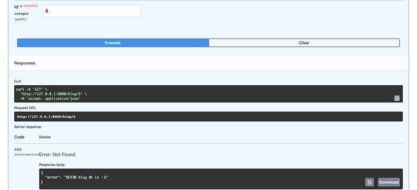
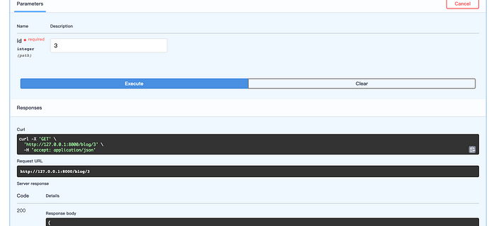
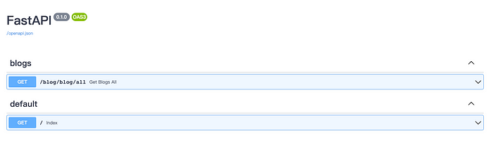
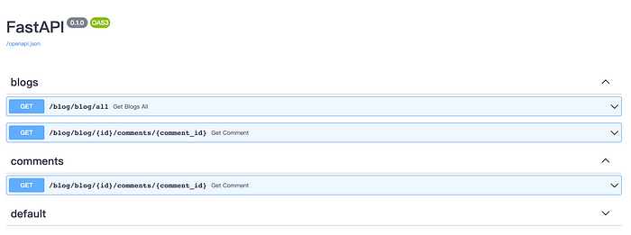
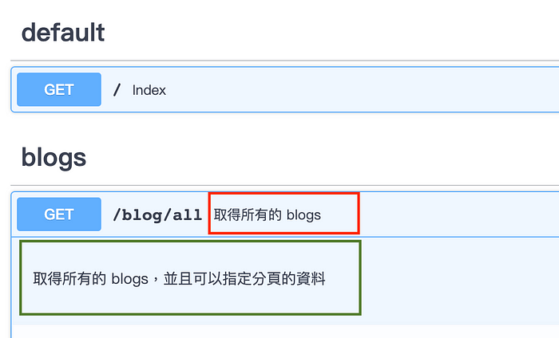
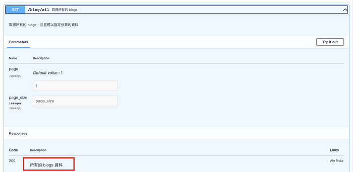

# FastAPI 的操作描述

这一篇要来聊聊FastAPI的「操作描述」。 说到FastAPI，它的描述和文件部分是它的鲜明特色，能让我们在使用API时轻松愉快。

「API的各个不同操作分别代表什么意思」？ 透过描述每个人都能一目了然，理解每一项操作分别代表什么，就像

在同侪之间沟通一样，直接又清楚。 我们接下来要深入探讨怎么写这些操作描述，并且将该文件公开给使用我们API的用户们。

首先会聊到「状态码」（status code），状态码就像是我们做了什么事情后，会收到的反馈。 只要看到状态码，就能知道我们的API操作到底是成功了还是出现了问题。

接着要介绍的是「标签」（tag），你可以想像它就像是一个个的标签，让我们可以对不同的端点（也就是API的各种操作）分门别类的贴上标签，整齐又方便。

然后我们要谈谈「摘要」和「描述」（summary and description），就像是每本书的封底简介一样，清楚告诉大家这个端点能做什么，有什么特色，能提供的信息是什么的说明书。

最后要提到的是「回应描述」（response description），就像你点了一份甜点，店家会告诉你这个甜点的成分和口感一样，回应描述能告诉你，当你使用这个端点，你可以期待收到什么样的回应。

就这样，我们一起探索FastAPI的操作描述，让API的使用变得更容易，也更有效率。

# 状态码（Status Code）

在使用API的过程中，我们常常会依赖状态码来了解该API请求是否成功，或者是否遇到了某些问题。 所以说，状态码其实就是反映了一个操作结果的指标。

如果你在Google搜索「HTTP状态码」，你会找到一些 列出状态码的网站（例如 MDN网站），这些资源可以让我们更深入了解状态码的意义和用途。

举例来说，当一个操作完成且没有任何问题时，我们会得到一个「200」代表「成功回应」的状态码。 另外，你可能也会遇到「301」的状态码，这表示你请求的地址已经被永久地重定向到了一个新的URL。 还有些像是鼎鼎有名的「404」找不到资源（404 Not Found）或「500」服务器内部错误（500 Internal Server Error）等等的状态码，这些都是API运行过程中可能会出现的情况。

## 举例说明

我们在开发API的过程中，常常需要使用到各种不同的状态码，让用户知道当下的API状况。 那么，我们就以一个实际的应用范例来看看吧。

假设我们有一个blog的API，其中的一个功能就是用ID去找寻对应的blog文章。 为了测试这个功能，我们会希望在找到对应的ID时，回传一个正常的消息，这个消息里面会包含该ID所对应的一些详细信息。

```python
@app.get("/blog/{id}")
def get_blog(id: int):
    return {"message": f"Blog 的 id 是：{id}"}
```

所以，这个例子是要来尝试模拟一下，当blog的API的功能成功运作时，该如何回传结果。 同时，我们也希望在未找到对应的特定ID的blog文章时，能够适当地告知用户这个情况。

要做到这一点，我们需要提供一个状态码的预设的选项。 例如，为了清楚的示范，在这里我们提供「404」找不到资源（404 Not Found）的状态码作为默认选项。

首先，在还没有设定预设状态码之前，让我们来看看这个API原本执行的状况。 以下我们会采用SwaggerUI来测试这个范例。 在此我们在ID字段给一个数字（例如：8）



执行后，可以在SwaggerUI里看到我们得到了一个状态码为200，意味着一切正常。



接下来，我们来尝试修改一下上面的API，将404状态码设定为我们API的默认回传状态码（status_code=404）。 然后，我们可以加上一个if判断式，如果Blog的ID大于5，就返回一个错误的信息，告诉用户找不到该ID的Blog。 这样的话，用户在遇到ID大于5的情况时，就会知道是因为找不到对应的Blog，而不是API出现了问题。

```python
@app.get("/blog/{id}", status_code=404)

def get_blog(id: int):
    if id > 5:
        return {"error": f"找不到 Blog 的 id ：{id}"}
    else:
        return {"message": f"Blog 的 id 是：{id}"}
```

现在，我们可以在SwaggerUI中来测试我们刚刚修改过的API。 这次，我们在ID字段输入8来进行测试。 按下执行后，你会看到结果出现了我们设定的预设状态码404。



## 安装状态码套件

对于不太想记住所有HTTP状态码的人，或者对于觉得这些状态码太多太难记的人，其实有另一种解决方法。

首先，我们可以引入FastAPI的status套件，如下面的Python代码：

```python
from fastapi import status
```

导入这个套件之后，我们就可以将之前的 `status_code=404` 改写成如下所示：

```python
@app.get("/blog/{id}", status_code=status.HTTP_404_NOT_FOUND)
def get_blog(id: int):
    if id > 5:
        return {"error": f"找不到 Blog 的 id ：{id}"}
    else:
        return {"message": f"Blog 的 id 是：{id}"}
```

在您的编辑器（例如：VsCode）中，当输入 `status` 的时候，它会自动弹出各种状态码供您选择。 您可以直接选择需要的状态码，或者可以简单地搜索它。 在此设定，将在代码中的 404 状态代码替换为 `status.HTTP_404_NOT_FOUND` 。

这样修改之后，再次执行程序，您会发现得到的结果与之前完全一致，这就证明我们的修改是成功的。 这种方法可以让我们更简单、更方便地使用http状态码，而不需要去记住每一个状态码都对应什么含义。

的确，我们的API到目前为止，无论输入什么，都会固定回传状态码404，这确实是个需要解决的问题。 实际上，我们希望在不同的情况下，API可以回传不同的状态码。

为了实现这个目标，可以将代码修改如下：

```python
@app.get("/blog/{id}", status_code=status.HTTP_200_OK)
def get_blog(id: int, response: Response):
    if id > 5:
        response.status_code = status.HTTP_404_NOT_FOUND
        return {"error": f"找不到 Blog 的 id ：{id}"}
    else:
        response.status_code = status.HTTP_200_OK
        return {"message": f"Blog 的 id 是：{id}"}
```

我们通过在response对象上直接设定状态码。 如果ID大于5，我们就设定状态码为404，并回传错误讯息; 如果ID小于或等于5，我们则设定状态码为200，并回传Blog的ID。 而预设的状态码则设置为200。

如此一来，我们的API就可以在不同的情况下，回传对应的状态码和信息了。 大家可以在SwaggerUI中来测试看看。

我们现在可以来试试看这段代码的运作情况。 当我们在id字段输入6并执行时，由于6大于5，所以状态码将会显示404。



然后，当我们将id改为3再执行一次，这次因为3小于或等于5，所以状态码将会显示200。



提供正确的状态码在API设计中非常重要，因为当前端或其他使用您的API代码收到回应后，他们会依据状态码来判断如何处理响应的内容。 透过正确的状态码，我们可以让API的用户更容易理解和处理API的响应，进而提高我们API的实用性和效率。

# 标签（Tags）

在软件开发中，通常我们会根据其功能和行为将操作分类。 常见的操作类别如：建立（Create）、读取（Read）、更新（Update）、删除（Delete）等。 以上四种操作常被合称为CRUD操作，是大部分软件系统的基础。 除此之外，还有其他类型的操作，例如：搜寻（Search）、排序（Sort）等。 这些都是非常常见的操作类别。 一个好的软件设计，通常会将这些操作有条理地组织起来，让整个系统更加结构化和易于维护。

在FastAPI中，我们可以透过在路由装饰器（route decorators）中加入 `tags` 参数，来给特定的路由加上标签。 这让我们能在API的文件中，根据标签对API的各个路由进行有条理的组织和分类。 这也意味着我们的用户可以更容易地找到他们需要的API路由。

举个例子，我们可能会在一个负责处理博客文章的路由上加上「blogs」标签，并在另一个负责处理评论的路由上加上「comments」标签。 代码可能会看起来像这样：

```python
@app.get("/blog/{id}", tags=["blogs"])
def get_blog(id: int):
    # …處理部落格文章的程式碼…

@app.post("/comment", tags=["comments"])
def create_comment(comment: Comment):
    # …處理評論的程式碼…
```

在上述代码中， `tags` 参数接受一个字符串的列表，代表该路由应该被加入的标签。 一个路由可以有多个标签，你只需要把所有的标签都放在同一个列表里即可。

```python
现在，当你打开FastAPI自动产生的Swagger UI文件时，你会看到所有的路由都根据他们的标签被整齐地分类在一起。 这不仅让你的API文件看起来更加整洁，也让用户能更容易地找到他们需要的路由。
```

## 范例：以get_blogs_all为例

以下面get_blogs_all函数为例，我们可以在函数中加上 `tags` 参数，并设置标签。

```python
@app.get("/blog/all")
def get_blogs_all(page=1, page_size: Optional[int] = None):
    return {"message": f"所有的 blogs： 來自第 {page} 頁， 總共有 {page_size} 筆資料"}
```

由于这个函数主要的功能在于处理与博客有关的代码，我们就可以将它贴上「blogs」的标记，代码修改如下：

```python
@app.get("/blog/all", tags=["blogs"])
def get_blogs_all(page=1, page_size: Optional[int] = None):
    return {"message": f"所有的 blogs： 來自第 {page} 頁， 總共有 {page_size} 筆資料"}
```

在Swagger UI中，你会可以发现出现了blogs的标题，并且 `/blog/all `被归在这个标题下面。



此外，除了放置一个标签外，也可以在同一个函数中放入复数的标签。 我们在刚刚的基础上，加上下面的get_comment函式。 在这个函式中，你会发现我们放了两个标签：blogs与comments。 并执行看看。

```python
@app.get("/blog/{id}/comments/{comment_id}", tags=["blogs", "comments"])
def get_comment(
    id: int,
    comment_id: int,
    valid: bool = True,
    username: Optional[str] = None
      ):
    return {"message": f"Blog 的 id 是：{id}， comment 的 id 是：{comment_id}， valid 是：{valid}"}
```

从Swagger UI可以发现：出现blog与comment两个Tag。



并且您会发现 `“/blog/{id}/comments/{comment_id}” `的路由会同时出现在blogs标题下以及comments标题下。

# 摘要和描述（Summary and Description）

在FastAPI中，我们可以通过在路由装饰器（decorators）中加入 `summary` 和 `description` 参数，来给特定的路由加上摘要（summary）和描述（ description）。 这让我们能在API的文件中，更好地解释每个路由的功能。

比如说，我们可能会在一个负责检索博客文章的路由（ `/blog/{id}` ）上写上一个描述该路由功能的摘要和描述。 代码可能会看起来像这样：

```python
@app.get("/blog/{id}",
    summary="檢索部落格文章",
    description="這個API呼叫了獲取指定id的部落格文章。...")
def get_blog(id: int):
    # ...處理部落格文章的程式碼...
```

在上述代码中， `summary` 参数是一个简短的句子，用来描述这个路由的主要功能; `description` 参数则可以是一段更长的文字，用来详细解释这个路由的功能、使用情况等等。

另外，你也可以在路由处理函数文字文件字符串（Docstring）中写上描述，FastAPI 会自动把这个文本文件字符串作为该路由的描述显示在文档中 ：

```python
@app.get("/blog/{id}", summary="檢索部落格文章")
def get_blog(id: int):
    """
    這個API呼叫了獲取指定id的部落格文章。...
    """
    # ...處理部落格文章的程式碼...
```

我们实际上以get_blogs_all为例，来进行说明。 首先，修改get_blogs_all的代码，在get_blogs_all函式的装饰器加上summary与description，并且在后面分别输入一些字符串作为说明这个路由的功能与使用情况等等。

```python
@app.get(
        "/blog/all",
        tags=["blogs"],
        summary="取得所有的 blogs",
        description="取得所有的 blogs，並且可以指定分頁的資料",
        )
def get_blogs_all(page=1, page_size: Optional[int] = None):
    return {"message": f"所有的 blogs： 來自第 {page} 頁， 總共有 {page_size} 筆資料"}
```

存档之后，我们到Swagger UI里面，您会发现我们写在装饰器加上的summary与description 文字出现在Swagger UI的文件中。 如下图所示，红色框框的部分为summary的文字; 绿色框框的部分则是description的文字。



## 范例：以get_comment为例

在下面的代码，我们通过get_comment为例，示范如何在文字文件字符串（Docstring）中写上描述。

```python
在下面的代码，我们通过get_comment为例，示范如何在文字文件字符串（Docstring）中写上描述。
```

同样的，在存档之后，我们到Swagger UI里面检视结果。


让我们一起养成一个好习惯吧！ 那就是在写代码的时候，顺手加上一些小摘要和解释。 就像我们会在日记里画上心心符号，或在笔记旁边涂鸦一样，这样做能让我们的代码更清楚易懂。

当你使用FastAPI的文件时，你会发现每个路由旁边都附有你写的那些摘要和解释。 这不仅让你的API文件看起来丰富多元，而且还能让用户更轻易地理解每个路由的功能，以及如何正确地使用它。

回应描述（Response Description）

当我们在建构API的时候，除了告诉用户该如何送出请求，也可以告诉他们请求送出之后会收到什么。 这就像去餐厅用餐的时候，我们不仅想要知道菜单有什么，还会想知道这道菜看起来、吃起来会是怎样的感觉。

为了要做到这点，我们只需要使用一个叫做 `response_description` 的标签，通过这个标签，就能将我们想回应的内容送出去。

## 范例：以get_blogs_all为例

试试看吧！ 假设我们在写一个获取所有博客文章的功能（ get_blogs_all），可以通过 `response_description` 写下「所有的blogs 资料」这样的描述。

```python
@app.get(
        "/blog/all",
        tags=["blogs"],
        summary="取得所有的 blogs",
        description="取得所有的 blogs，並且可以指定分頁的資料",
        response_description="所有的 blogs 資料"
        )
def get_blogs_all(page=1, page_size: Optional[int] = None):
    return {"message": f"所有的 blogs： 來自第 {page} 頁， 總共有 {page_size} 筆資料"}
```

完成之后，存储代码，并且重新整理您的Swagger UI文档。 然后，您就可以在对应的blog API下看到我们刚才写的描述了（红色框框部分）。



这样一来，用户就会知道他们呼叫这个API后会得到「所有的 blogs 资料」的博客文章列表。

这就是我们如何提供信息的方式，在这里只是简单的示范而已，当然，你可以在这里写下更多的信息

# 结语

总结来说，FastAPI的操作描述就像是API的向导，让我们在使用API的过程中更加方便。

首先，我们谈到「状态码」，这就好比向世界丢出一颗石头，并透过回音来判断石头是否击中目标。 状态码是我们判断API操作结果的反馈，直接而准确。

接着，探讨到「标签」。 它就像是物品的分类标签，让一切都井井有条，使我们能够轻松区分并且找到需要的API操作。 还有「摘要」和「描述」，这就好比是一本书的简介或者书摘一般。 它们能让我们一眼就看出API端点的全貌，迅速了解它的具体功能，以及它的特色和提供的信息。

最后，我们提到了回应描述，这就像是在餐厅点餐时，服务员向我们解释餐点的口味和成分。 回应描述告诉我们，一但我们使用这个API端点时，可以期待得到如何的回应。

透过上述的操作描述，我们可以将使用API的过程变得更清楚、更容易，也更有效率。