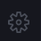
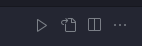

# 虚拟环境

## 使用Python自带的venv

确保电脑的Python版本为3.3或更高

`venv`模块是Python3.3中引入的新功能。如果您使用的是较早版本的Python，则需要升级电脑上的Python版本。

## 创建虚拟环境

要创建一个名字为`myvenv`的虚拟环境并将其存储在当前目录中，可以使用以下命令

```shell
python3 -m venv myvenv
```

该命令将在当前目录中创建一个名字上`myvenv`的目录。该目录包含用于运行虚拟环境的Python解释器和其他文件。

## 激活虚拟环境

要激活虚拟环境，可以使用以下命令

```shell
source myvenv/bin/activate
```

激活虚拟环境后，终端提示符会发生变化，显示虚拟环境的名称。例如，激活`myvenv`虚拟环境后，终端提示符会变为：

```shell
(myvenv) user@host:~ $
```

## 安装项目依赖项

在激活虚拟环境后，可以使用`pip`命令安装项目所需的依赖项。例如，要安装`requests`库，可以使用以下命令：

```shell
pip install requests
```

## 退出虚拟环境

要退出虚拟环境，可以使用以下命令：

```shell
deactivate
```

**使用 venv 的优势**

使用 `venv` 模块创建虚拟环境具有以下优势：

- **隔离性：** 虚拟环境中的 Python 软件包与全局安装的软件包隔离，因此不会相互冲突。
- **可移植性：** 虚拟环境可以很容易地复制到其他计算机，因为它们包含运行 Python 环境所需的所有文件。
- **可重复性：** 虚拟环境可以轻松地重新创建，这对于测试和部署应用程序很有用。

**总结**

`venv` 模块是一种简单易用的虚拟环境创建工具。它是 Python 3.3 或更高版本用户的绝佳选择。

## Visual Studio Code 配置虚拟环境

### 方式1:

直接在终端输入

```shell
source 虚拟环境目录/bin/activate
```

### 方式2（推荐）:

1. 点击vscode齿轮⚙️按钮

   

2. 点击设置

3. 从左往右数，点击第二个图标，打开json

   

4. 在`settings.json`文件的代码里增加以下内容：

   ```shell
   "python.venvPath": "/Users/xx/env"
   ```

   ⚠️`python.venvPath":"你自己电脑上存放python的虚拟环境的总目录`
   ⚠️`env目录是我电脑上存放python虚拟环境的总目录，所有的python虚拟环境都放在这`

5. 保存

6. 按下(Mac OS)快捷键`⌘ `+ `⇧`+`p` ,(Windows)快捷键`ctrl` + `shift` + `p`

7.  在弹出的输入框中输入如下内容

   ```shell
   python:Select Interpreter
   ```

8. 按下回车，选择你对应的虚拟环境。

9. 先把`visual studio code`的终端的先关闭掉，然后开启一个新的终端。

10. 虚拟环境已经绑定成功了。

#### 解释

问题：为什么要在settings.json设置python的虚拟环境代码？

回答：因为vscode默认的Python虚拟环境地址是`～/Envs`目录，如果你没有在`~`创建Envs目录和在`Envs目录`中建立虚拟环境。无论我们方式2的第6步骤和第6步骤选择了虚拟环境，最终发现还是不生效。这就是为什么要在`settings.json`设置python的虚拟环境总目录的原因。如果你设置的python的虚拟环境总目录里没有python的虚拟环境，那也是不会展示虚拟环境的。