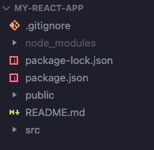

# 基础知识

使用 `pnpm` 创建 React 项目是一个高效的方法，可以快速搭建开发环境。下面是详细步骤：

## 安装 pnpm

如果你还没有安装 `pnpm`，首先需要全局安装它：

```shell
npm install -g pnpm
```

## 创建 React 项目

接下来，使用 `pnpm` 创建一个新的 React 项目。你可以使用 Create React App 或 Vite。下面是两种方法的步骤：

### 方法 1：使用 Create React App

1. **初始化项目**

    ```shell
    pnpm create react-app my-react-app
    ```

    `my-react-app` 是你的项目名称，你可以根据需要更改。

2. **进入项目目录**

    ```shell
    cd my-react-app
    ```

3. **安装依赖**

    ```shell
    pnpm install
    ```

4. **启动开发服务器**

    ```shell
    pnpm start
    ```

    这会启动开发服务器并在浏览器中打开 React 应用。

### 方法 2：使用 Vite

Vite 是一个更现代的构建工具，具有更快的构建速度和更轻量的配置。

1. **初始化项目**

    ```shell
    pnpm create vite my-react-app --template react
    ```

    `my-react-app` 是你的项目名称，你可以根据需要更改。

2. **进入项目目录**

    ```shell
    cd my-react-app
    ```

3. **安装依赖**

    ```shell
    pnpm install
    ```

4. **启动开发服务器**

    ```shell
    pnpm run dev
    ```

    这会启动 Vite 开发服务器并在浏览器中打开 React 应用。

### 总结

使用 `pnpm` 创建 React 项目非常简单，无论是使用 Create React App 还是 Vite，都能快速搭建起一个 React 开发环境。选择哪种方法取决于你的需求和偏好。如果你需要一个简单且传统的设置，Create React App 是一个不错的选择。如果你更关注构建速度和现代化工具链，Vite 是一个更好的选择。

项目文件



### 1. `node_modules`

`node_modules` 目录包含了项目中所有的依赖包。这些依赖包是通过 `pnpm install` 命令从 `package.json` 文件中指定的依赖项下载并安装的。

### 2. `package-lock.json`

`package-lock.json` 文件记录了当前安装的每个依赖包的确切版本及其依赖项的版本。它确保在不同的机器上安装依赖时能够得到完全相同的版本。这对项目的稳定性和一致性非常重要。

### 3. `package.json`

`package.json` 文件是 Node.js 项目的配置文件，包含了项目的基本信息（如名称、版本、描述），以及项目的依赖项、脚本、作者等信息。它是项目管理的核心文件。

### 4. `public`

`public` 目录包含了公开资源和静态文件，这些文件不会被 Webpack 处理。通常包括 `index.html` 文件，作为应用的入口点，以及其他资源如图片、favicon 等。

### 5. `README.md`

`README.md` 文件是一个 Markdown 格式的文档，通常用来描述项目的基本信息、安装步骤、使用说明、贡献指南等。它是开发者查看项目概述和了解如何使用和贡献项目的主要文档。

### 6. `src`

`src` 目录是项目的源代码目录。它包含了所有的 React 组件、样式文件、脚本文件等。这个目录通常是你进行开发工作的主要区域。

典型的 `src` 目录结构可能如下：

```shell
src
|--- App.js #主应用组件
|--- index.js #应用入口文件
|--- components #自定义组件目录
|			|___ MyComponent.js
|___ styles
			|___App.css
```

### 第二种创建react项目的方式

### 创建 Vite 项目

接下来，使用 `pnpm` 创建一个新的 Vite 项目。

1. **创建 Vite 项目**

    使用 Vite 提供的项目模板来创建一个 React 项目（你也可以选择其他模板，如 Vue、Svelte 等）：

    ```shell
    pnpm create vite
    ```

    或者直接指定项目名称和模板：

    ```shell
    pnpm create vite my-vite-app --template react
    ```

    其中，`my-vite-app` 是你的项目名称，`react` 是模板类型。你可以根据需要更改项目名称和模板类型。

2. **进入项目目录**

    ```shell
    cd my-vite-app
    ```

3. **安装依赖**

    ```shell
    pnpm install
    ```

4. **启动开发服务器**

    ```shell
    pnpm run dev
    ```

    这会启动 Vite 开发服务器并在浏览器中打开你的应用。

### 项目目录结构

创建好的 Vite 项目通常会有如下的目录结构：

```shell
my-vite-app
├── node_modules
├── public
├── src
│   ├── assets
│   ├── App.jsx
│   ├── index.css
│   └── main.jsx
├── .gitignore
├── index.html
├── package.json
├── pnpm-lock.yaml
├── README.md
└── vite.config.js
```

### 文件和目录功能说明

- **`node_modules`**: 包含项目的所有依赖包。

- **`public`**: 存放静态资源，如图片、favicon 等，不会被 Vite 处理，直接原样提供。

- `src`

    : 存放源代码，主要的开发工作目录。

    - **`assets`**: 存放项目的静态资源。
    - **`App.jsx`**: 主应用组件。
    - **`index.css`**: 全局样式文件。
    - **`main.jsx`**: 应用入口文件，挂载 React 组件。

- **`.gitignore`**: Git 忽略文件配置。

- **`index.html`**: 项目入口 HTML 文件。

- **`package.json`**: 项目的配置文件，包含依赖和脚本等信息。

- **`pnpm-lock.yaml`**: 锁定文件，确保依赖版本一致。

- **`README.md`**: 项目说明文档。

- **`vite.config.js`**: Vite 配置文件，用于自定义 Vite 行为。

### 自定义 Vite 配置

你可以在 `vite.config.js` 文件中自定义 Vite 的配置。下面是一个简单的示例：

```javascript
import { defineConfig } from 'vite';
import react from '@vitejs/plugin-react';

export default defineConfig({
  plugins: [react()],
  server: {
    port: 3000,
    proxy: {
      '/api': {
        target: 'http://localhost:5000',
        changeOrigin: true,
        rewrite: (path) => path.replace(/^\/api/, ''),
      },
    },
  },
  build: {
    outDir: 'dist',
    sourcemap: true,
  },
  resolve: {
    alias: {
      '@': '/src',
    },
  },
});
```

### 总结

使用 `pnpm` 创建 Vite 项目可以快速搭建一个现代化的前端开发环境。通过了解和使用 `vite.config.js` 文件，你可以灵活地定制项目配置以满足特定需求。

## React如何使用UI框架

使用`material/web`UI框架时，按照官方建议从特定路径导入组件定义。在React项目中，我们需要确保这样Web Components被正确导入和使用。下面是一个更详细的指南，展示如何在React中使用这些组件。

### 安装依赖

官方网址：https://github.com/material-components/material-web/ 

官方网址：https://material-web.dev/about/intro/

首先，确保已经安装了`@material/web`包

```shell
pnpm install @material/web
```

### 使用Material Web Components

创建一个简单的React应用，并在其中使用`@material/web`的按钮和复选框组件。

1. 导入组件：

    在`src/main.jsx`中导入所需的组件。

    ```javascript
    // src/main.jsx
    import React from 'react';
    import ReactDOM from 'react-dom/client';
    import App from './App';
    import '@material/web/button/filled-button.js';
    import '@material/web/button/outlined-button.js';
    import '@material/web/checkbox/checkbox.js';
    
    ReactDOM.createRoot(document.getElementById('root')).render(
      <React.StrictMode>
        <App />
      </React.StrictMode>
    );
    
    ```

2. 使用组件

    在`src/App.jsx`中使用这些导入的Web Components

    ```javascript
    // src/App.jsx
    import React from 'react';
    
    function App() {
      return (
        <div>
          <h1>Material Web Components with React</h1>
          <md-filled-button label="Filled Button"></md-filled-button>
          <md-outlined-button label="Outlined Button"></md-outlined-button>
          <md-checkbox>Checkbox</md-checkbox>
        </div>
      );
    }
    
    export default App;
    
    ```

3. 添加样式

    Material Web Components可能需要一些全局样式。确保这些样式在项目中被正确加载。在`index.html`中添加必要的样式链接。

    ```javascript
    <!-- index.html -->
    <!DOCTYPE html>
    <html lang="en">
      <head>
        <meta charset="UTF-8" />
        <meta name="viewport" content="width=device-width, initial-scale=1.0" />
        <title>Material Web with React</title>
        <link rel="stylesheet" href="https://fonts.googleapis.com/css?family=Roboto:300,400,500,700&display=swap" />
        <link rel="stylesheet" href="https://fonts.googleapis.com/icon?family=Material+Icons" />
      </head>
      <body>
        <div id="root"></div>
        <script type="module" src="/src/main.jsx"></script>
      </body>
    </html>
    
    ```

4. 运行应用，看效果

    ```shell
    pnpm run dev
    ```

### 总结

过以下步骤，React 应用能够成功使用 `@material/web` 提供的 Web Components：

1. 安装依赖。
2. 在 `main.jsx` 文件中导入需要的 Web Components。
3. 在组件中使用这些 Web Components。
4. 添加必要的全局样式。

这样，你就可以在 React 项目中轻松集成和使用 Material Web Components，享受现代化的 Material Design 风格。