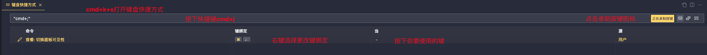

## 彻底删除

有时编辑器安装插件过多，造成异常时就需要重置 VSCODE。

> 重置前将安装的插件和热键备份，在下次重装时就省很多事情，具体操作方式请看下面的章节

### mac

1. 首先删除 vscode 软件（可以使用腾讯柠檬清理删除）

2. 执行以下命令删除 vscode 本地数据

    

    ```shell
    rm -rf ~/Library/Application\ Support/Code
    rm -rf ~/.vscode
    ```

3. 如果是 insider 版本执行以下命令删除本地数据

    

    ```shell
    rm -rf ~/Library/Application\ Support/Code\ -\ Insiders/
    rm -rf ~/.vscode-insiders/
    ```

### window

1. 首先删除 vscode 软件
2. window 系统删除以下文件夹 将`houdunren` 换成你的帐号

```shell
C:\Users\houdunren\.vscode
C:\Users\houdunren\AppData\Roaming\Code
```

## 风格界面

我们可以根据自己的审美，配置vscode的界面风格

### 中文语言

1. 扩展中搜索 `chinese` 即中文语言包

    

    https://marketplace.visualstudio.com/items?itemName=MS-CEINTL.vscode-language-pack-zh-hant

    > 也可以点击上面链接在浏览器中直播安装

2. 重启 vscode 工具完成

### 设置风格

下面的两款风格插件都不错，里面有多个主题。

1. Monokai Pro 
2. One Dark Pro
3. Ayu
4. Material Theme

## 修改键盘快捷方式

将`vscode`默认打开终端的方式快捷键`cmd`+`j`修改为`cmd`+`;`

方法：按`cmd`+`k`+`s`打开键盘快捷方式，然后鼠标左键点击右侧键盘标志，在输入框输入按下键盘的`cmd`+`j`键， 下面将展示对应的命令。选择`查看：切换面板可见性` ,右键点击更改键绑定，按下你要绑定的快捷键，这里我使用`cmd`+`j`来作为终端的打开方式。

