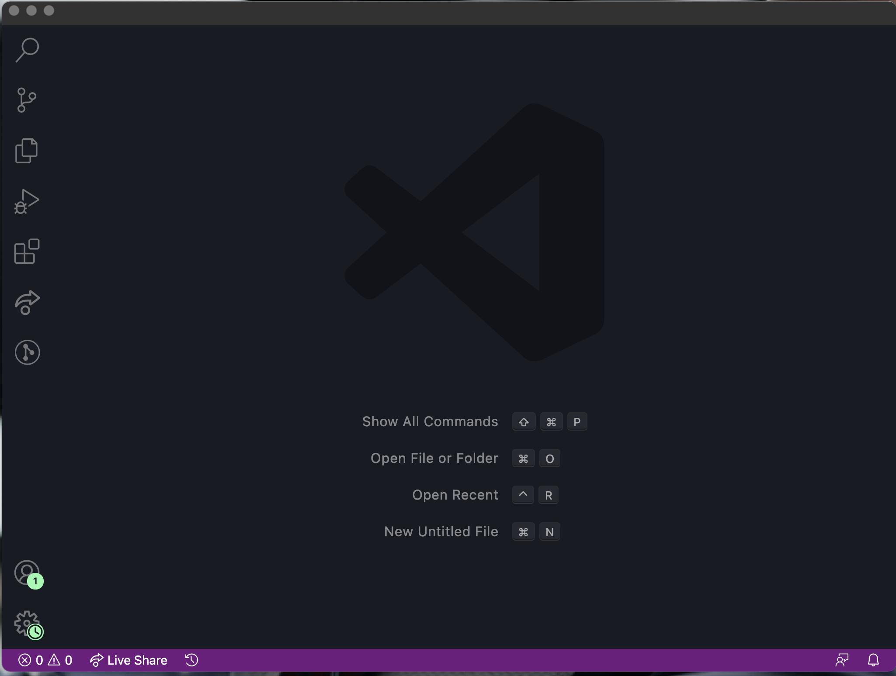
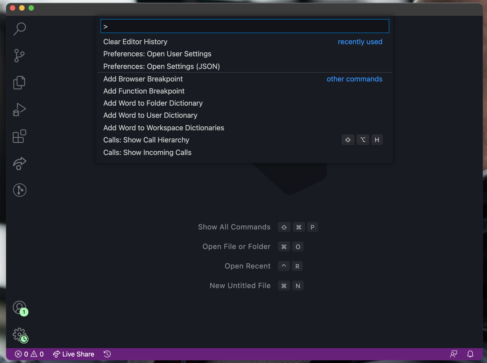
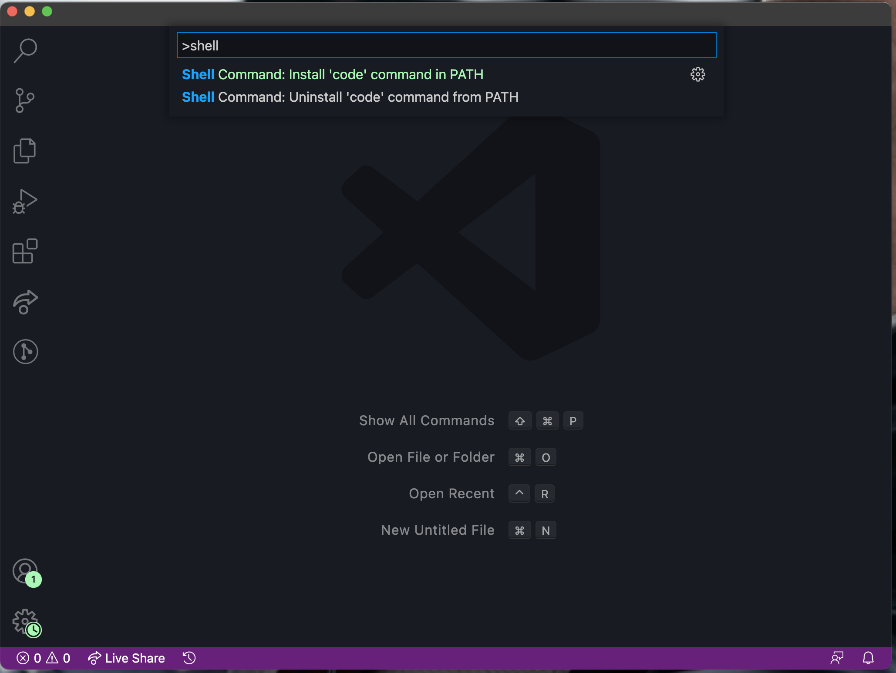
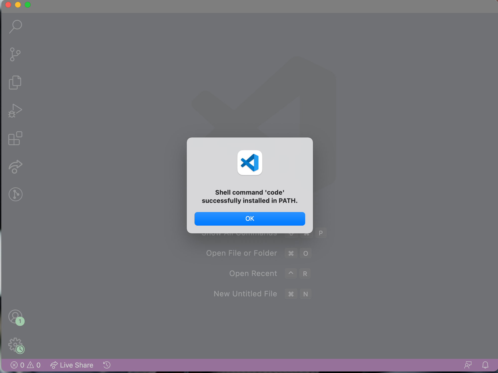
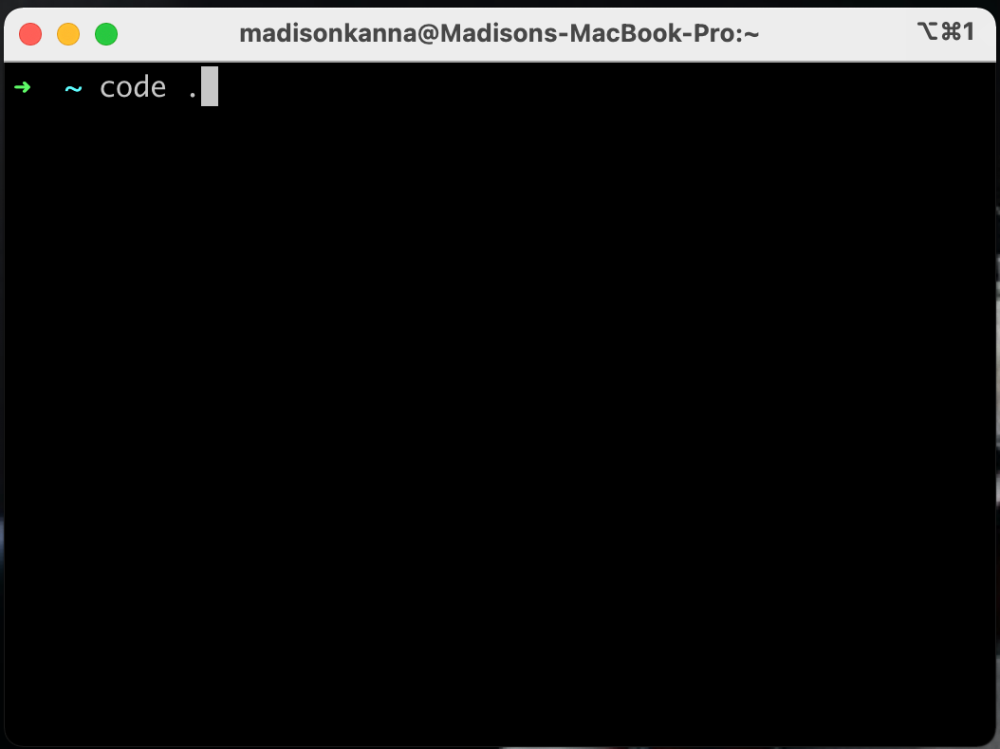

# 如何从终端打开 VS Code 编辑器

在本教程中，我们将介绍如何从 Mac 终端打开 VS Code 文本编辑器（Visual Studio Code）。

从终端打开文本编辑器是打开新项目和更快开始编码的一种快速、简单的方法。

## 如何下载和打开 VS Code

你需要做的第一件事是打开 VS Code。如果你还没有 VS Code，可以在[这里](https://code.visualstudio.com/)下载。VS Code 是 Microsoft 创建的流行的文本编辑器。

打开 VS Code 后，它应该如下所示：

现在，运行 `Command + Shift + P`。

你应该看到如下界面：

我们在这里所做的是打开了 VS Code 命令面板，这将允许你自定义 VS Code 设置等。

接下来，进入命令面板类型 `shell` 并按回车键。当你键入 `shell` 时，你的编辑器应如下所示：

当你点击回车键，你就完成了。你现在应该会看到一条成功消息：

现在你可以从终端打开 VS Code。现在让我们这样做。

## 如何从终端打开 VS Code

首先，打开你的终端。你可以通过几种方式打开终端。一种方法是同时按下 `command` 按钮和空格键。这将打开聚焦搜索。从这里，你可以输入“终端”。

一旦你的终端打开，你可以通过输入 `$ code .` 从它打开 VS Code。然后按回车键。

这应该是这样的：

点击回车键就可以打开 VS Code 了。

祝你编程愉快！