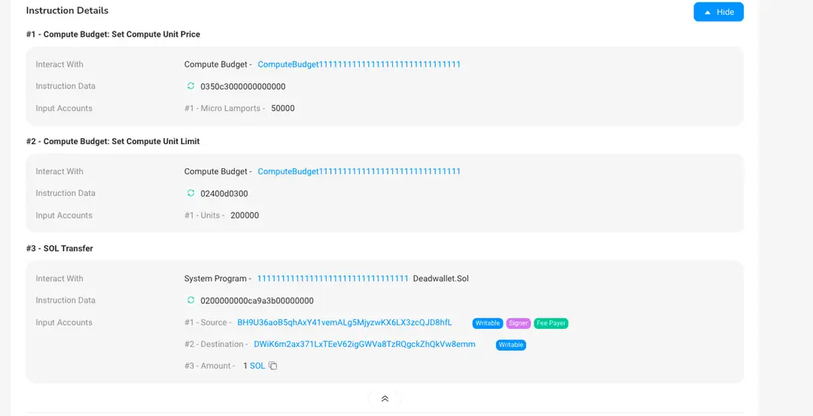

# 交易与指令

**引文**

### **交易（Transaction）**

交易是一组原子性的操作，代表对区块链状态的一系列更改，包括转账代币、调用程序、更新账户状态等。每个交易都具有唯一的签名，并由一个或多个指令组成。交易费用的支付通常使用 Solana 的原生代币 SOL。

**签名：**每个交易都必须由一个或多个账户的私钥进行签名，以确保交易的身份和完整性。

### **指令（Instruction）**

指令是交易中的一条具体指令，包含执行指令所需的具体数据，可以包括执行指令的程序唯一标识 program_id、账户列表、指令参数、配置信息等，用于执行一个特定的操作。

多个指令组成的交易可以实现多个不同的操作，形成一个**原子性**的事务。

当我们需要通过 Solana 发起一笔转账，或者调用一个程序时我们就需要通过交易（Transaction）来来完成。每个交易都包含：

●instructions：一个或多个指令

●blockhash：最新的块哈希值

●signatures：指令对应的发起人的签名

我们通过交易与 Solana 发生交互，而交互的最小单元就是交易中的指令（Instruction）。一个交易可以打包多个指令，指令指定调用哪个程序，要读取或修改哪些账户，以及执行程序需要的额外数据。

在进行一笔转账交易后我们可以在区块链浏览器查看相关操作，就可以看见一笔转账交易包含了三个指令: **Compute Budget: Set Compute Unit Price**， **Compute Budget：Set Compute Unit Limit**和 **Sol Transfer**

**Set Compute Unit Price**： 设置单个CU的价格

**Set Compute Unit Limit**：设置最多能消耗的CU的数量

**Transfer**: 进行一次转账

