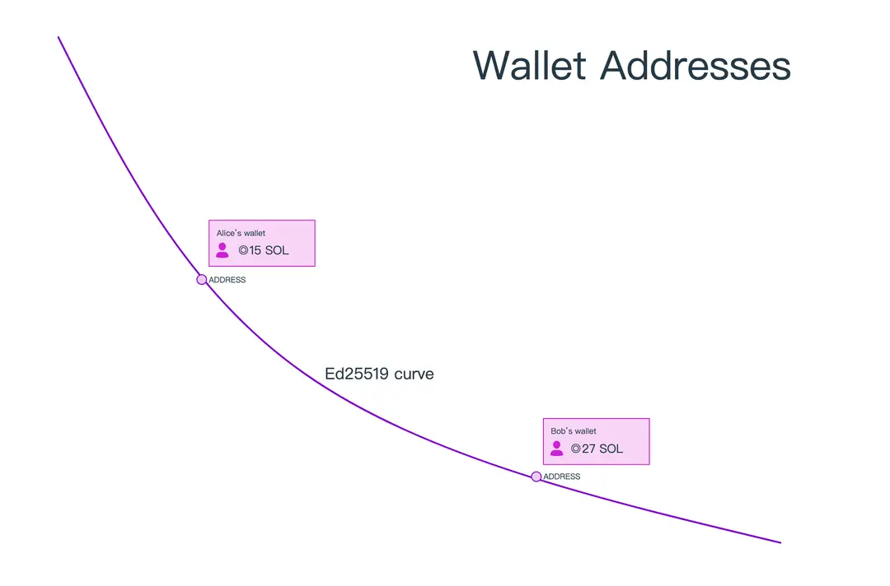
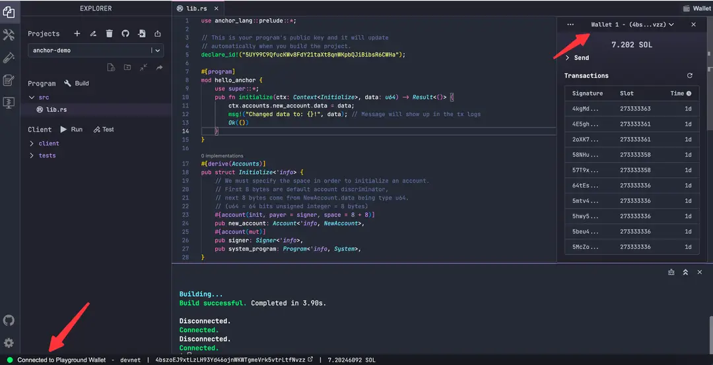
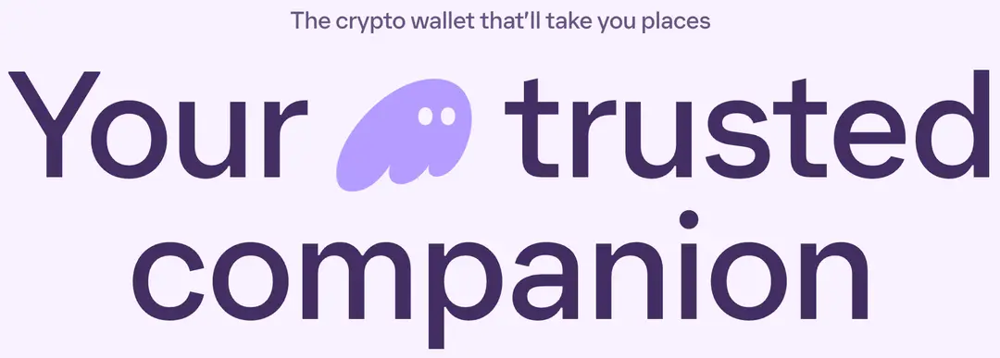

# 密钥与钱包

**引文**

### 什么是 Keypair 密钥对

在 Solana 中，采用了Ed25519 curve非对称加密算法，用于生成数字签名和验证数字签名。与对称加密算法不同，非对称加密使用一对密钥：pubkey公钥和secretkey私钥，如果使用公钥加密，则只有对应的私钥能够进行解密；如果使用私钥加密，则可以使用对应的公钥验证签名，即判断该签名是否由私钥的持有者发起。

Preview

Solana 中公钥用作指向网络上帐户的address地址，由于地址本身可读性较差，也可以使用域名系统，如使用example.sol来指向dDCQNnDmNbFVi8cQhKAgXhyhXeJ625tvwsunRyRc7c8这样的地址，使得地址的辨识度更高。

私钥用于验证该密钥对的权限。如果您拥有某个地址的私钥，您就可以控制该地址内的代币。当然，您应该始终对私钥保密。更推荐的做法是使用钱包。

### 什么是Wallet 钱包

钱包是为了安全存储私钥的地方。可以简单的分为软件钱包和硬件钱包，前者可以是 app 或浏览器钱包插件（跟网站交互更加方便），我们可以方便的查看钱包地址、提交交易、使用私钥进行签名。后者把私钥存在单独的硬件设备上，相比于软件钱包，硬件钱包通常更安全，因为它们是离线的，不容易受到网络攻击，不过它们的使用却没有软件钱包那样方便灵活。当然并没有绝对的好与坏，具体选择哪种应该根据具体情况而定。

### Playground 中的测试钱包

Preview

Solana 的[Playground](https://beta.solpg.io/)是一个在线 IDE 工具，用于在浏览器中体验和测试 Solana 区块链的功能，类似于以太坊的Remix开发工具。我们在后续的课程中会大量地使用 Solana Playground。

在 Playground 中，Wallet（钱包）通常是通过 Solana 提供的默认生成机制生成的，包括一个公钥和一个私钥。可以通过该 keypair 密钥对 Playground 中执行各种操作，如创建账户、发送交易等。用户可以通过界面上的相关功能查看和管理生成的钱包。

对于开发环境，我们可以在这个[🚰🚰🚰水龙头](https://faucet.solana.com/)地址领取测试sol，每小时最多10个（后续课程中我们需要用到大量的测试币，请提前领取）。

请注意，由于 Solana Playground 是一个测试和学习工具，生成的钱包主要用于模拟 Solana 区块链上的交互，并不适用于真实的生产环境。在真实的应用中，我们需要更安全和专业的方式来生成和管理钱包。

### Phantom 软件钱包

在进行实际的资产管理时，我们应该使用专业的软件钱包或硬件钱包。

比如，[Phantom](https://phantom.app/) 是 Solana 生态系统中使用最广泛的软件钱包之一。它支持一些最流行的浏览器，并具有用于随时随地连接的移动应用程序。更多的信息，大家可以在它的官网查阅。

Preview