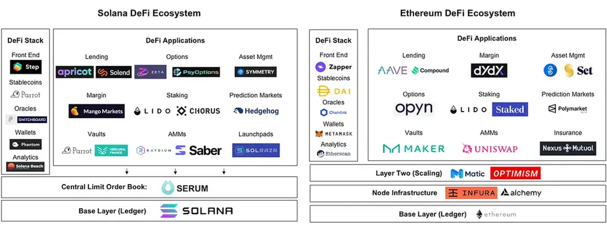
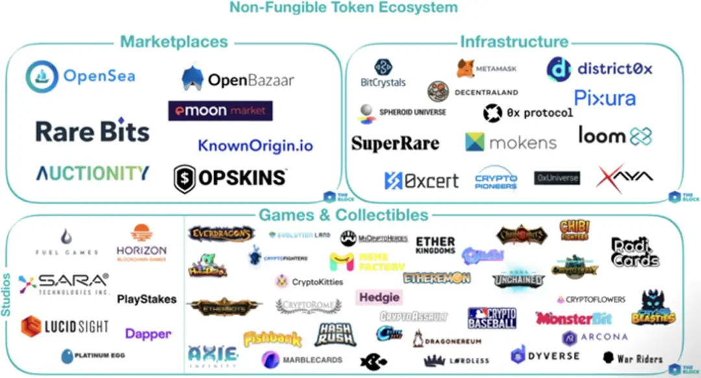
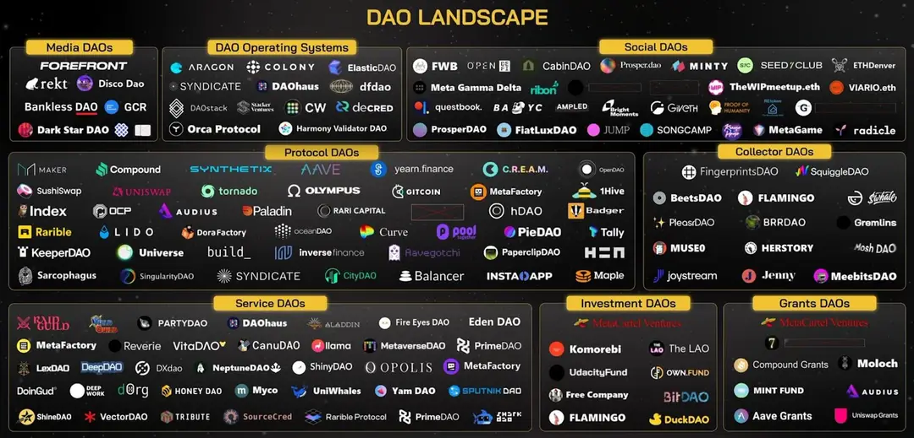
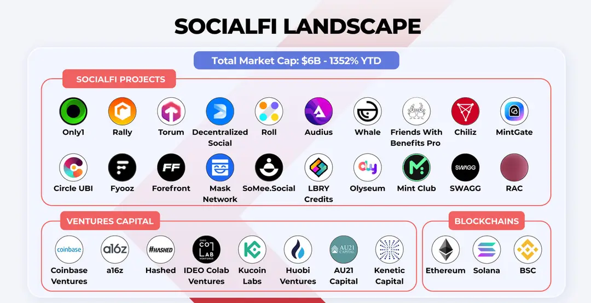
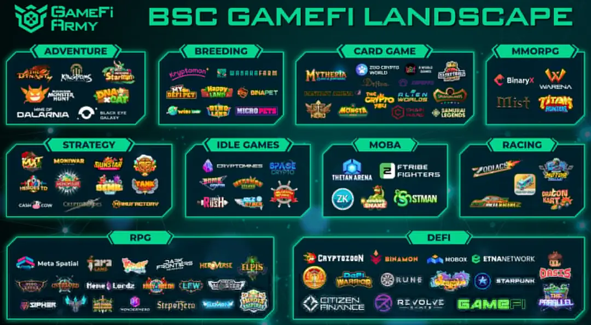

# Web3 领域分析（赛道和经典项目）

## 目标

本节的目标是学习

- Web3 有哪些主流的赛道
- Web3 各赛道有哪些经典项目

## **赛道整体介绍**

Web3 致力于构建一个去中心化、由用户主导的下一代互联网。在这个生机勃勃的领域中，广泛分布着各种类型的赛道，涵盖了去中心化金融（ DeFi ）、非同质化代币（ NFT ）、去中心化自治组织（ DAO ）、去中心化身份（ DID ）、社交金融（ SocialFi ）、游戏金融（ GameFi ）和基础设施等关键领域。每个赛道都孕育出了具有创新性和影响力的经典项目，从为用户提供金融自主权 的 DeFi 协议，到赋予数字创作独特身份的 NFT 市场，再到通过 DAO 促进群体决策的平台。每个赛道都是 Web3 世界的一个关键支点，共同构建起一个更加开放、透明和包容的数字未来。

接下来，让我们来揭开每一个赛道的神秘面纱。

## **去中心化金融**

去中心化金融（ Decentralized Finance，简称DeFi ）是基于区块链、智能合约技术的金融服务和应用，允许用户直接通过智能合约进行金融交易。与传统的中心化金融（ CeFi ）不同，DeFi 不依赖中央权威或中介机构来提供金融服务。在 DeFi 生态中，传统金融中的银行、经纪人和其他中介机构被智能合约所代替，一切都是通过代码来自动运行的，并且是开放透明的，任何人都可以参与验证。

去中心化金融为用户提供全球范围内无缝接入的金融服务，包括很多创新性的金融产品和服务，典型的 Defi 项目有 Uniswap（去中心化交易平台）、Aave（去中心化借贷平台）、MakerDAO（去中心化稳定币 DAI ）等，这些项目推动金融行业向更加开放、透明和包容的方向发展。同时，DeFi 还通过分布式账本技术保障了金融交易记录的不可篡改性，从而增强了金融系统的安全性。

## **非同质化代币**

非同质化代币（ Non-Fungible Token，简称NFT ）是一种特殊类型的加密资产，它建立在区块链技术之上，通过智能合约保证其唯一性和稀缺性。与传统的加密货币（如比特币或以太坊）不同，每个 NFT 都有独特的身份标识。每个 NFT 就像一件有独特编号的艺术品或收藏品，比如一幅画或一枚限量版邮票，因为它们各自有不同的价值和特征，所以你不能简单地把它们进行交换。

非同质化代币具备唯一性和所有权的不可篡改性，这为数字内容创造者提供了将作品货币化的方式。典型的 NFT 项目有数字艺术平台 OpenSea 和 Rarible，这些平台让创作者能够直接向收藏爱好者销售其作品。此外，NFT 还可以用于游戏中，例如加密猫（ CryptoKitties ）这个游戏，每只猫咪都是一个独特的 NFT，玩家可以在游戏里购买、繁育和交易猫咪。随着 NFT 技术的成熟和市场的认可， NFT 正在逐渐扩展到更多的领域，如音乐、影视和体育等。

## **去中心化自治组织**

去中心化自治组织（ Decentralized Autonomous Organization，简称DAO ）是一种基于区块链技术的创新组织形式，它不同于传统的中心化管理结构。在 DAO 中，权力和决策过程是分散的，对于重大的问题，比如资金分配、规则制定和项目发展方向等，不是由单个领导或小团体决定，而是由持有组织代币的成员共同投票决策。DAO 通过把规则写入代码中，由智能合约来自动执行，确保了规则的确定和透明。

去中心化自治组织允许成员在没有中央管理者的情况下共同做出决策，这样的组织形式能够促进更加公平和透明的决策过程，同时也增强了社区成员之间的协作。典型的 DAO 项目有 MolochDAO，它是一个专注于为以太坊生态系统提供资金支持的组织，其运作方式是成员提交提案请求资金，然后其他成员共同投票决定是否批准这些提案，如果有足够多的投票支持，那就会从 DAO 的资金库中拨款来执行这些提案。MolochDAO 的提案信息是公开的，任何人都可以查看项目的介绍、投票和执行情况，从而增加了透明度和社区参与度。

## **社交金融**

社交金融（ Social Finance，简称 SocialFi ），结合社交网络和去中心化金融（ DeFi ）的特点，通过区块链技术，实现了社交互动的同时进行资产的生成、交换和增值。与传统社交平台不同的是， SocialFi 平台让用户在参与社交活动如发帖、评论、分享内容时得到实质性的经济奖励，比如代币或 NFT，同时保证了他们对自己数据的所有权和控制权。这种模式打破了传统社交网络的利益分配机制，将价值回馈给内容创造者和社区成员。

社交金融重新定义了内容创造和社区参与的奖励系统，用户不仅能享受社交乐趣，还能从中获得实际收益。Mirror 是当前较为主流的 SocialFi 项目之一，Mirror 平台利用区块链技术确保创作者拥有其作品的数字版权，并且能够通过加密货币进行收益分配。比如创作者在平台上发布文章后，可以根据文章的受欢迎程度和用户的互动情况（点赞、分享、评论等），获得相应的代币奖励。创作者还可以在平台上进行众筹活动，使用智能合约创建代币化的众筹项目，这些代币可能会随着创作者的成功而增值，从而吸引投资者支持他们的创作。

## **游戏金融**

游戏金融（ Game Finance，简称 GameFi ）是一种结合了加密货币和非同质化代币（ NFT ）的游戏模式，玩家可以在虚拟的游戏世界中参与活动，并通过这些活动获得实际的经济回报。这种游戏模式赋予玩家拥有资产的所有权和交易能力，允许他们自由地买卖、交换或投资这些资产。GameFi 项目往往集成了 DeFi（去中心化金融）的功能，如流动性挖矿、借贷和收益农场，使玩家在享受游戏乐趣的同时，还能参与到复杂的金融活动中。

游戏金融创造了一个全新的经济模型，玩家的时间和技能可以转化为现实世界的财富，同时也促进了数字资产的流通和创新。Axie Infinity 作为典型的 GameFi 项目，让用户通过购买、培育、繁衍及交易虚拟宠物来参与游戏。这些宠物如果拥有稀缺的属性，往往具有更高的市场价值，用户可通过繁殖和销售这些宠物来赚取利润。此外，用户参加战斗也能够赚取 SLP 和 AXS 代币，这些代币可以在加密货币市场兑换成真实的货币。同时，将 AXS 和 SLP 代币质押到 DeFi 协议中，用户还有机会获得额外的收益。

## **去中心化身份**

去中心化身份（ Decentralized Identity，简称 DID ），是一种基于区块链技术的身份认证方式，使得用户无需依赖于任何中心化组织或服务提供商，就能够拥有并控制自己的身份信息。在这个系统中，用户的身份数据被加密并分散存储在区块链网络上，用户可以自主管理其身份证明和相关数据，使用私钥进行安全验证，以此确保身份信息的可靠性和隐私性。

去中心化身份为用户提供了身份数据主权和隐私保护，一个典型的 DID 项目例子是 ENS（ Ethereum Name Service ），它允许用户将复杂的以太坊钱包地址转换为易读易记的域名，如“ alice.eth ”，从而简化了转账过程，并且提升了用户体验。此外，这些域名也是用户在 Web3 世界的身份标志，通过 ENS，用户可以更方便地管理和展示自己的去中心化身份。

## **基础设施赛道**

基础设施赛道为整个 Web3 生态系统的运行提供了必需的底层技术支持，就像建筑需要坚固的地基那样，基础设施提供一系列的关键技术组件，包括区块链协议、智能合约平台、节点网络、分布式存储和跨链互操作协议等，这些组件确保了所有应用和服务能够安全、高效地运行。

基础设施赛道为 Web3 生态提供了稳固的根基，使得开发者能够构建出更加复杂、功能丰富的去中心化应用。典型的基础设施非常多，比如，以太坊（ Ethereum ）提供了一个智能合约平台，允许开发者在上面创建各种去中心化应用；IPFS（ InterPlanetary File System ）是一个分布式存储网络，解决了数据存储与传输的问题；而 Polkadot 和 Cosmos 等项目则致力于解决区块链间的互操作性问题，允许不同的区块链网络之间进行信息和价值的传递。这些基础设施项目是 Web3 生态发展的基石，对于推动整个行业的创新和成熟起着至关重要的作用。

## **小结**

这一小节，我们学习了 Web3 领域的主流赛道和经典项目。

Web3 的各赛道犹如百花齐放，共同构建了一个去中心化、透明且充满创新的数字生态系统。去中心化金融（ DeFi ）通过摒弃中介，实现了开放式的金融交易和服务；非同质化代币（ NFT ）增加了数字资产的独特性和价值；去中心化自治组织（ DAO ）推动了集体决策和公平管理；去中心化身份（ DID ）确保了个人身份数据的安全和隐私；社交金融（ SocialFi ）和游戏金融（ GameFi ）将传统的社交和游戏行为与经济激励结合，重新定义了用户参与的价值；而基础设施赛道则为这一切提供了稳定的技术支持和发展平台。

总的来说，Web3 的各赛道不仅推动了技术创新，也为用户赋权，创造了全新的价值流转方式和收益模型，展现了互联网发展的新趋势。

## 下一节

下一节课我们将介绍 Web3 未来的发展趋势。