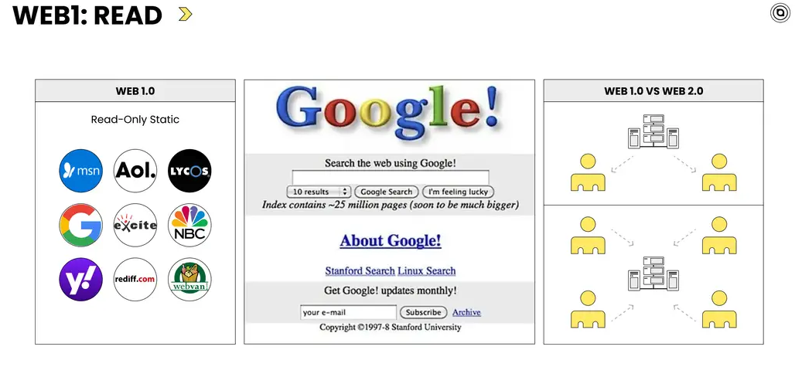
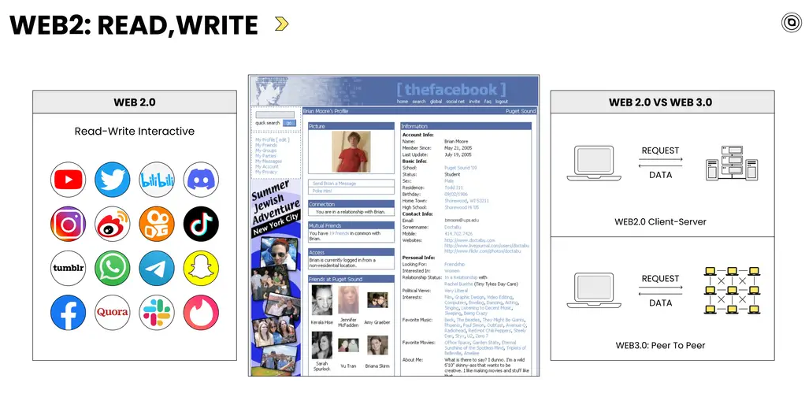
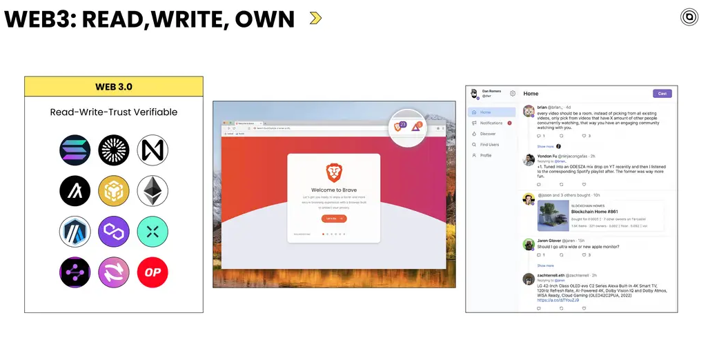

# Web3发展简史

## 目标

本节的目标是学习

●Web3 如何一步一步发展至今

##  **互联网诞生之初**

在介绍 Web3 的发展历史之前，我们先回顾一下互联网的诞生过程。

互联网的诞生源于冷战时期的通信需求。在20世纪60年代，美国国防部的高级研究计划局（ ARPA ）开发了一种分布式网络系统，即 ARPANET，旨在保持即使在核攻击下也能保持通讯线路畅通。这一网络技术经历了 web1.0—> web2.0 —> web3.0 三个阶段，逐渐演化成了今天的互联网形态。

##  **Web1.0 阶段**

在1990年代初期，随着万维网（World Wide Web, 简称 WWW ）的出现，Web1.0 时代正式拉开序幕。Web1.0 是互联网的早期形态，以静态网页为主，内容由网站所有者创建和管理，用户主要是信息的接收者。

Web1.0 时代的典型产品有新浪、搜狐、网易等，作为门户网站提供新闻、体育、娱乐等内容的聚合和分发，用户可以在上面阅读各种信息，但互动性非常有限，早期并不支持用户发布内容或参与评论。

Web1.0 解决了信息共享和传播的问题，使得文本、图片和后来的多媒体内容能够迅速在全球范围内传播，用户通过在线新闻网站，就可以即时阅读到全球各地的新闻报道。比如2001年9月11日，当美国著名的“911恐怖袭击事件”发生时，各大新闻网站能够迅速地将现场的图片和报道传遍全世界，人们无需等待传统的电视和广播报道，就可以通过互联网实时获取事件的最新进展。

然而，Web1.0 也存在明显的问题，如互动性差，缺乏用户参与和内容贡献，用户只能被动接受信息，不能对网页内容进行修改或评论，这在很大程度上限制了互联网的发展。

## **Web2.0 阶段**

正是由于 Web1.0 存在的这些问题，Web2.0 应运而生。这个互联网的新阶段开始于2004年左右，强调用户参与、共享和协作，在互动性和参与性方面大大增强，标志着互联网从静态页面向交互性和社会性网站转变。

Web2.0 时代的典型产品非常多，有微博、博客、贴吧、论坛、公众号、抖音等，用户可以在上传内容、评论和互相交流，这些产品大量依赖用户生成的内容，并通过社交网络连接用户。

Web2.0 极大地解决了用户参与度低的问题，推动了信息的开放共享、用户间的互动协作以及社群文化的繁荣发展。比如使用抖音平台，用户可以非常容易地拍摄短视频，分享自己的烹饪技巧，其他用户在观看短视频后，不仅能够快速理解和掌握烹饪技巧，还可以在评论区提出问题或分享自己的烹饪成果，形成了一个良好的互动学习的社区。

尽管 Web2.0 的推广和普及推动了互联网的进步，但也引发了一系列问题和挑战。首先，数据的所有权和平台垄断问题日益突出，用户创造的内容和产生的数据往往由少数几家大公司控制，用户无所有权。其次，隐私泄露问题频繁发生，中心化平台的用户数据信息容易成为黑客攻击的目标。

## **Web3.0 阶段**

由于对 Web2.0 中心化控制和隐私问题的担忧，人们开始探索建立一个更加分散的、由用户主导的网络，这就是 Web3.0 早期的雏形。

经过多年的发展，Web3.0 的理念逐渐形成。这一阶段强调去中心化，旨在解决数据的所有权和隐私问题。利用区块链、智能合约和分布式存储等技术，用户可以拥有并控制自己的数据，不必将信息托付给中心化的服务提供商，同时也降低了数据泄露的风险。

说到 Web3.0 时代，不得不介绍一下以太坊（ Ethereum ），它是一个开源的、去中心化的区块链平台，由加密领域的传奇人物 Vitalik Buterin 等人于2015年推出，是 Web3.0 发展中的核心平台之一。以太坊引入了一个关键的创新——智能合约（Smart Contracts），允许在全球范围内无需信任第三方的情况下执行 DApps 代码，扩展了区块链技术的应用场景，极大的推动了 Web3 生态的繁荣发展。

虽然 Web3.0 在理论上具备很多优点，但它也面临着一系列的挑战，包括技术复杂性、用户体验不友好以及法律监管等问题，目前还未得到大规模的普及和应用。

## **小结**

这一小节，我们学习了 Web3 的发展历程。总而言之，从 Web1.0 时代的静态网页，到 Web2.0 时代的社交互动，再到 Web3.0 的去中心化智能网络，互联网的每一次演进都是为了解决前一代技术的不足，体现了人们对数字世界持续不断的探索和追求。 Web3.0 目前虽然尚处于发展早期，但其背后的理念 ”赋予用户更多的控制权和隐私保护” 无疑为未来互联网的发展指明了方向。随着技术的进步和用户需求的不断变化，我们可以期待 Web3.0 将继续演进，为我们打开一个全新的数字世界。

##  下一节

下一节课我们将对 Web3 各个领域进行分析。