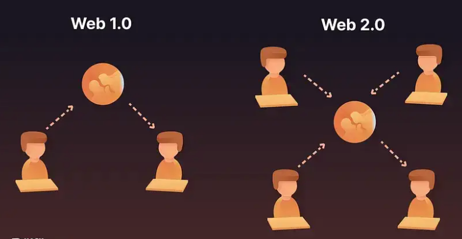
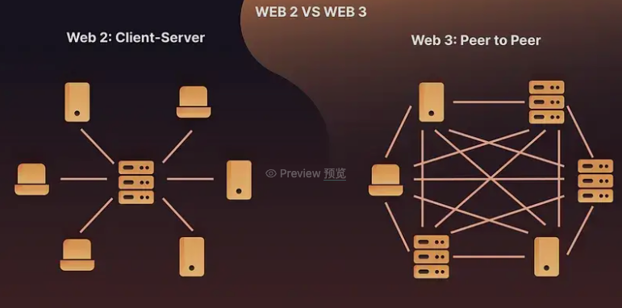

## 1. Web3 简介

## 目标

本部分的目标是学习：

- 什么是 Web3
- Web3 的意义

## 前言

亲爱的读者，如果您对近年来出现的 Web3 热门概念感到困惑，请不要担心，您并不孤单。

作为一种新兴技术，Web3正在逐渐改变我们的数字生活。理解其基本概念对于与时俱进至关重要。本文将带您进入 Web3 的世界，探索其复杂性。让我们从Web3的诞生开始。

## 当前的互联网格局和问题

在 Web3 时代之前，互联网用户可以进行各种在线活动，例如浏览网站、创建自己的文本、图像、视频和其他内容，以及在社交网络上分享和交流，从而引领充满活力的在线生活。例如，在微博上社交，在公众号上发表文章，在淘宝上购物，在TikTok上上传短视频作品等等。

然而，这个时代也带来了一些问题。尽管用户可以自由创建和共享内容，但这些内容和相关数据实际上由运营这些平台的科技公司控制。用户是内容的生产者，但他们并不真正拥有自己的数据。这导致了一系列隐私和安全问题，个人信息可能被滥用或泄露。一个典型的例子是 2018 年 Facebook-Cambridge Analytica 数据泄露丑闻，数百万 Facebook 用户的个人信息被不当收集并用于影响政治选举，凸显了集中式数据控制的风险和后果。

## Web3 的诞生

正是在这样的背景下，Web3（也称为Web 3.0）的概念诞生了。简单来说，Web3 是建立在区块链技术上的下一代互联网。它强调去中心化，这意味着没有集中管理数据和资源的权力机构。

## Web3的意义

在 Web3 世界中，用户对他们创建的内容和数据拥有真正的所有权，从而摆脱了对传统中心化平台的依赖。此外，Web3 的不变性和透明度特性由智能合约和区块链技术提供支持，可促进建立信任、减少欺诈并降低中介成本。Web3 还激发了新的商业模式和经济系统，例如去中心化金融 （DeFi）、不可替代代币 （NFT）、去中心化自治组织 （DAO） 等。

综上所述，Web3不仅仅是一场技术创新，更是一场关于数据主权的社会运动，代表了对隐私保护的更高追求。

## 总结

通过本教程，我们了解了 Web3 作为下一代互联网技术的基本概念和重要性。Web3不仅解决了传统互联网时代面临的隐私泄露和安全问题，还促进了信任的建立，降低了交易成本。

## 下一节

在下一课中，我们将了解 Web3 的发展历史。