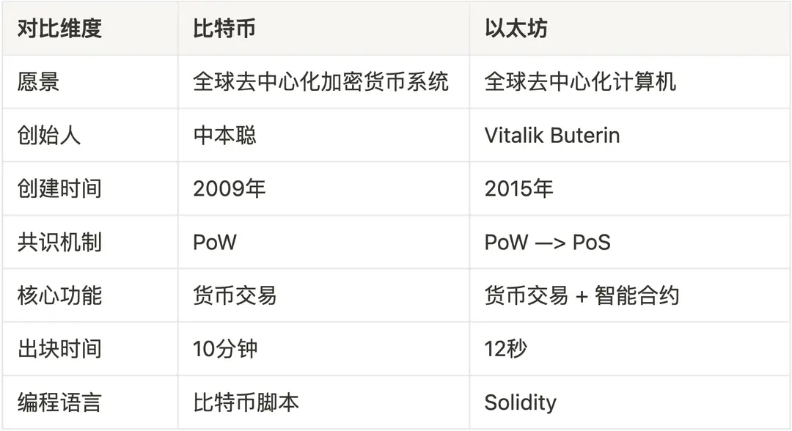

# 以太坊和智能合约

## 目标

本节的目标是学习

●什么是以太坊

●什么是智能合约

●以太坊和比特币的区别

## **以太坊简介**

2013年，一个年轻的程序员、同时也是比特币的狂热爱好者 Vitalik Buterin 注意到，比特币的区块链技术具有极大的潜力，但是其功能只用于处理货币交易。他想要创建一个更加灵活的平台，除了货币交易，开发者还能够构建各种应用。于是，以太坊于2015年应运而生。

以太坊同样是一个开源的、去中心化的区块链平台，它不仅支持原生的加密货币：以太币（ ETH ），还提供了一个运行去中心化应用程序（ DApps ）的生态系统。这些应用程序通过智能合约来实现，运行在以太坊虚拟机（ EVM ）上。如果说比特币是一个全球分布式账本，那么以太坊就是一个全球分布式计算机。

## **智能合约**

智能合约是以太坊平台的灵魂所在，它们是存储在区块链上的、可以自动执行的代码，代码中包含了所有的运行规则。当预设的条件被满足时，合约便会自动执行相关的功能。

你可以把以太坊想象成一台自动售货机，你走到这台售货机前，选择了一瓶可乐，然后将需要的以太币（ ETH ）投入到售货机中。售货机内部运行的程序（智能合约）会自动验证你的支付，然后立即向你投递一瓶可乐。购买可乐的整个过程由智能合约来控制，无需第三方中介，降低了交易成本。智能合约代码是完全开源的，这样确保了交易的透明性。

## **以太坊和比特币的区别**

在区块链世界中，比特币和以太坊是最著名的两个平台，尽管都使用了区块链技术，但它们在设计、目标和应用上有着本质的区别。两者的主要区别如下：

## **小结**

这一小节，我们学习了以太坊的基本概念和其关键功能：智能合约，了解了以太坊和比特币的主要区别。尽管比特币和以太坊有着显著的区别，但它们都是区块链技术革命的关键参与者，共同促进了全球 Web3 生态的发展。