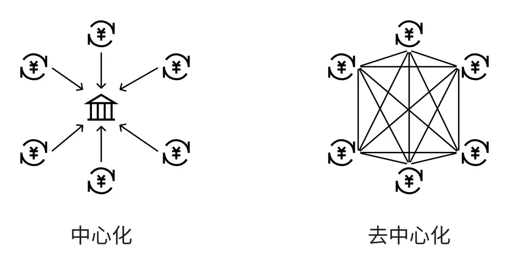

# 分布式账本和去中心化

## 目标

本节的目标是学习

- 什么是分布式账本

- 分布式账本的意义是什么

## **中心化账本**

传统的银行和金融机构使用中心化的账本系统，所有的交易信息都存储在银行的内部数据库中。这种模式让银行成为数据和资金流的控制中心，虽然便于管理，但是也存在着一些弊端。比如个人信息可能存在泄露的风险，一旦银行的系统遭受黑客攻击或内部人员滥用权限，用户的财务数据和个人隐私可能会被非法获取，甚至被用于欺诈和盗窃。

## **分布式账本诞生**

2008年，随着比特币白皮书的发布，一个被称作区块链的去中心化技术首次进入大家的视野。

## **分布式账本比喻**

让我们先用一个形象的比喻，来理解分布式账本和去中心化。

想象一下，你所在的班级有一笔公共经费，这笔经费只能用于班级公共开支，比如购买文具、组织活动、聚餐等。如果这笔经费的所有使用情况，都由班长一个人负责记录在他的笔记本里（这就是中心化），那么一旦班长不小心丢失了笔记本或者班长不诚实地篡改了数据，就会导致班级的经费记录出现问题，整个班级的利益都会受到损害。这就是单一账本和中心化方式存在的问题。

现在让我们换一种方式来管理这笔经费，每个同学都有自己的一个小本子（这就是去中心化），每当有经费收入或支出时，所有人都会在自己的本子上记录下来。这样，即便有少部分同学的记录出现差错，班级经费的管理仍然能够维持其透明度与可信度，因为每个人都持有一份相同的记录，这种分散记录的账本就叫分布式账本。使用分布式账本，如果某位同学需要篡改经费开支记录，必须联合一半以上的同学同时修改，这样的修改难度会随班级人数的增加而增加，篡改成功的难度非常大。

## **分布式账本工作原理**

每一条区块链都是一个分布式账本，所有的交易记录不是存放在一个中央服务器上，而是分散存储在网络中的所有计算节点中，每个节点都有一份交易账本的拷贝，这些拷贝是完全相同且实时更新的。当有新的交易发生时，这个交易会被发送到网络中的所有节点，并通过矿工验证确保其有效性。一旦交易被验证，它就会被添加到账本的最新页面上，也就是区块中，并且这个过程是不可逆的，一旦记录下来，就无法被篡改或删除。

## **分布式账本典型案例**

比特币，作为第一个成功的加密货币，也是分布式账本的典型应用。比特币网络由超过10000个活跃的全节点组成，这些节点遍布全球各地，任何人都可以运行一个节点，参与到网络的维护中来。节点的多样性与地理分布性，确保了网络的健壮性和抗审查能力。

## **小结**

这一小节，我们学习了分布式账本的基本概念。分布式账本这种去中心化的数据管理方式，保证了交易记录的透明、安全和不可篡改，它使得在没有中央权威机构的情况下，网络中的参与者可以达成共识，这是 Web3 能够提供去中心化信任和协作的基础，得到了全球的广泛认可。