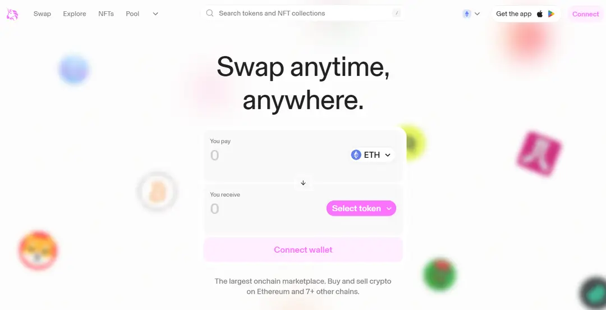

# 去中心化金融（ DeFi ）

## 目标

本节的目标是学习

●什么是 DeFi

●DeFi 的价值

●DeFi 的典型项目

## **DeFi 简介**

去中心化金融（Decentralized Finance，简称 DeFi），是一种运行在区块链技术之上的金融生态系统。它通过智能合约（自执行的程序代码），实现了金融服务的自动化，同时也消除了传统金融体系中存在的中介机构如银行、经纪人等。在 DeFi 的世界里，所有的交易和服务都是透明的、无需许可的，并且对所有连接到互联网中的人都开放。

## **DeFi 的价值**

与传统的中心化金融（ Cefi ）相比，去中心化金融在可访问性、透明度、安全性、效率、创新性和去中心化等方面具有显著价值。

●首先，DeFi 通过提供无国界的金融服务，确保全球的用户只需要连接互联网，就能够不受地理限制地进行交易。这对于那些传统银行服务不足或不可获得的地区尤其重要。

●其次，DeFi 利用区块链技术公开记录所有交易，使得任何人都可以验证和审计这些记录。这种开放性极大地增加了系统的透明度和可信度，用户可以直观地看到资金流动，减少了隐藏费用和潜在的不正当行为。

●在安全性上，DeFi 通过先进的加密技术来保护用户的资金和交易，大幅降低了欺诈行为和黑客攻击的风险。自动化的智能合约还确保了交易的无缝执行，无需传统金融机构复杂的手续和人工审核，从而提高了操作的效率。

●在创新方面，DeFi 所提供的开放式开发平台吸引了全球的开发者参与，促使新的金融产品和服务不断涌现。这种基于社区的发展模式促进了创意的交流和快速迭代，加速了金融领域的技术进步。

●最后，与传统金融机构可能存在宕机的风险不同，DeFi 的分布式结构从本质上消除了单一控制点，增强了整个系统对于故障和攻击的抵抗力。即便部分节点受损，整个网络仍可持续运行，保障了金融服务的连续性和稳定性。

## **DeFi 典型项目**

Defi 的典型项目有 Uniswap，它是一个建立在以太坊区块链上的去中心化交易所（ DEX ）。Uniswap 基于一套全新的自动做市商( AMM )模型，而不是传统的订单簿系统，允许用户无需中介即可交易不同的加密货币。

交易流程如下：

●第一步：用户（流动性提供者）将他们的代币对存入资金池，比如往交易池存入一定数量的 ETH-USDT 代币对，为交易提供所需的流动性。

●第二步：其他用户需要兑换代币时，比如用 ETH 兑换 USDT，他们只需要将ETH转入交易所，智能合约会自动按照当前的汇率进行交易，再转出指定数量的 USDT。

在 Uniswap 中进行交易，用户不需要信任任何第三方，因为所有交易都是通过代码自动完成的，这降低了欺诈和中介风险。

## **小结**

这一小节，我们学习了 DeFi 的基本概念和典型项目。DeFi 代表了金融领域的一次革命，它通过技术创新，为用户提供了更多的选择和自由。虽然当前仍面临许多挑战，比如用户体验差、法律监管不健全等，但随着技术的进步，我们相信 DeFi 将在未来的金融行业扮演越来越重要的角色。