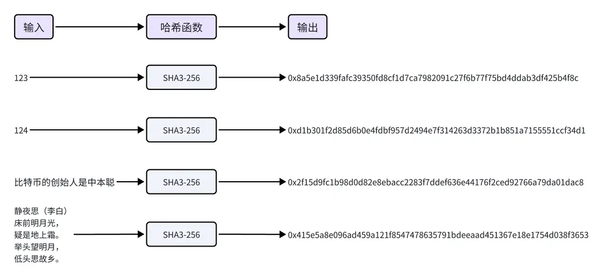

# 哈希函数和区块链链接

## 目标

本节的目标是学习

- 什么是哈希函数

- 哈希函数在区块链中的应用

## **哈希函数的历史**

哈希函数的概念可以追溯到20世纪50年代，当时它主要用于数据结构中，如哈希表，用来快速定位和检索数据。后来哈希函数经历了一系列的发展，旧的标准不断被更安全的新标准所替代：

MD4—>MD5—>SHA0—>SHA1—>SHA2—>SHA3

目前最先进的标准是 SHA-3，SHA-3 基于 Keccak 算法，由比利时密码学家设计，并在2015年成为 NIST 的标准。

## **什么是哈希函数**

哈希函数，也称为散列函数。它将任意长度的输入（通常称为“消息”），通过数学算法转换成固定长度的字符串，这个输出通常称为哈希值、散列值、消息摘要或者数字指纹。下图以 SHA3-256 哈希函数来展示，无论输入什么，输出都是一个长度为64的十六进制字符串。

## **哈希函数比喻**

你可以把哈希函数当做一台精密的蔬果汁机，想象一下，你有各种各样的水果和蔬菜，比如苹果、香蕉、胡萝卜、西红柿等。无论你放入多少种类和数量的水果蔬菜（输入），它们在机器里都会被切割、压榨（哈希计算），最终给你一杯特定容量的蔬果汁（哈希值）。放入不同种类数量的水果蔬菜，会给出不同味道的蔬果汁，你从蔬果汁中也没法准确推断出所使用原料的种类和数量。

## **哈希算法的特征**

●正向快速：无论输入的长度有多大，都能够快速计算出哈希值。比如把一个字符或者一本书的所有文字作为输入，都可以快速计算出哈希值。

●逆向困难：通过哈希值，无法在有限时间内逆向推出输入。比如通过哈希值0x8a5e1d339fafc39350fd8cf1d7ca7982091c27f6b77f75bd4ddab3df425b4f8c，无法逆向推出输入是123.

●输入敏感：输入的微小变化，会导致输出的显著变化。比如123和124的哈希值千差万别，看上去没有任何关联。

●避免碰撞：很难找到两个不同的输入，使得输出的哈希值一致（即发生碰撞）。比如很难找到除123之外的另一个输入，使它的哈希值也是0x8a5e1d339fafc39350fd8cf1d7ca7982091c27f6b77f75bd4ddab3df425b4f8c。

●不可预测：通过输入无法预测输出，所以挖矿时随机数nonce只能从1开始累加。

## **区块链中的应用**

哈希函数在区块链技术中起到关键作用，主要应用在这几个方面：

●确保交易数据的完整性和不可篡改性。每笔交易的哈希值都是独一无二的，任何细微的数据变化都会导致哈希值的巨大变化，使得网络参与者能够迅速发现交易数据被篡改的行为。

●将各个区块串联起来形成区块链，每个区块包含前一个区块的哈希值，从而确保了链上数据的连贯性和不可逆性。

●用于构建 Merkle 树以高效验证数据。

●实施工作量证明机制来增强区块链的安全性，通过解决计算难题来限制新区块的生成速度。

另外，哈希函数还与非对称加密结合，为交易提供数字签名，确保了交易的真实性。这些应用共同，保障了区块链网络的安全性和可靠性。

## **小结**

这一小节，我们学习了哈希函数的基本概念和在区块链中的应用。

总结来说，哈希函数是一种将任何长度的数据转换成一个固定长度的字符串的方法。在区块链中，哈希函数使得每笔交易和每个区块都变得独一无二，保证了数据的安全性和不可篡改性，是区块链中的核心工具。