# 如何参与 Web3

## 目标

本节的目标是学习

- 如何创建数字钱包

- 如何获得加密货币

- 如何交易加密货币

- 如何购买 NFT

## 前言

Web3 作为下一代互联网，为人们提供了一个去中心化、由用户控制的网络环境。普通人可以通过创建数字钱包、购买和交易加密货币、及参与 NFT 市场等方式参与到 Web3 中。下面我将带领你，从零开始一步一步踏入 Web3 的世界。

> [!NOTE]
>
>  由于 Web3 生态正处于迅速演变之中，相应的平台操作界面可能会不断更新和变化。如果您在阅读文章时，发现相关截图与实际操作界面不同，请以实际界面为准。感谢您的理解，并建议您关注平台的最新动态，以获取最准确的信息和操作指南。

## **创建一个数字钱包（以 MetaMask 为例）**

●第1步：访问 MetaMask 官网（ [metamask.io](http://metamask.io/) ）并选择合适的浏览器扩展程序进行安装。本次使用 Chrome 浏览器进行演示。

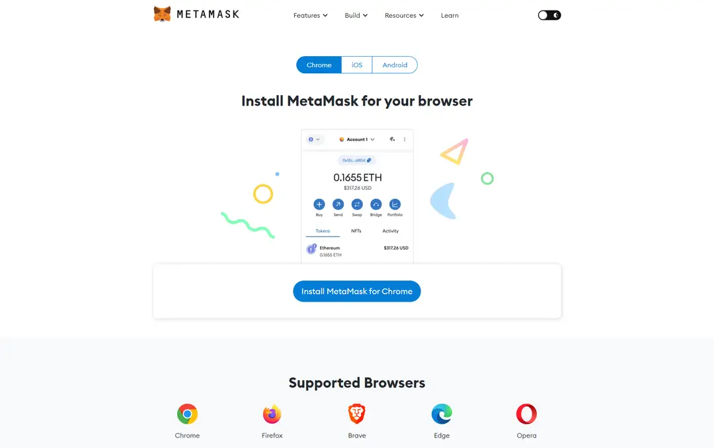

第2步：安装 MetaMask 插后，点击浏览器扩展图标打开 MetaMask，并选择“创建新钱包”。

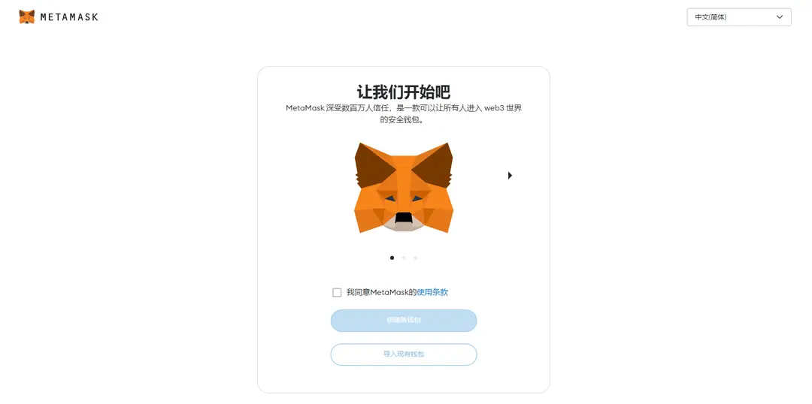

第3步：请设置一个强密码，相当于 MetaMask 钱包登录密码，用于在此设备上解锁钱包，保护你的信息。

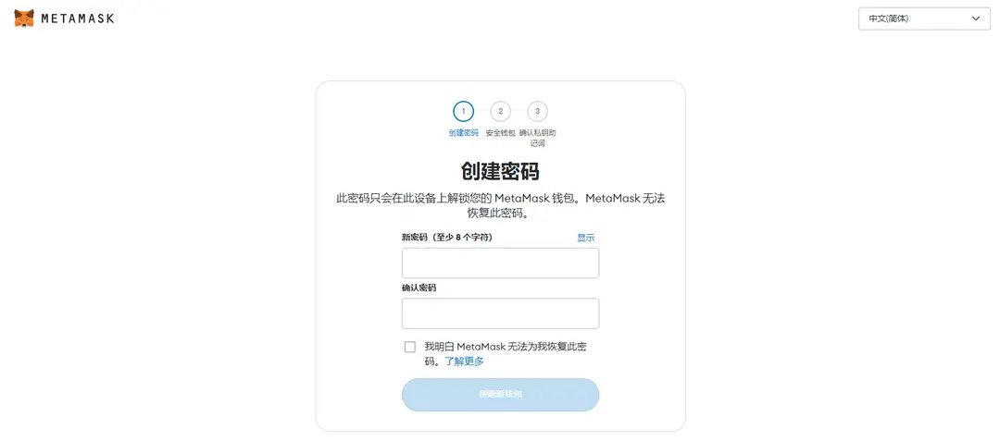

第4步：接下来会有一个简短的视频，介绍账户私钥助记词。如果您是一个 Web3 初学者，建议观看次视频。然后点击“保护我的钱包”。

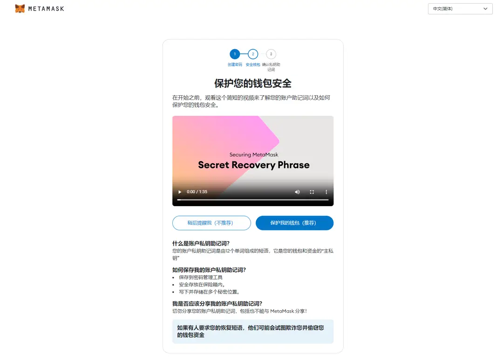

第5步：此时请确认没有人在看您的屏幕，电脑中也没有打开任何屏幕录制或屏幕共享软件，确保即将显示的私钥助记词只有您一个人知道。然后点击“显示私钥助记词”。

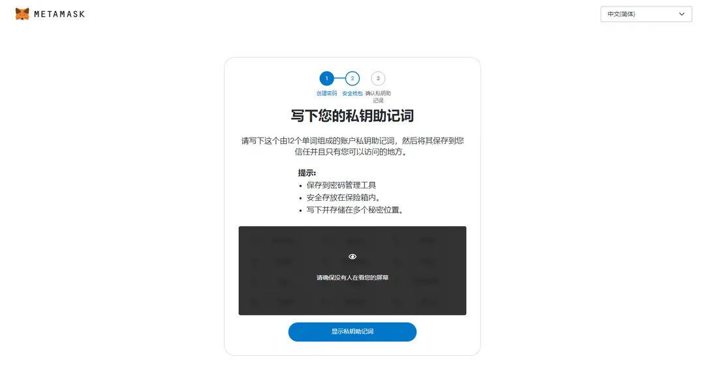

第6步：你会看到界面上显示由12个单词组成的私钥助记词，强烈建议将这12个单词用笔抄写下来，并存放到一个只有您知道的地方。请勿拍照、复制、打印或以其他任何电子文档的形式保存，否则可能存在泄漏风险。注意点击“下一步”之前务必记录好该助记词，之后将无法再次查询。

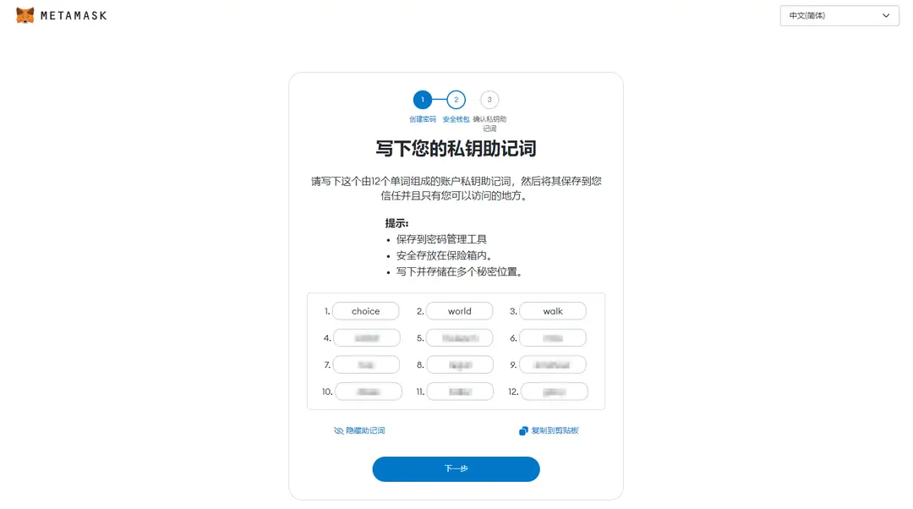

第7步：接下来会要求您确认刚才记录的私钥助记词，请将提示框中的助记词填入，后点击确认即可。

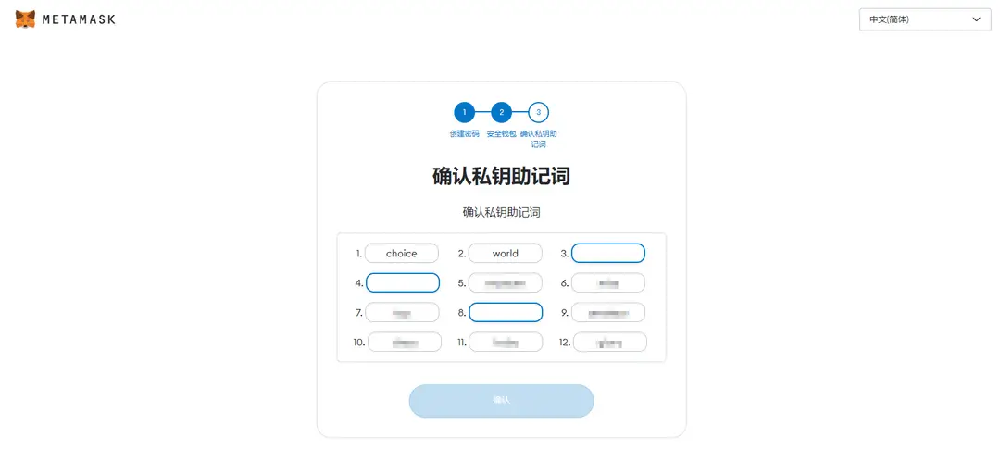

第8步：当看到钱包创建成功的提示，您的数字钱包就创建好了。

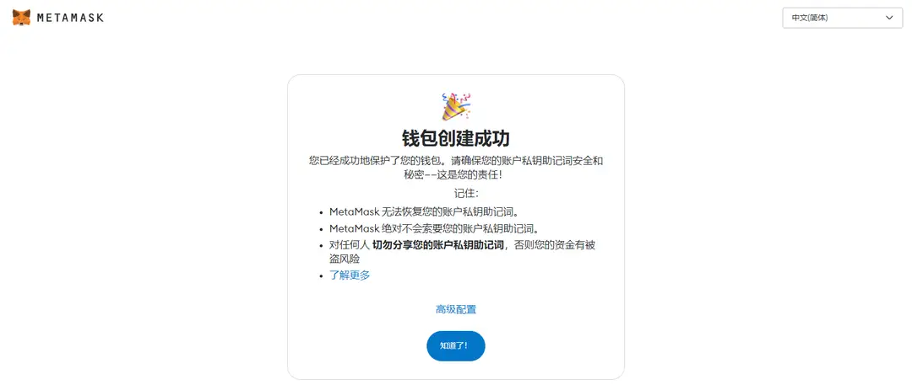

> [!WARNING]
>
> 重要提醒 请妥善保管好您的私钥助记词，不要泄露给任何人。其他人一旦获取了助记词，都可以完全控制该钱包中的所有资产。另外，如果您的设备丢失或损坏，不用担心，可以使用助记词在其他设备恢复钱包，您的资产仍然是安全的。

## **如何获得加密货币**

上一步我们创建了一个数字钱包，新钱包中没有任何加密货币，无法参与 Web3 生态中的活动。

下面介绍几种常见获取加密货币的方法：

●在中心化交易所购买：在交易所中，例如币安（ Binance ）和欧易（ OKX ）等，可以用法币直接购买加密货币。

●从其他钱包转账：你可以从自己的其他钱包向这个新钱包转账，或让其他人给你转账。

●参与项目空投活动：某些新项目为了推广，可能会给参与活动的用户免费分发一些代币。

●通过挖矿获取：如果你有能力和资源，可以通过挖矿的方式获得加密货币作为奖励。

获取加密货币之后，在钱包中可以查看指定网络中的货币名称和余额等信息。比如在下图中显示，该钱包在币安智能链( Binance Smart Chain，简称 BSC )中，拥有0.0266个 BNB 和1.59741个 CAKE。

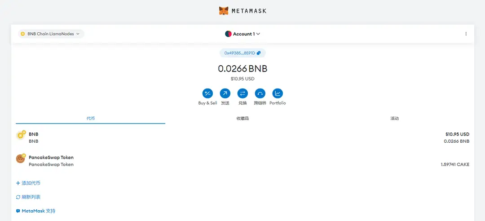

## **如何交易加密货币**

刚才的钱包中只有 BNB 和 CAKE 两种加密货币，如果此时需要 USDT，你可以在交易所进行加密货币交易，将 BNB 兑换为 USDT，下面以去中心化交易所 PancakeSwap 为例。

●第1步：访问 PancakeSwap 官方网站，并点击右上角的 “Connect Wallet” 按钮，选择你的钱包类型和账户地址，并授权连接到 PancakeSwap。

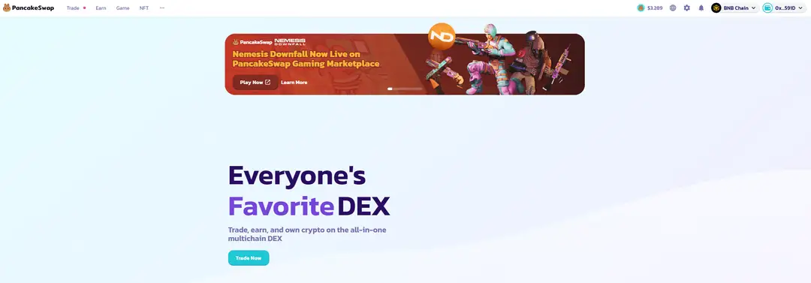

第2步：在 PancakeSwap 左上角的 “ Trade ” 菜单下选择 “ Swap ” 选项，即可看到兑换界面，此时需要选择交易前后的币种和交易金额，比如我们要将0.001个 BNB 兑换为 USDT：

●选择输入货币为 BNB（通常默认为 BNB）；

●选择输出货币为 USDT；

●输入兑换的 BNB 数量为0.001，系统会自动显示你将获得的 USDT 数量、汇率、滑点和手续费等信息，并实时更新。

如果对兑换比率感到满意，点击 “ Swap ” 按钮即可启动交易。

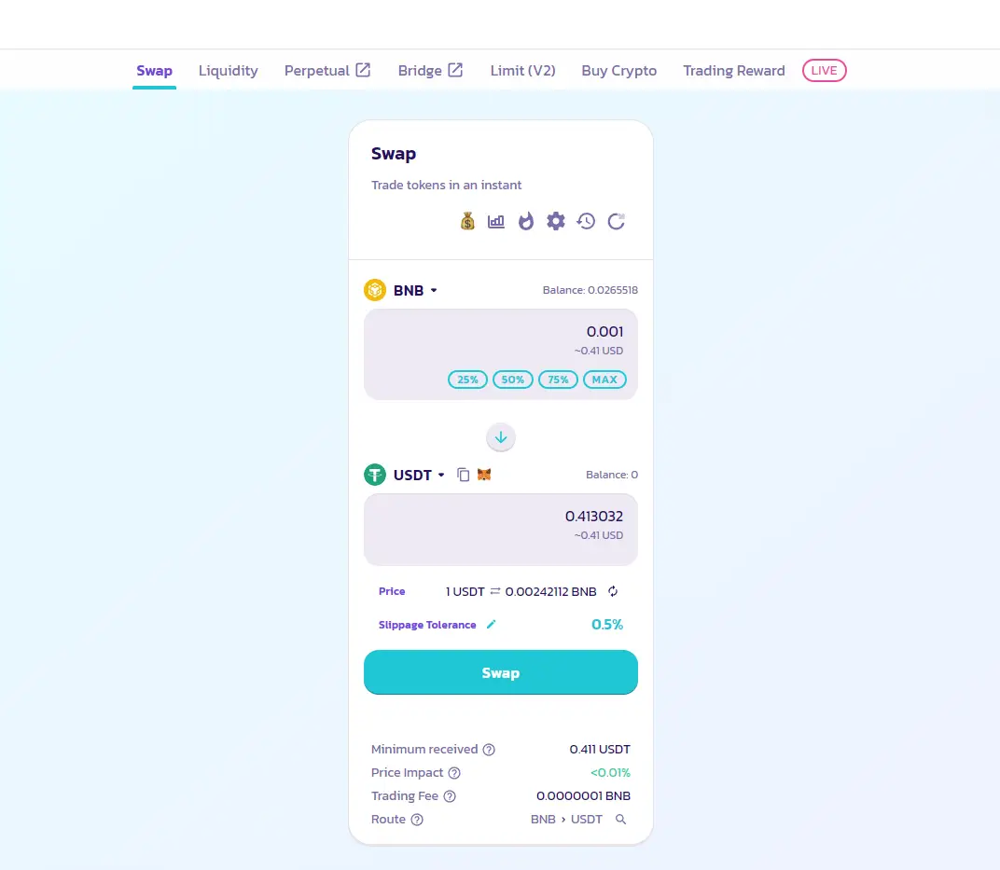

第3步：因为交易汇率在实时变化，平台会再次提醒你确认兑换比例是否满意，如果没问题，点击“ Confirm Swap ”按钮确认交易。

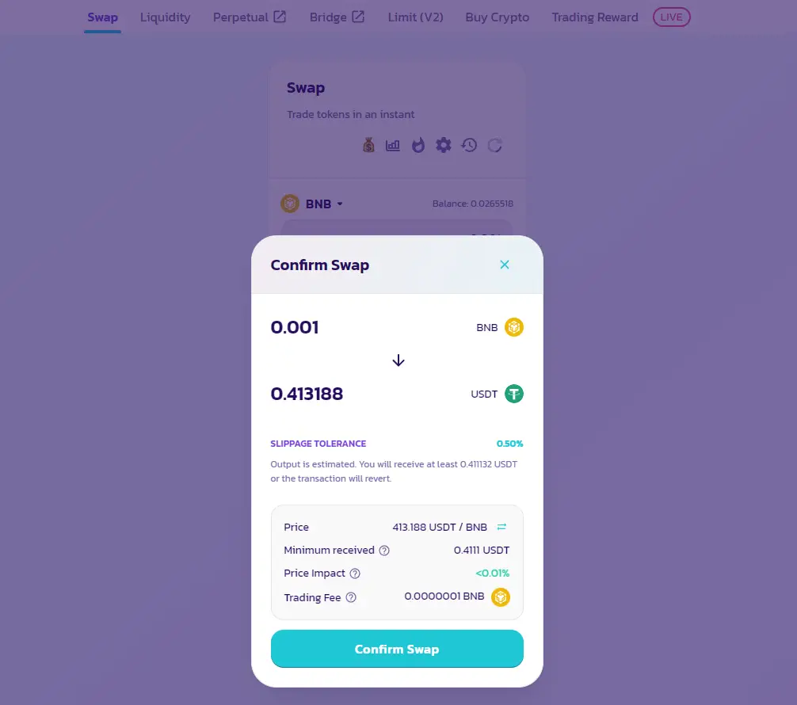

第4步：此时将会弹出 MetaMask 界面，显示交易的账户、交易金额和燃料费（手续费），确认无误后点击“确认”按钮。这一步的本质是，用户使用 MetaMask 钱包中的私钥，对交易进行签名授权操作。如果你对签名的原理还不太了解，可以不必深究，在后续章节，我们会对签名进行详细的介绍。

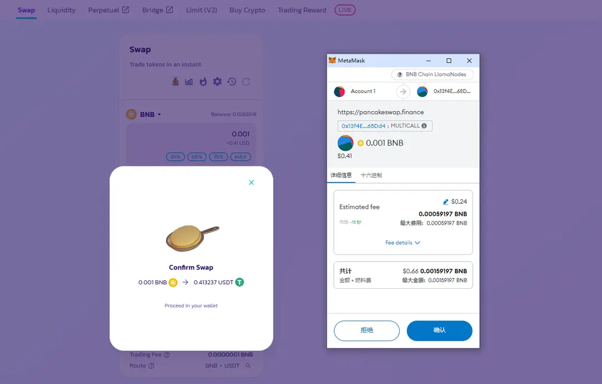

第5步：交易提交后，你需要等待区块链网络中的矿工确认交易，这可能需要几秒钟到几分钟不等。矿工确认交易完成后，你将看到如下交易回执提示（ Transaction receipt ）。

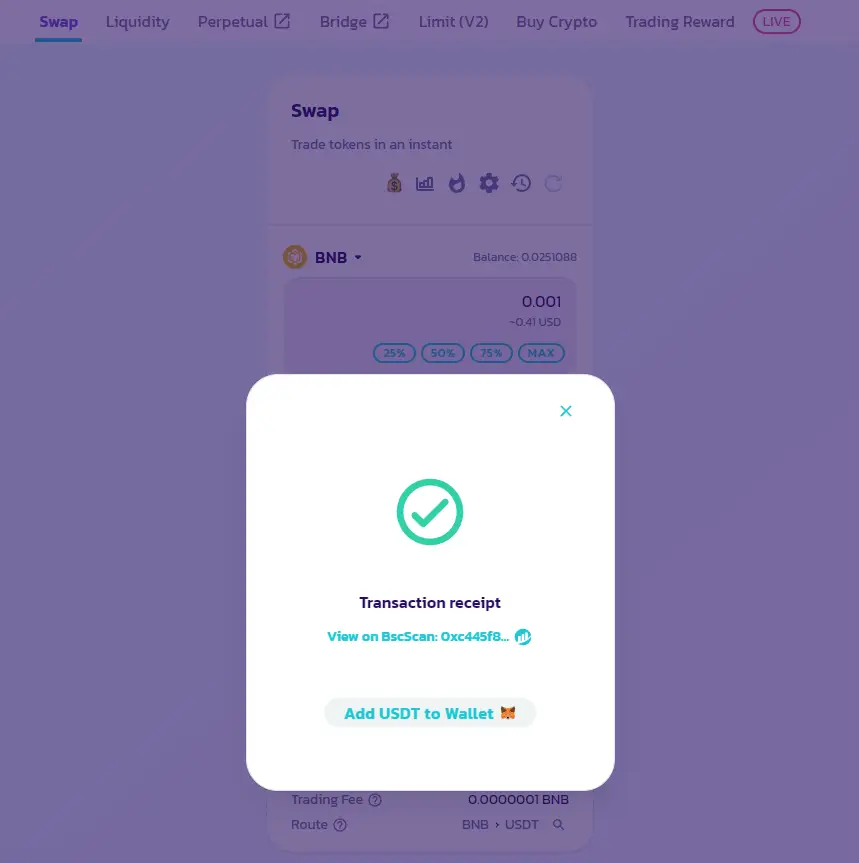

第6步：点击上方的链接，打开区块链浏览器，你可以查看本次交易的详细信息。

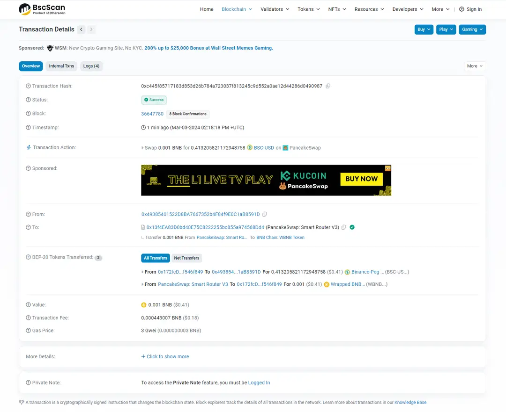

第7步：再次打开 MetaMask 钱包，你会发现刚才兑换的新货币 USDT 已经出现在钱包中了。

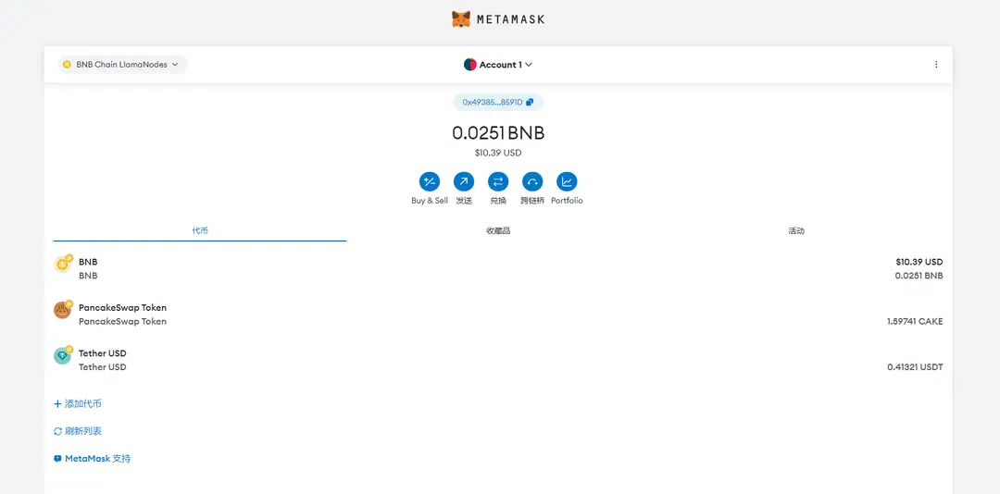

## **如何购买 NFT**

Element Market 是一个去中心化的 NFT 交易平台，允许用户浏览和交易各种数字艺术品。

下面介绍一下如何在 Element Market 中购买 NFT：

●第1步：打开浏览器并访问 Element Market 的官方网站（https://element.market/），在网站的右上角选择网络类型，点击连接钱包按钮，然后按照提示操作连接钱包。

第2步：找到想要购买的 NFT，点击它进入详细页面。比如下面这个名称为 Polyhedra 2024 的 NFT 作品，你可以查看作品的详细信息，包括当前价格、交易记录、所有者等，点击“立即购买”按钮开始交易。

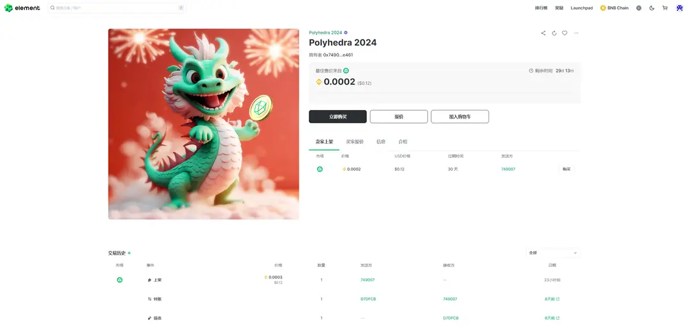

第3步：与前面章节交易加密货币类型，此时将会弹出 MetaMask 界面，显示交易的账户、交易金额和燃料费（手续费），确认无误后点击“确认”按钮。

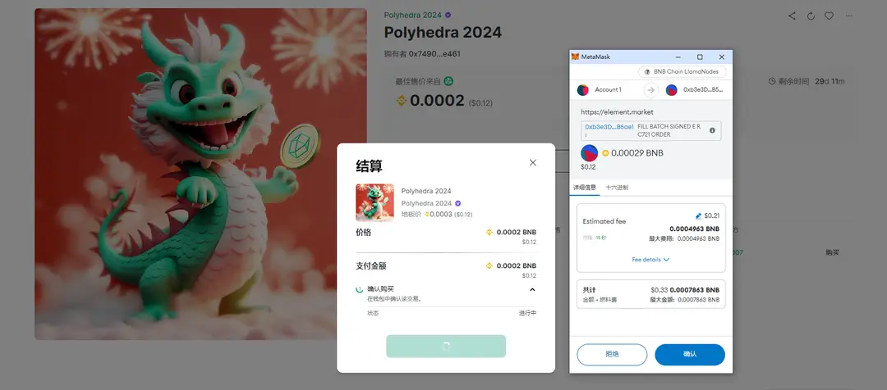

第4步：交易提交后，你需要等待区块链网络中的矿工确认交易，这可能需要几秒钟到几分钟不等。矿工确认交易完成后，你将看到如下购买成功提示。

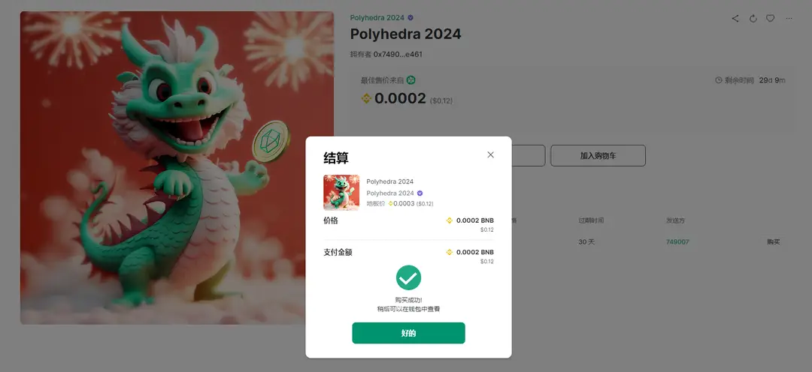

第5步：打开“我的 NFTs ”页面，即可查看刚才购买的 NFT 作品。

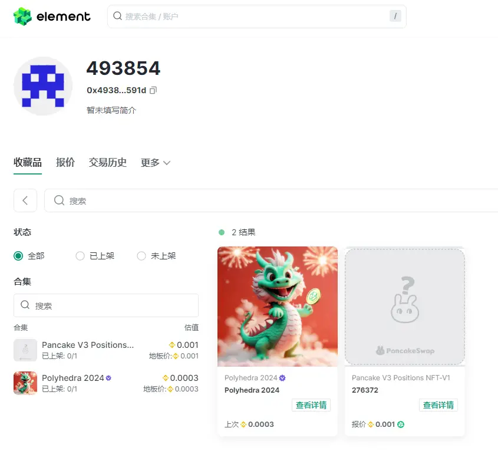

## **查看所有数字资产**

如果你想查看 MetaMask 钱包中所有的数字资产，可以打开https://portfolio.metamask.io/网页。如下方所示，在这里，你可以查看所有的 Tokens 和 NFTs。

Tokens 显示界面：

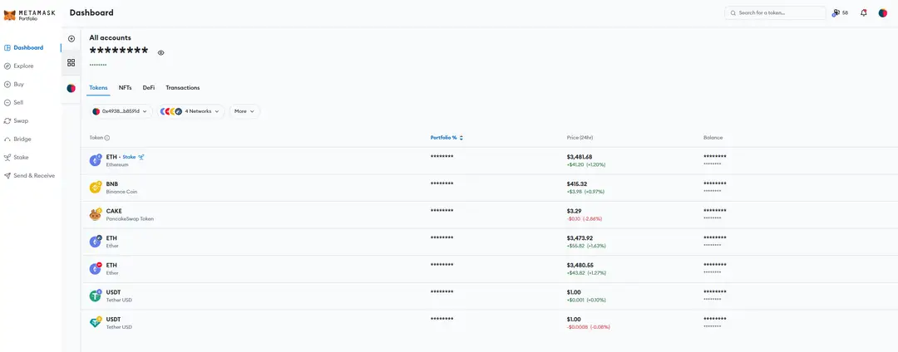

NFTs 显示界面：

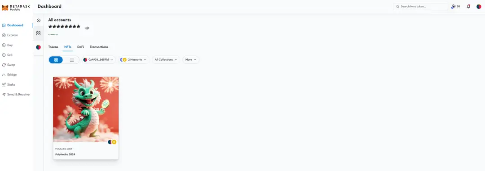

## **小结**

这一小节，我们学习了参与 Web3活 动的基本操作方法。

我们演示了如何创建数字钱包、如何交易加密货币 和 如何购买 NFT 数字作品，Web3 生态中的活动远远不止这些，你还可以参与到更多的 Defi 活动中，比如借贷、质押等。你还可以加入一个 DAO 组织，通过投票来参与社区治理。

但是请注意，Web3 生态尚在不断发展中，其安全机制和法规体系尚未完善。你应时刻保持警惕，关注平台最新动态，谨慎对待每一笔交易，以防范网络钓鱼和欺诈行为，确保自身资产安全。