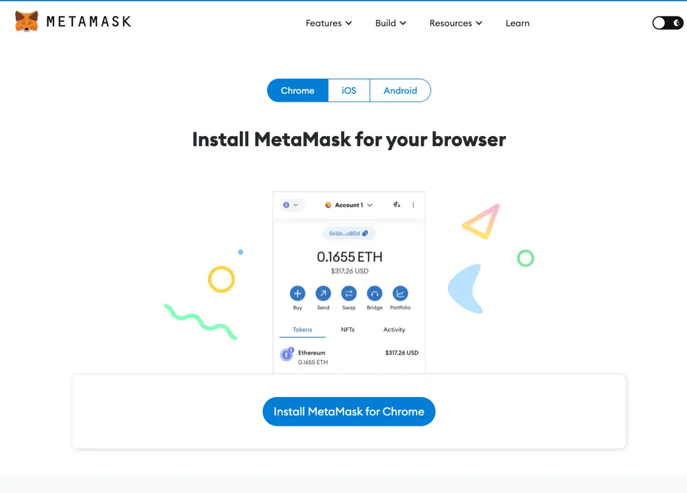
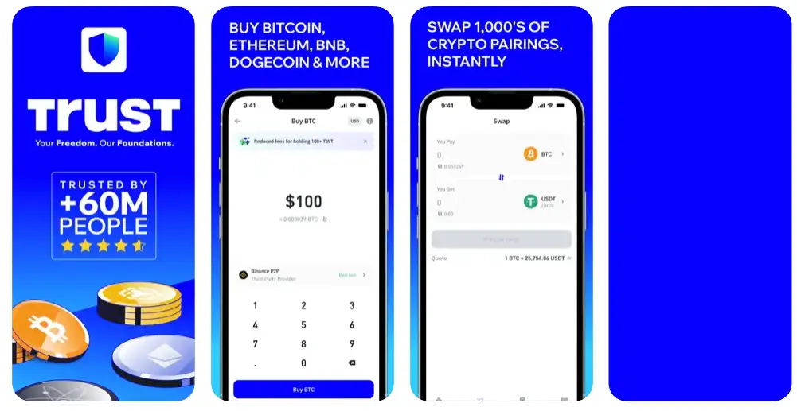
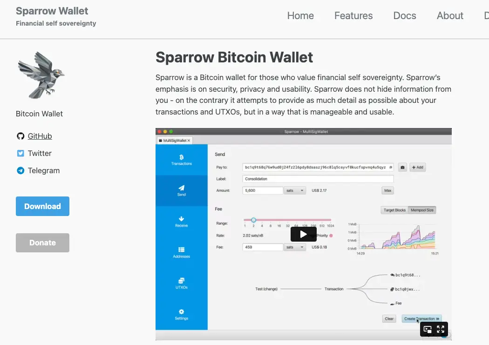
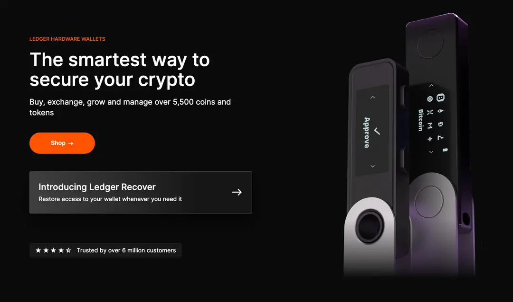
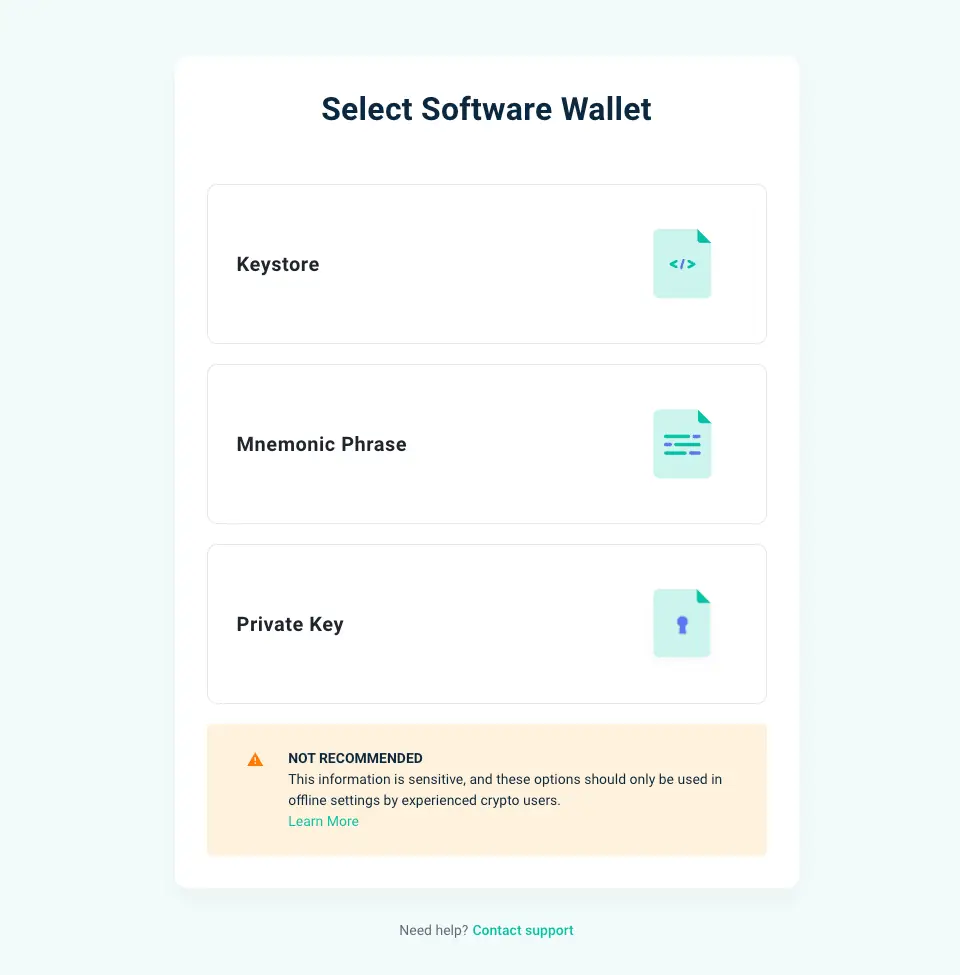
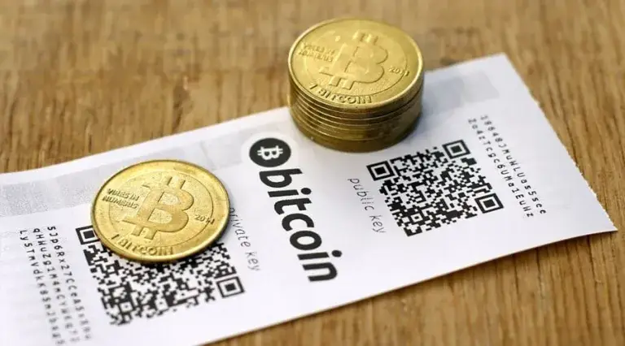

# web3钱包

# 目标

本节的目标是学习

●web3 钱包是什么

●web3 钱包形式（类别）

# web3 钱包是什么

Web3 钱包是一种数字货币钱包，专为与Web3 技术（去中心化网络）集成而设计。与传统的数字货币钱包不同，Web3 钱包允许用户与去中心化应用程序（DApps）进行交互，签署交易并管理其加密资产，而无需信任中心化的第三方。这种钱包通常支持多种加密货币，并提供安全的私钥管理功能，以确保用户的资金安全。

## 比喻

Web3 钱包就像我们的现实生活中的钱包跟保险柜，现实钱包跟保险柜存放着你现实的重要资产，Web3 钱包存放着你的加密货币和数字资产，并且它存放在一个相对安全的空间,不像现实当中存放在某个银行某个地方，它不属于任何第三方机构或组织，让你能够更安全地访问和管理它们。 web3 钱包也不像传统数字钱包如支付宝钱包，微信钱包，apple 钱包等，你可以使用它们来进行线上支付、转账和消费，但它们仍然依赖于中心化的金融机构和支付平台。你需要信任这些平台来保护你的资金安全，并且它们对你的资金有一定的控制权。Web3 钱包更加去中心化，用户拥有更大的控制权和隐私保护。

## 实际应用

在 Web3 世界里，有几款备受欢迎的钱包应用，它们在安全性、易用性和功能性上都有着不同的特点，成为用户的首选。以下是一些热门的 Web3 钱包：

1.**MetaMask：** MetaMask 是最知名的以太坊钱包之一，它是一个浏览器插件和移动应用程序，允许用户在网页浏览器中轻松访问以太坊 DApps，并管理其加密资产。

2.**Trust Wallet：** Trust Wallet 是一款安全的移动钱包应用，支持多种加密货币，包括以太坊和比特币。它提供了简单易用的界面，支持与 DeFi 应用程序的集成。

3.**Coinbase Wallet：** Coinbase Wallet 是由加密货币交易平台 Coinbase 推出的钱包应用，支持以太坊和ERC-20代币，同时还提供了内置的 DApp 浏览器。

4.**Binance Chain Wallet：** Binance Chain Wallet是由加密货币交易平台 Binance 推出的一款钱包应用，旨在与 Binance 智能链（BSC）兼容，支持多种加密货币和 DApp。

5.**Trezor：** Trezor 是一款硬件钱包，以其高安全性和便携性而闻名。它支持多种加密货币，包括比特币、以太坊等，是安全存储加密资产的理想选择之一。

这些钱包应用在 Web3 生态系统中扮演着重要角色，为用户提供了安全、便捷的加密资产管理解决方案。

# web3钱包形式（类别）

钱包从应用形式（分类）来说主要分两大类：

###  **冷钱包（Cold Wallet）：**

冷钱包是指不连接到互联网的加密货币钱包，主要用于离线存储加密资产。

●硬件钱包

●纸钱包

###  **热钱包（Hot Wallet）：**

热钱包是指连接到互联网的加密货币钱包，方便用户进行快速交易和日常使用。

●浏览器钱包

●移动端钱包

●桌面钱包

●网页钱包

*注:热钱包不能变成冷钱包，但冷钱包一旦其私钥存储在线就可以变成热钱包。*

当我们进入 web3 世界，随着时间的推移，我们的钱包数量也会不断增加，因为不同的用途决定着你使用哪个钱包，同时用途也决定着你会如何对待这个钱包。

##  浏览器钱包

浏览器钱包是一种在网页浏览器中运行的加密货币钱包。它们通常作为浏览器插件或扩展程序提供，允许用户在浏览网页的同时管理其加密资产。这种钱包使用户能够直接在网页上执行加密货币交易，与去中心化应用程序（DApps）进行交互，并访问区块链网络。

如 [MetaMask](https://metamask.io/)、[Rabby](https://rabby.io/) 等，是作为浏览器的插件安装在用户的浏览器（如 Google Chrome、Firefox 等）

Preview

###  特点

1.**易于使用**：用户可以直接通过浏览器访问和操作钱包，无需下载额外的软件，操作简便快捷。

2.**即时接入**：浏览器钱包使得用户能够快速接入加密货币网络，进行交易或参与去中心化应用（DApps）。

3.**集成性**：浏览器钱包通常可以轻松地与多个网站和服务集成，如加密货币交易所、NFT 市场以及各种基于区块链的应用。

4.**低门槛**：对新用户而言，浏览器钱包的接口通常更友好，上手更快，降低了进入加密货币世界的门槛。

5.**多币种支持**：许多浏览器钱包支持多种加密货币，方便用户管理和交易多种资产。

6.**安全风险**：与硬件钱包相比，浏览器钱包的安全性较低，因为它们更容易受到网络攻击，如钓鱼攻击、恶意软件入侵等。

7.**备份与恢复**：和硬件钱包类似，浏览器钱包也使用助记词进行备份和恢复，但用户需要对助记词的安全存储负责。

总的来说，浏览器钱包是一种方便、安全的加密货币管理工具，适合那些经常使用网页浏览器进行加密货币交易和互动的用户。

##  移动端钱包

移动端钱包是一种安装在移动设备（如智能手机或平板电脑）上的加密货币钱包应用程序。这种钱包应用允许用户在他们的移动设备上安全地存储、接收和发送加密货币，以及与去中心化应用程序（DApps）进行交互。

如Trust Wallet、MetaMask Mobile等，作为应用程序提供，用户可以在移动设备上下载和安装

Preview

###  特点

1.**便携性：** 移动端钱包可以随时随地携带，用户无需依赖于桌面电脑或笔记本电脑即可访问其加密资产。

2.**易用性：** 大多数移动端钱包应用都具有简洁直观的用户界面，使用户能够轻松地管理其加密货币资产。它们通常提供简单的功能，如收款、转账和查看交易历史记录。

3.**安全性：** 移动端钱包通常采用高级加密技术来保护用户的私钥和敏感信息。此外，许多钱包应用还提供额外的安全功能，如指纹识别、密码保护和双重验证，以增强用户的资产安全。

4.**DApp集成：** 一些移动端钱包应用提供内置的 DApp 浏览器，使用户能够直接在钱包应用内与去中心化应用程序进行交互，无需额外的操作。

5.**支持多种加密货币：** 大多数移动端钱包支持多种加密货币，用户可以在同一应用程序中管理多种不同类型的加密资产，提高了便利性和灵活性。

总的来说，移动端钱包是一种方便、安全的加密货币管理工具，适合那些经常使用移动设备进行加密货币交易和互动的用户。

##  桌面钱包

桌面钱包在加密货币问世的早期较为常见，是一种安装在个人电脑（如台式机或笔记本电脑）上的加密货币钱包应用程序。与移动端钱包相比，桌面钱包通常具有更多的功能和更高的安全性，适合那些更喜欢在桌面环境下管理加密资产的用户。

如 Electrum、Sparrow 等，作为应用程序提供，用户可以在计算机设备安装下载

Preview

###  特点

1.**高安全性：** 桌面钱包通常在用户的个人电脑上运行，私钥和加密资产数据存储在本地，因此具有较高的安全性。用户可以自行负责保护钱包应用程序和设备的安全，从而降低了第三方入侵的风险。

2.**丰富的功能：** 桌面钱包通常提供丰富的功能，包括收款、转账、交易历史记录查看、地址簿管理、多账户管理等。一些桌面钱包还支持与硬件钱包的集成，提供更高级的安全性和功能。

3.**备份和恢复功能：** 桌面钱包通常提供备份和恢复功能，用户可以轻松地备份和恢复他们的钱包数据，以防止意外丢失或损坏设备时丢失资产。

4.**支持多种加密货币：** 大多数桌面钱包支持多种加密货币，用户可以在同一应用程序中管理多种不同类型的加密资产，提高了便利性和灵活性。

5.**定制化选项：** 一些桌面钱包提供了丰富的定制化选项，用户可以根据自己的偏好调整钱包的外观和功能，以及安全设置和隐私选项。

总的来说，桌面钱包是一种功能强大、安全可靠的加密货币管理工具，适合那些更喜欢在桌面环境下管理加密资产的用户。

##  硬件钱包

硬件钱包是一种专门用来存储加密货币的物理设备，如比特币、以太坊等。它与软件钱包（即在电脑或手机上运行的钱包软件）相比，提供了更高的安全性。硬件钱包通常的形式是小型的USB设备，它能够将用户的私钥完全隔离于互联网，有效防止了黑客攻击和恶意软件的威胁。

如Ledger、Trezo

Preview

###  特点

1.**高安全性**：硬件钱包存储私钥的方式使其不与互联网直接连接，大大减少了被黑客攻击的风险。私钥在物理设备内生成和存储，不会暴露给外部系统。

2.**隔离性**：进行交易时，私钥不离开硬件设备，仅在设备内部使用，从而保证了交易安全。

3.**便携性**：硬件钱包通常体积小巧，如USB设备大小，便于携带。

4.**多币种支持**：大多数硬件钱包都能支持多种加密货币，方便用户管理不同的资产。

5.**备份与恢复**：通过助记词（一组可以恢复钱包的词汇）的方式，即使硬件钱包丢失或损坏，用户仍可以恢复其资产。

6.**用户友好性**：尽管提供了强大的安全性，但现代硬件钱包的界面设计趋向于简单易用，适合各类用户。

7.**物理安全特征**：一些高级模型还提供如PIN码保护、生物识别等物理安全措施，进一步提升安全性。

这些特点使得硬件钱包成为存储和管理重要加密资产的理想选择，尤其是对于那些希望远离网络威胁、注重资产安全的用户。

##  网页钱包（不建议使用）

网页钱包，是一种基于网页的加密货币钱包，用户可以通过网页浏览器访问和管理。但因为其背后的巨大安全风险用户需要谨慎选择使用

[myetherwallet](https://www.myetherwallet.com/wallet/access/software?type=overview)

Preview

###  潜在风险

1.**网络攻击风险**：网页钱包的安全性取决于钱包提供者的服务器和网站的安全性。如果这些服务器受到黑客攻击，用户的私钥和个人信息可能会受到威胁，导致资产损失。

2.**钓鱼网站风险**：恶意者可能会创建钓鱼网站，冒充正规的网页钱包服务提供者，诱使用户输入私钥或其他敏感信息。如果用户被诱骗并输入了私钥，他们的资产可能会被盗取。

3.**密码管理风险**：网页钱包通常要求用户设置密码或输入私钥来访问。如果用户选择了弱密码或者在不安全的环境下输入了私钥，那么他们的账户可能会受到攻击。

4.**中心化风险**：许多网页钱包是由中心化的服务提供者管理和运营的，这意味着用户需要信任这些服务提供者来保护他们的资产和个人信息。如果这些服务提供者出现问题，用户的资产可能会受到影响。

##  纸钱包（不建议使用）

纸钱包是一种用纸质或者其他不可复制的材料制成的加密货币钱包，用于存储加密货币的私钥和公钥

Preview

###  潜在风险：

1.**易于丢失**：由于是物理形式存在，纸钱包容易丢失，一旦遗失，资金将无法找回。

2.**容易损坏**：纸钱包易受潮、火灾或其他破坏性因素影响，可能导致私钥损坏而无法访问资金。

3.**安全性依赖于保管**：纸钱包的安全性取决于用户如何妥善保管，如果被盗窃或不慎泄露，资金可能遭受损失。

#  小结

通过本教程，我们了解了 Web3 钱包概念以及 Web3 钱包存在的形式以及它们的特点，可以让我们更好的选择我们需要用到的钱包，进入到 Web3 世界你肯定不会只有一个钱包，我们也会强烈建议你使用 TAP 协议（三个地址协议），TAP 后续我们会详细介绍

#  下一节

下节课我们将学习如何安全地下载 Web3 钱包，以进一步提升我们的加密资产安全性。