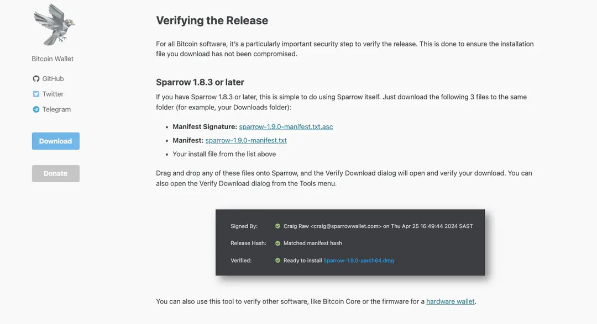

# 下载安全

# 目标

本节的目标是学习

●下载骗局

●安全下载

# 下载骗局

当我们兴致勃勃的进入 Web3 世界，准备下载我们第一个钱包的时候，往往骗局就潜伏在身边。

下载，看似简单的一个操作，其实一点不简单，原因：

1.**假冒钱包应用下载**：很多人，真的很多人找不到正确的下载途径：如正确的官网，正确的应用市场，正确的应用，于是安装了假的钱包（对于硬件钱包，供应链攻击是硬件钱包安全性的主要威胁之一，用户要尽量选择在官网商店或授权经销商处选择购买）

2.**恶意篡改：**很多很多人对下载了的钱包、应用无法确认是否被篡改过

于是很可能上演一出天堂地狱的戏码，开心地想进入这个世界，但还没回过神来钱包就已经空空的了

# 安全下载

针对上面的第1点，我们可以使用以下的一些技巧：

●Google（注意搜索结果里的广告条目，非常不靠谱，注意搜索结果的内容，有可能你点击进去是一个类似官网的钓鱼网站，也有可能进去是一篇介绍相关内容的文章，里面提到的超链接不一定安全）

●行业知名的收录，具备权威、认证的收录，如 CoinGecko、CoinMarketCap

●多问一下你身边拥有 Web3 世界经验且值得你信赖的人

结合上面的技巧，互相佐证，就可以获取到正确的下载途径。

针对第2点，当我们从正确途径下载了应用还需要我们去安装，在安装之前建议做一下是否被篡改的校验工作，这个工作无法从源头防止被篡改（如官网自己内部被黑，官网被入侵等），但可以防止源头被部分篡改，被中间人劫持篡改等情况

如何防止被篡改而我们不知道的情况，我们可以做以下措施：

●**哈希校验**：开发者会为钱包应用程序发布正式的哈希值（通常是SHA-256）。用户在下载钱包后，可以使用工具计算下载文件的哈希值，并与开发者公布的哈希值进行比较。如果两者匹配，则文件未被篡改。

●**GPG签名**：对于一些开源的 Web3 钱包，开发者可能使用 GPG 签名来保证文件的完整性。用户可以下载公钥，然后使用 GPG 工具来验证下载文件的签名是否有效。

## 实际案例

上面提供的两种校验文件一致性的方法我们都可以从 [Sparrow Wallet](https://sparrowwallet.com/download/) 的下载页面“Verifying the Release”中参考学习，指南清晰，非常良心，诸君且用且珍惜

●**利用社区力量**：加入相关的社区论坛或 Telegram、Reddit 等社交媒体群组，获取其他用户的反馈和经验。社区成员经常会对可疑的文件版本发出警告。

# 小结

通过本教程，我们了解了 Web3 钱包存在的下载骗局以及如何一些防范措施，让我们安全并快乐的进入这个世界吧