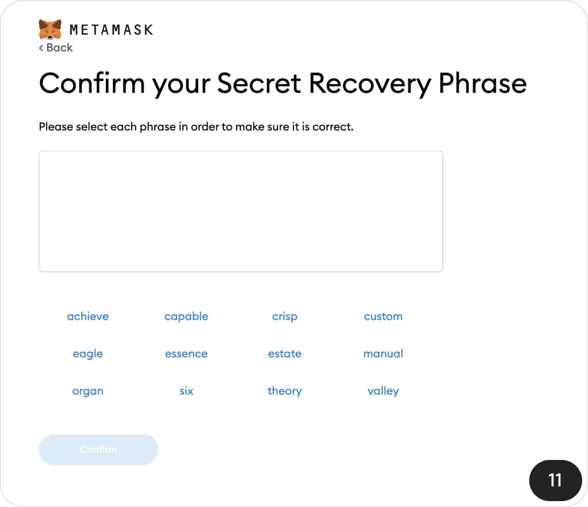

# 助记词

# 目标

本节的目标是学习

●助记词的特点

●助记词的种类

上文我们就提到过助记词就是制作钥匙（私钥）的”秘方“，有了它我们就可以打造钥匙获得房子（钱包）的控制权，它的重要性是毋庸置疑的，因此在整个系列课程当中也不厌其烦的多次提到了它，下面就让我们来更多的认识它

## 它是

●一组提供你访问钱包的单词

●需要离线备份的东西

●需要在多个不同的地方多重备份的东西

●只应失去控制钱包权限输入的东西

##  它不是

●像电话号码一样可以共享的

●应该放在云端的东西

●任何人、任何设备商需要的东西

#  助记词的特点

##  安全性

●**随机性和熵：**助记词的生成依赖于随机性和熵。BIP-39标准规定了生成助记词的流程，确保生成的助记词具备足够的随机性，从而提供足够的安全性。随机性越高，暴力破解助记词的难度也越大。

以metaMask钱包为例，当用户创建一个新钱包时，钱包应用会生成一个128位到256位的随机数，通过哈希算法生成一个校验位，然后按照词汇表将随机数映射为12到24个助记词。这些词语的组合方式几乎是无限的，确保了安全性。

*注：上文提到的熵是用来衡量助记词中信息量和随机性的标准，代表了系统的不可预测性。熵越高，系统越安全。对于助记词来说，熵直接影响其安全性。*

因此，助记词本身是很安全的，你很难寻找到它的规律从而实现破解，基本上钱包被盗都是因为我们的私钥或者助记词被窃取了。

##  易用性

●**较好记**：助记词的设计初衷之一就是为了提高加密资产管理的易用性，避免用户直接处理复杂的私钥。

●**跨平台恢复:**助记词是通用的，可以在不同的钱包和平台之间进行恢复，这提高了用户更换设备和钱包的灵活性。

用户可以在MetaMask生成助记词，并在支持BIP-39标准的Exodus钱包中使用同一组助记词恢复他们的资产。

# 助记词的种类

助记词有多种类型，根据其安全性和应用场景的不同，主要包括以下几种：

●明文

●加密助记词

●多重签名助记词

●Shamir's Secret Sharing，简称 SSS

##  **普通助记词**

普通助记词是最常见的类型，通常由12到24个随机单词组成，用于生成单一的私钥。

用户在创建 metaMask 钱包时会生成一组普通助记词，用于备份和恢复钱包。

##  **加密助记词**

在普通助记词的基础上，用户可以设置一个额外的密码来增加安全性。只有同时拥有助记词和密码的人才能恢复钱包

Ledger 硬件钱包支持用户在助记词基础上设置一个密码，以增加安全性。用户在创建钱包时，可以选择启用这项功能，确保只有知道密码的人才能访问钱包。

##  **多重签名助记词**

多重签名助记词涉及多个助记词，每个助记词代表一个私钥，只有达到一定数量的签名（如2/3或3/5）才能进行交易。

BitGo 是一家知名的多重签名钱包服务提供商，企业和大型投资者使用 BitGo 的多重签名钱包来确保资产安全。需要多个签名才能批准交易，从而降低单点故障和内部欺诈的风险。

##  **Shamir’s Secret Sharing (SSS)**

Shamir’s Secret Sharing 是一种分割私钥的方法，将助记词分成多个部分，只有收集到足够多的部分才能恢复私钥。

Trezor 硬件钱包提供 Shamir’s Secret Sharing 功能，用户可以将助记词分割成多个部分，并分别保存在不同的安全地点或交给信任的人。这样即使部分助记词丢失或被盗，只有收集到足够多的部分才能恢复钱包。 业务参考实践：

https://guide.keyst.one/zh/docs/shamir-backup

https://wiki.trezor.io/Shamir_backup

#  小结

从本课中我们认识到助记词的特点以及不同类型，多签，SSS 这类方案可以帮助我们规避单点风险，但同时管理上也复杂了，因为涉及到多人问题。选择哪种形式这需要我们根据实际情况去权衡，但是在对待存储安全的意识形态上要保持高度认真警惕，千万不能偷懒。