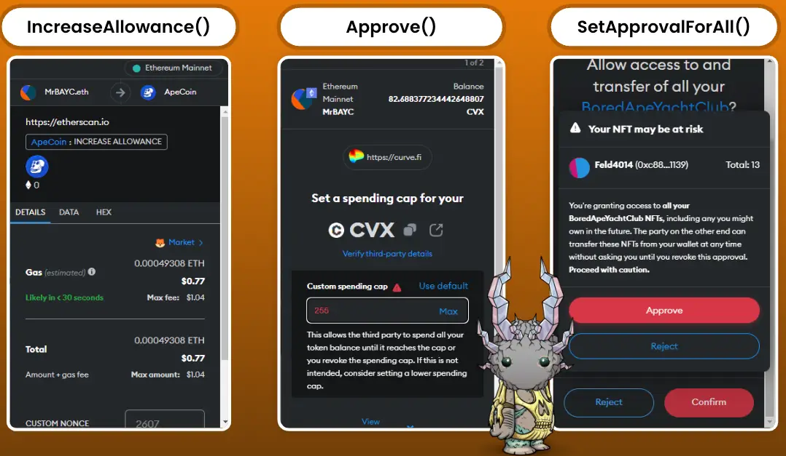

# 常见授权形式

## 目标

本节的目标是学习

●授权形式介绍

●授权安全提示

# 授权形式介绍

主要分为以下三种：

1.**IncreaseAllowance**

●用途：增加特定代币的授权额度。

●风险：可能会增加您的代币被转移的风险。

2.**Approve**

●用途：批准特定数量的代币授权。

●风险：只允许特定数量的代币被转移，相对安全。

3.**SetApprovalForAll**

●用途：批准所有 NFT 的授权。

●风险：授予对所有 NFT 的完全控制权，风险最大。

第三种授权是我们最好理解的，就是完全授权，相当于你把你的控制权完全交出去了，别人可以代理掌管你一切资产

至于**IncreaseAllowance** 与 **Approve** 它们有什么不一样呢？

1.**覆盖 vs 增加**：

●**Approve**：设置新的授权额度，覆盖之前的授权。

●**IncreaseAllowance**：在现有授权额度上增加指定数量。

2.**安全性**：

●**Approve**：如果要减少授权额度，直接调用 Approve 设置一个较小的数值，但这种操作有潜在的安全问题。如果在减少授权额度的过程中，有另一笔交易在原额度下被批准，可能会导致安全问题。

●**IncreaseAllowance**：更安全的选择，通过增加授权额度避免了潜在的竞争条件问题。

3.**实际应用**

●**Approve**：用于初次授权或者重新设置授权额度。

●**IncreaseAllowance**：用于在现有授权基础上增加额度，更加灵活和安全。

#  授权安全提示

●**仔细检查交易细节**：在批准任何交易前，确保您完全理解其内容。

●**限制授权范围**：尽量使用有限授权（如 Approve），避免使用完全授权（SetApprovalForAll）。

●**保持警惕**：对于任何看似过于美好的交易保持警惕，不要轻易批准任何交易。

#  小结

本节通过了解这些常见的授权形式及其风险，您可以更好地管理您的加密资产，确保其安全性。