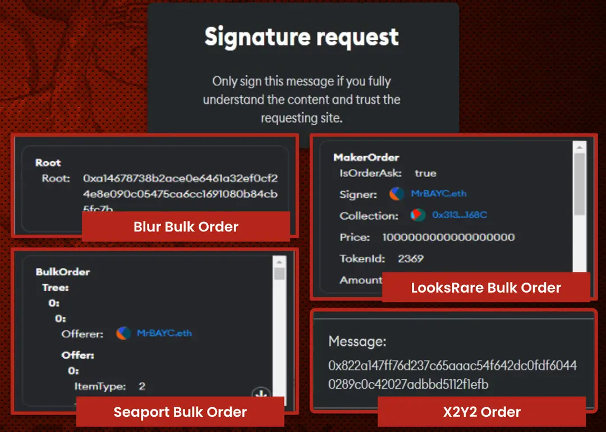

# 恶意市场签名

# 目标

本节的目标是学习

●什么是恶意市场签名

●防范措施

## **什么是恶意市场签名** 

恶意市场签名其实就是一些非常难以阅读的消息内容，大多数几乎不可能去识别理解，诈骗者们就是故意这样做让无法识别然后趁机骗取你的签名/授权，最终偷走你的数字资产

●特点：内容难以阅读

●目标：偷走你的数字资产

# 防范措施

面对这些恶意的市场前面我可以使用**安全减速带**以及 **TAP（三地址协议）**来保护我们，关于这两者的内容我们将在Unit5中详细介绍，简单概括有下面几点：

●**不要轻易签署任何复杂的签名请求**：如果您无法完全理解签名的内容，不要签署。

●**仔细检查签名请求**：确保请求来自可信任的网站和服务。

●**使用分离策略**：将不同用途的钱包分离，如铸币、交易和存储，避免全部资产暴露在同一个钱包中。

#  小结

本节通过了解恶意市场签名的特征和防范措施，您可以更好地保护您的加密资产，避免落入恶意签名的陷阱。