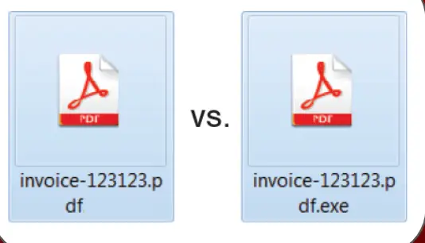

## 恶意程序攻击

## 目标

本节的目标是学习

●什么恶意程序攻击

●防范措施

#  什么恶意程序攻击

恶意程序攻击是指利用漏洞，针对计算机系统、网络或区块链技术进行的恶意行为。在区块链领域，恶意程序攻击包括对智能合约、去中心化应用（DApps）、加密货币钱包和区块链网络的攻击。

●许多恶意软件会伪装成常见文件类型（如 PDF 文件），以骗取用户点击和安装。

●通过开启已知文件类型的扩展名显示功能，您可以更容易地识别潜在的恶意文件。例如：

●正常文件：invoice-123123.pdf

●恶意文件：invoice-123123.pdf.exe

#  防范措施

●**开启扩展名显示功能**：这可以帮助您识别文件的实际类型，防止误点击恶意文件。

●**定期更新和扫描**：使用防病毒软件并确保系统和软件都是最新版本，定期进行扫描。

#  小结

这次我们了解部分恶意程的伪装手段，希望大家可以识别防范它们