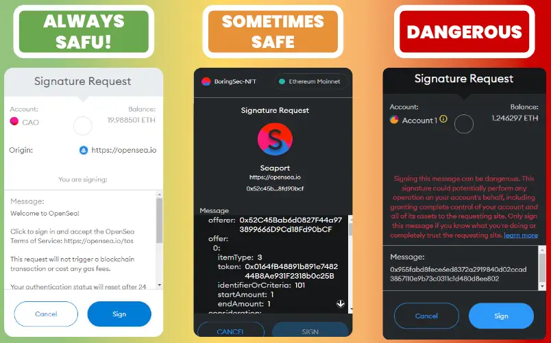

# 数字签名

## 目标

本节的目标是学习

●什么是数字签名

●数字签名请求

Web3 的数字签名是一种加密技术，用于验证交易、消息或数据的真实性和完整性，同时确保签名者的身份。数字签名在 Web3 和区块链领域具有重要意义，下面我们将会对 Web3 数字签名的做详细解释。

# 什么是数字签名

##  数字签名的基本概念

●**公钥和私钥**：每个用户在 Web3 环境中都有一对密钥：公钥和私钥。公钥是公开的，可以与他人分享，而私钥必须保密，只有自己知道。

●**私钥签名**：用户使用私钥对消息或交易进行签名。签名过程会生成一个独特的签名，只有对应的私钥可以生成。

●**公钥验证**：任何人都可以使用签名者的公钥来验证签名的真实性。验证过程确保消息或交易未被篡改，并确认签名者的身份。

*私钥签名：上面提到的私钥签名其实就是数字签名的一种具体实现。*

## 数字签名的工作原理

1.**生成密钥对**：用户生成一个公钥和私钥对。私钥必须保密，公钥可以公开。

2.**签名消息**：用户使用私钥对消息进行签名。签名算法会结合消息内容和私钥生成一个唯一的签名。

3.**传输签名和消息**：签名和消息一起发送给接收者或在网络上发布。

4.**验证签名**：接收者使用签名者的公钥验证签名。验证过程确保签名确实由私钥生成，并且消息在传输过程中未被篡改。

## 数字签名的用途

●**交易验证**：在区块链上，每笔交易都需要签名，以确保交易是由账户所有者发起的。

●**消息验证**：数字签名用于验证发送给智能合约或其他用户的消息，确保消息的真实性和完整性。

●**授权和认证**：在去中心化应用（dApps）中，用户可以使用数字签名授权特定操作或访问权限。

## 数字签名的安全性

●**不可篡改性**：签名是基于消息内容和私钥生成的，任何对消息的修改都会使签名无效。

●**身份验证**：只有拥有私钥的人才能生成有效的签名，因此签名可以验证签名者的身份。

●**防止抵赖**：一旦用户对消息进行签名，无法否认自己签名的行为。

# 数字签名请求

很多时候我们会遇到以下三种签名请求：安全的，有时候安全，以及危险的

这个时候我们就需要去判断其风险然后根据风险类型作出相应的操作，那么如何判断呢，我们可以从以下几个方面入手：

●**来源：**明确可信的网站提供的请求通常更加安全

●**消息内容：**简单明了、不涉及资产转移的消息内容较为安全；复杂的交易或合约信息需要仔细验证；授权范围广的请求极其危险

●**签名请求的目的：**明确声明不会产生交易的这类请求会更安全

根据上述方面我们再来对上述的三种请求作出分析：

###  左边（总是安全）：

●**来源：** [https://opensea.io](https://opensea.io/)

●**消息内容：**

●欢迎信息

●说明此请求不会触发区块链交易或产生任何手续费

●**签名请求的目的：** 仅用于身份验证

●**风险判断依据：**

●来源明确且可信

●没有涉及交易或资产转移

●请求内容简单，明确

###  **中间（有时安全）**

●**来源：** [https://opensea.io](https://opensea.io/)

●**消息内容：**

●包含复杂的合约数据和条款

●涉及具体的交易信息，如 **offer** 和 **consideration**

●**签名请求的目的：** 可能涉及特定交易或合约的签署

●**风险判断依据：**

●来源可信，但内容复杂

●包含可能影响账户资产的交易信息

●需要用户仔细检查交易条款以避免潜在风险

###  **右边（危险）**

●**消息内容：**

●说明签署此消息可能很危险

●此签名可以执行任何账户操作，包括完全控制账户及其资产

●**签名请求的目的：** 完全控制账户

●**风险判断依据：**

●没有明确的来源信息

●消息内容暗示高风险操作

●请求权限广泛，可能导致账户被完全控制

#  小结

本节内容介绍了数字签名的概念以及三种数字签名请求，当需要使用数字签名请求时，我们需要认真了解其来源、消息内容以及请求目的