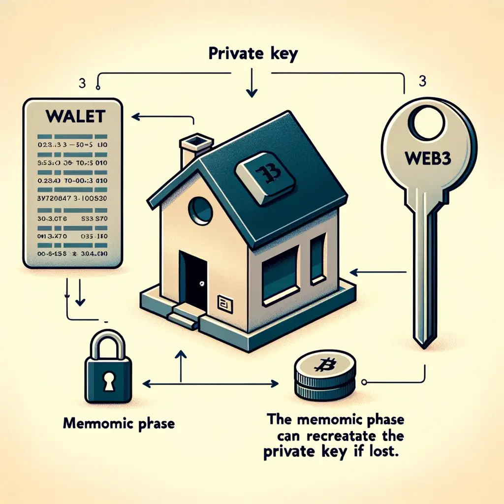

# 私钥

## 目标

本节的目标是学习

●私钥与公钥的区别和关系

●web3 钱包中的私钥

# 私钥与公钥的区别和关系

它们就像一对孪生兄弟，它们是共存的，配对使用的，有私钥就会有公钥，所以这里简单说一下两者：

###  **私钥（Private Key）**

●**定义**：私钥是一串随机生成的字符串，通常由一系列字母和数字组成。它是用户身份和资产管理的核心，必须严格保密。

●**用途**：

●**签名**：私钥用于对交易或信息进行数字签名，以证明该交易或信息确实由私钥的持有者发出。

●**解密**：在非对称加密系统中，私钥用于解密由公钥加密的信息。

●**安全性**：私钥一旦泄露，任何人都可以访问和控制与其相关的加密资产，因此需要高度保密。

###  **公钥（Public Key）**

●**定义**：公钥由私钥生成，是私钥的配对密钥，可以公开分享。公钥用于验证由私钥签名的信息和加密数据。

●**用途**：

●**验证签名**：公钥用于验证交易或信息的数字签名，以确认该签名确实是由对应私钥生成的。

●**加密**：在非对称加密系统中，公钥用于加密信息，使得只有拥有对应私钥的人才能解密。

●**安全性**：公钥可以公开分享，不会影响安全性。

###  **私钥与公钥的关系**

●公钥通过复杂的数学算法从私钥生成，但无法通过公钥反推私钥，这保证了非对称加密的安全性。

●私钥和公钥配对使用，共同确保信息和交易的安全性和完整性。

# web3 钱包中的私钥

在 web3 世界中，钱包、私钥和助记词是核心概念，它们相互关联，共同构成用户管理和保护加密资产的基础。

私钥是用户拥有和管理加密资产的核心是用户身份的唯一凭证，必须妥善保管，切勿透露给别人。

# 比喻

钱包就像我们的房子，里面涵盖我们的重要资产，而私钥就是唯一可以打开这个房子的钥匙，而助记词就是我们制作这把钥匙的秘方（制作方法），即使我们丢失了钥匙（私钥），我们仍然可以用助记词这个秘方去重新打造一把新钥匙，进而重新进入和管理我们的房子。 但是但是但是，钥匙我们也是一定要保管好的，即使我们拥有丢失钥匙可以重新造钥匙的秘方，你也很难保证丢失了的钥匙是否已经被别人利用打开了你的房子，夺取了你的资产，所以 我们一定一定一定要保管好我们的钥匙以及秘方

### **私钥的作用**

●**资产控制**：私钥赋予用户对其加密资产的完全控制权，只有拥有私钥的人才能发起交易或操作资产。

●**交易签名**：私钥用于对区块链上的交易进行数字签名，确保交易的真实性和不可抵赖性。

●**身份验证**：私钥作为用户身份的唯一标识，确保用户在去中心化应用（DApps）中的身份验证和授权。

### **私钥的常见的形式**

**原始私钥**：通常是256位的二进制数。为了便于使用，常常以十六进制（hex）或其他格式表示，例如：

0x4c0883a69102937d6231471b5dbb6204fe512961708279d87e7db96f4720c17a

#  小结

通过本教程我们进一步的了解了公钥以及私钥的概念以及在 Web3 钱包中私钥的一个作用，让我们能够更加清晰的知道私钥的重要性，进一步提高安全意识llmlnmllll