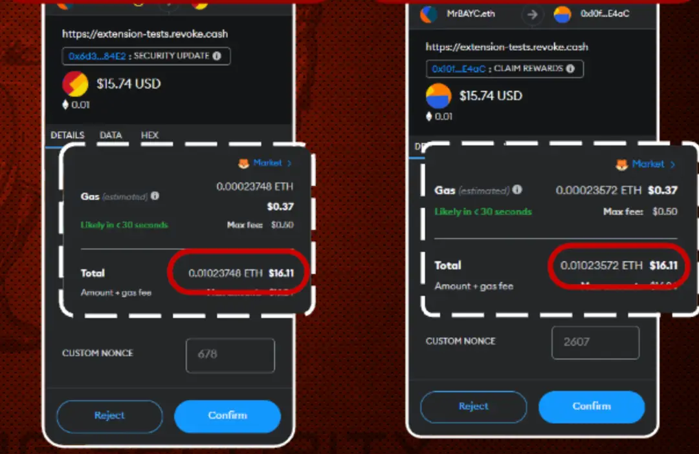

# 虚假功能费用

## 目标

本节的目标是学习

●什么是虚假功能费用

●如何避免

#  什么是虚假功能费用

虚假功能费用指的是一种欺诈性交易请求，其目的是骗取你的数字资产。当你连接到一个骗子网站想要出售你空投获取的代币时，你可能会看到这种交易请求。这个交易请求里面隐含着要支付某种功能的费用（类似于铸造 NFT），其实是一个恶意合约，合约内容就是大量的消耗用户的GAS去铸造NFT，而这些铸造出来的NFT将会作为骗子的利润。

Chi Gas 代币是 1inch 项目的一项举措，其中 Chi Gas 代币是一种 BEP20 代币，是为了在 1inch 交易时使用，支付交易成本。Chi 与该网络的 GAS 价格挂钩。当 GAS 价格低时，Chi 价格也低，反之亦然。

骗子如何利用这一点是非常有趣的。首先，他们会随机空投一堆 BEP20 代币。当用户批准 PancakeSwap 出售这些代币时，在这些代币的批准方法中，会硬编码消耗大量（如90%以上）用户的 GAS 限额来铸造 Chi Gas 代币，可以用来补贴 GAS 费用，这些铸造的 Chi Gas 代币就是骗子的利润。

#  如何避免

●**仔细比较总费用和 Gas 费用**：如果总费用远高于 Gas 费用，且没有合理的解释，这可能是一个虚假费用的标志。

●**使用钱包扩展显示详细信息**：使用如 MetaMask 等钱包扩展来显示交易的详细费用和余额变化，以识别任何异常费用。

●**保持警惕**：在批准任何交易前，务必核实所有费用的合理性，特别是在涉及高额费用的情况下。

#  小结

本节我们了解了虚假功能费用，但我们可以通过严格检查交易的详细信息和费用识别出潜在的虚假费用，从而避免落入诈骗陷阱。