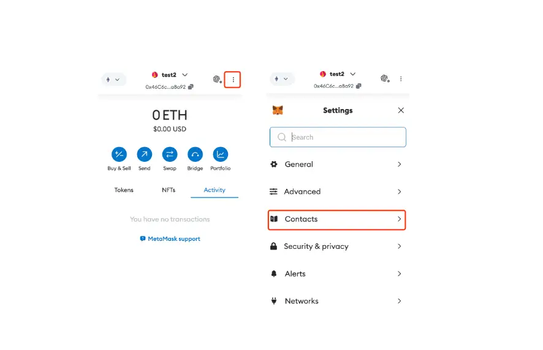
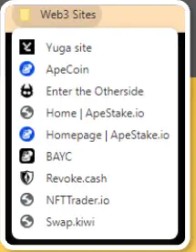
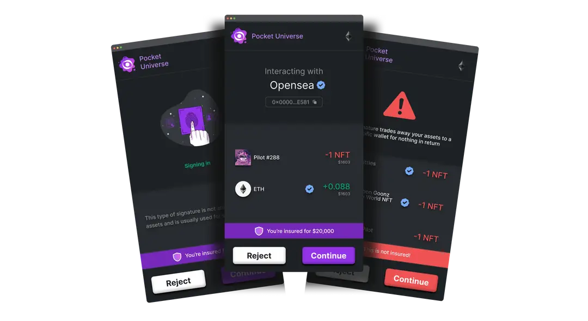

# 安全减速带

## 目标

本节的目标是学习

●什么是安全减速带

#  什么是安全减速带

Security speedbumps（安全减速带）是指在网络安全领域中为提高系统的安全性而设置的一系列额外的检查或措施。

它主要包括三个部分，下面我们再来详细了解它们

●双重检查细节

●利用书签

●利用浏览器扩展工具

##  双重检查细节

双重检查有助于我们可以更加明确交易信息，确保我们的交易安全

**交易请求来源**

●显示哪个网站发起了交易请求

**钱包和合约地址**

●确保你正在与正确的合约进行交易，可以通过一些工具如 Etherscan 检查地址

**合约方法调用**

●查看合约上调用了哪些方法

##  利用书签

利用书签可以保存我们交易的对象地址，同时也能保存建立连接的网站，确保操作对象是安全的

●交易地址书签（钱包通讯录）

以 metaMask 为例：可以把安全的交易对象添加到通讯录中：设置→通讯录→添加联系人

### 浏览器书签

## 浏览器扩展、网页工具

这些工具可以让我们去检验来源网站是否安全，交易、授权过程中判断风险，依据这些信息让我们的操作更加安全

**
Pocket Universe Pocket Universe** 是一个提供去中心化身份验证和安全服务的扩展程序。它旨在帮助用户管理他们的数字身份和钱包，同时确保交易的安全。Pocket Universe通常会整合多个钱包和身份验证服务，使用户能够更方便地管理他们的加密资产和身份数据。

●**Revoke Revoke** 是一款专注于区块链授权管理的浏览器扩展。它允许用户查看和管理他们在去中心化应用（dApps）中授予的智能合约权限。用户可以撤销不再需要或不信任的授权，从而保护他们的资产免受潜在的安全风险。

●**SafeSoul SafeSoul** 是一款区块链安全浏览器扩展，旨在保护用户在使用去中心化应用时的安全。它提供了交易监控、授权管理和安全提醒等功能，帮助用户识别潜在的风险交易和恶意智能合约。SafeSoul通过提供详细的交易信息和安全建议，帮助用户做出更明智的决定。

●**Wallet Guard Wallet Guard** 是一款保护用户加密钱包安全的浏览器扩展。它通过实时监控和分析用户的交易和授权行为，帮助用户检测和防止潜在的安全威胁。Wallet Guard还提供了安全提醒和建议，以帮助用户避免常见的安全风险，如钓鱼攻击和恶意合约。

●**CryptoScamDB CryptoScamDB** 是另一个用于检测和报告加密货币诈骗的网站。它支持多种加密货币和相关服务，用户可以查询网站是否被报告为钓鱼或诈骗。

●**PhishFort PhishFort** 提供了一个实时检测钓鱼网站的服务，并与多个钱包和交易所集成，帮助用户在进入恶意网站前收到警告。

●**Scam Sniffer Scam Sniffer** 是一个浏览器插件，它会自动检测用户访问的网站是否为钓鱼或诈骗网站，它通过监控和分析各种区块链交易和活动，帮助用户识别潜在的诈骗行为和恶意活动。

###  **最后使用这些工具的建议**

●**保持警惕**：即使使用了这些工具，用户也应保持警惕，注意网站的细节，如域名是否正确，是否有拼写错误等。

●**多层次防护**：结合多个工具和方法，提供多层次的防护，有助于更好地识别钓鱼网站。

●**教育与培训**：提高安全意识和防范技能是避免钓鱼攻击的重要手段。定期参加安全培训，多去参与社区活动获取资讯，了解最新的钓鱼攻击手段。

#  小结

本节介绍了安全减速带的概念和实践，通过一系列额外的检查和措施来提高系统的安全性。