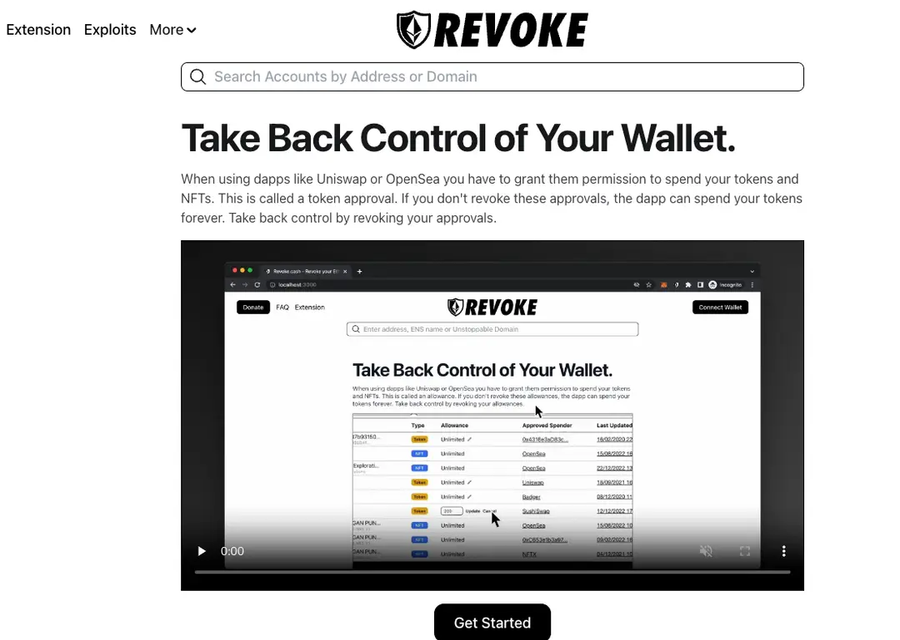

# 检测和撤销授权

## 目标

本节的目标是学习

●检查和撤销授权的重要性

●如何进行检查和撤销授权

#  检查和撤销授权的重要性

在区块链和加密货币的世界中，授权管理至关重要。定期检查和撤销不必要的授权可以显著提高安全性，保护用户的资产免受潜在的威胁。

长时间未使用的授权可能成为攻击者的目标。定期检查并撤销这些授权，可以减少攻击者利用过期或不再需要的权限进行恶意活动的机会。

即使是曾经信任的合约，如果其代码被发现存在安全漏洞，攻击者可以利用这些漏洞进行攻击。定期撤销授权可以降低这种风险。

当我们发现未使用的授权、不再需要的授权，就可以撤销掉，这样可以最大限度的控制我们的授权范围，有助于我们保持账户的整洁和健康状态

#  如何进行检查和撤销授权

这里我们以 **Revoke.cash** 与 **Etherscan** 为例

## **使用 Revoke.cash 检查和撤销授权**

1.**访问 Revoke.cash**：

●打开浏览器，访问 [Revoke.cash](https://revoke.cash/)。

2.**连接您的钱包**：

●点击页面右上角的“Connect Wallet”按钮。

●选择您使用的钱包（例如 MetaMask）并授权连接。

3.**查看授权列表**：

●连接钱包后，您将看到与您的钱包地址相关的所有已授权合约和地址。

●仔细查看每个授权条目，确保了解每个合约的用途。

4.**撤销不需要的授权**：

●找到您希望撤销的授权条目。

●点击“Revoke”按钮。

●在弹出的 MetaMask 窗口中确认交易，等待交易完成以撤销授权。

##  **使用 Etherscan 检查和撤销授权**

1.**访问 Etherscan**：

●打开浏览器，访问 [Etherscan](https://etherscan.io/)。

2.**找到您的地址**：

●在搜索栏中输入您的以太坊地址，按回车搜索。

3.**查看授权合约**：

●在地址页面中，找到并点击“Token Approvals”选项（可能需要点击更多选项按钮）。

●查看与您的地址相关的所有已授权合约和地址。

4.**撤销授权**：

●如果您希望撤销某个授权，可以记下相关的合约地址。

●使用 Revoke.cash 或 MetaMask 直接与合约交互，发送“Revoke”交易撤销授权。

#  小结

本节介绍了定期检查您的钱包授权情况，确保没有不必要的授权，通过检查和撤销授权可以有效地管理和撤销钱包地址的授权，提升您的加密资产安全性。