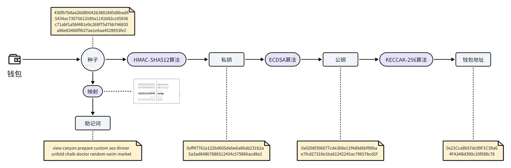

# 钱包地址生成和作用

## 目标

本节的目标是学习

●什么是钱包

●钱包地址的生成过程

## **钱包和钱包地址**

在 Web3 生态中，钱包扮演着一个至关重要的角色，因为钱包中保存着可以让你控制资产的关键信息：私钥。与真实世界的钱包不同，Web3 钱包并不直接存储加密货币（加密货币都存储在区块链中），只用来管理和交易加密货币。

钱包地址可以当做你在区块链上的账号，它是一个公开的字符串，主要用于接收和发送加密货币。就像你的银行卡账号一样，人们需要知道你的钱包地址才能向你转账。同样，当你想要给别人转账时，你也需要知道对方的钱包地址。比如，这是一个标准的以太坊钱包地址：0x21Cca8b57dc09F1C39a64FA34Bd390c10f088c78

## **钱包地址的生成过程**

在前面的章节中，我们介绍了如何在 MetaMask 上创建一个数字钱包。虽然只需要在浏览器界面上简单操作，即可拥有一个钱包地址，但是这背后是一个复杂的生成过程。

下面介绍一下钱包地址生成过程中，涉及的几个关键步骤：

●第一步：生成种子。种子是一个随机生成的数字序列，是后续的起点。种子可以由系统生成的随机数或用户提供的熵（比如随机移动鼠标产生的数据）来产生。

●第二步：生成助记词。助记词是将种子转换成的一系列方便记忆的单词。在以太坊中，有一个固定的2048个单词的单词库，首先将种子分割成多个二进制数据片段，每一个片段对应单词库中的一个单词，最终形成一串单词序列，即助记词。

●第三步：生成私钥。私钥是控制钱包地址的密钥。使用上一步的种子，通过 HMAC-SHA512 算法进行计算，可以得到私钥。

●第四步：生成公钥。有了私钥之后，通过椭圆曲线加密算法（ ECDSA ），我们可以计算出对应的公钥。

●第五步：生成地址。最后一步是生成钱包地址。首先使用 Keccak-256 哈希函数计算公钥的哈希值，然后取哈希值的最后20个字节，就是一个以太坊钱包地址。

## **小结**

这一小节，我们学习了钱包的基本概念和钱包地址的生成过程。

在整个钱包地址的生成过程中，每一步都使用了严格的密码学算法来确保安全性，保证了每个人都能拥有一个独一无二的地址。再次提醒，请妥善保管好私钥和助记词，且必须保密存放，一旦泄露，那么相应地址上的资产就可能会被盗走。