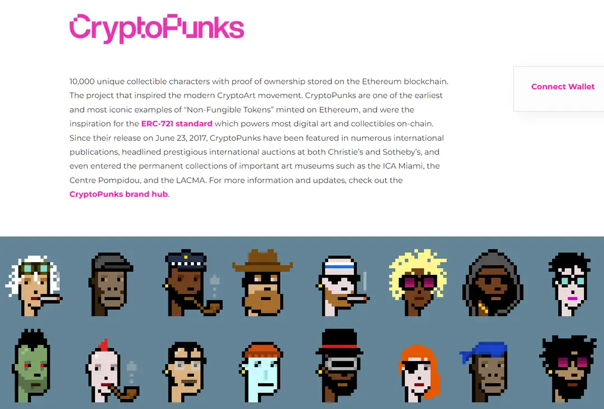

# 非同质化代币（ NFT ）

## 目标

本节的目标是学习

●什么是 NFT

●NFT 的价值

●NFT 的典型项目

## **NFT 简介**

在介绍非同质化代币（ NFT ）之前，我们需要先了解“同质化”和“非同质化”的概念。

在加密货币的世界里，同质化代表着可互换性。比如你拥有1个 BTC，而我也拥有1个 BTC，尽管这两个 BTC 可能在不同的钱包地址中，但它们具有相同的价值，可以直接交换，这就像你用一张100元的钞票换另一张同样面额的100元钞票一样。

而非同质化代表着独一无二，不可替代。非同质化代币（ NFT ），正是这样一种唯一且不可互换的数字资产。NFT 通常用于证明资产的所有权，比如数字艺术品、收藏品等。

## **NFT 的价值**

与同质化代币相比，非同质化代币（ NFT ）在所有权验证、独特性、收藏价值、市场流通性以及参与性等方面具有独特的价值。具体如下：

●首先，NFT 作为一种区块链技术的产物，能够为数字资产提供不可篡改的所有权证明。这意味着艺术家和内容创造者可以确保他们的原创作品被合法地认证和追踪，从而保护了他们的知识产权。

●其次，由于每个 NFT 都是不可替代的，它们固有的稀缺性成为了价值的重要来源。尤其是对于那些独特的艺术品来说，这种稀缺性赋予了 NFT 较高的收藏价值。

●再者，尽管 NFT 是非同质化的，但它们在全球范围内的多个平台上仍然可以被买卖和交换，这为 NFT 提供了流通性。随着市场的不断发展，这种流通性正在不断增强。

●最后，部分 NFT 项目允许持有者对项目的发展进行投票，或者提供社区特定的福利。这增强了用户体验，使得 NFT 变得不仅仅是一个收藏品，而是一个拥有社群和生态的活跃项目。

**NFT 典型项目**

以 CryptoPunks 为例，这是一个在以太坊上非常著名的NFT项目。CryptoPunks 是由 Larva Labs studio 创造的一系列10,000个像素艺术角色，每个角色都是独一无二的，且已经成为了加密艺术和文化的象征。它们不仅仅是图片，更是身份和地位的象征。CryptoPunks 项目的成功在于它结合了艺术、稀缺性和社区的力量，创造了巨大的经济价值和文化影响力。

## **小结**

这一小节，我们学习了 NFT 的基本概念和典型项目。NFT 开辟了数字艺术和收藏品的新市场，为用户提供独特的体验和权益。未来，NFT 可能会继续在艺术、游戏、娱乐和其他领域拓展其应用，提供更丰富的交互方式和更加完善的所有权记录。随着技术的发展和法律法规的完善，NFT 可能会成为数字身份和资产所有权证明的重要工具。

123